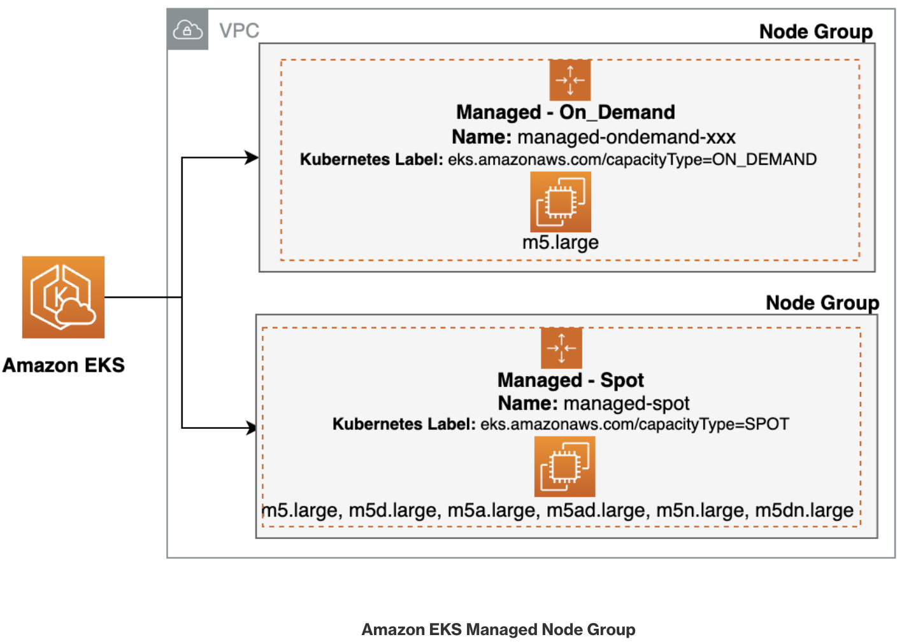

All of our existing compute nodes are using On-Demand capacity. However, there are multiple "[purchase options](https://docs.aws.amazon.com/AWSEC2/latest/UserGuide/instance-purchasing-options.html)" available to EC2 customers for running their EKS workloads.

A Spot Instance uses spare EC2 capacity that is available for less than the On-Demand price. Because Spot Instances enable you to request unused EC2 instances at steep discounts, you can lower your Amazon EC2 costs significantly. The hourly price for a Spot Instance is called a Spot price. The Spot price of each instance type in each Availability Zone is set by Amazon EC2, and is adjusted gradually based on the long-term supply of and demand for Spot Instances. Your Spot Instance runs whenever capacity is available.

Spot Instances are a good fit for stateless, fault-tolerant, flexible applications. These include batch and machine learning training workloads, big data ETLs such as Apache Spark, queue processing applications, and stateless API endpoints. Because Spot is spare Amazon EC2 capacity, which can change over time, we recommend that you use Spot capacity for interruption-tolerant workloads. More specifically, Spot capacity is suitable for workloads that can tolerate periods where the required capacity isn't available.

# EKS managed node groups with Spot capacity

In this module, we will first deploy a managed node group that creates Spot instances, followed by modifying the existing `catalog` component of our application to run on the newly created Spot instances.

Let’s get started by listing all of the nodes in our existing EKS Cluster. The `kubectl get nodes` command can be used to list the nodes in your Kubernetes cluster, but to get additional detail about the capacity type, we'll use the `-L eks.amazonaws.com/capacityType` parameter.

The following command shows that our nodes are currently **On-Demand** instances.

```bash
$ kubectl get nodes -L eks.amazonaws.com/capacityType
NAME                                          STATUS   ROLES    AGE    VERSION                CAPACITYTYPE
ip-10-42-103-103.us-east-2.compute.internal   Ready    <none>   133m   v1.25.6-eks-48e63af    ON_DEMAND
ip-10-42-142-197.us-east-2.compute.internal   Ready    <none>   133m   v1.25.6-eks-48e63af    ON_DEMAND
ip-10-42-161-44.us-east-2.compute.internal    Ready    <none>   133m   v1.25.6-eks-48e63af    ON_DEMAND
```

:::tip

If you want to retrieve nodes based on a specific capacity type, such as `on-demand` instances, you can utilize "<b>label selectors</b>". In this particular scenario, you can achieve this by setting the label selector to `capacityType=ON_DEMAND`.

```bash
$ kubectl get nodes -l eks.amazonaws.com/capacityType=ON_DEMAND

NAME                                         STATUS   ROLES    AGE     VERSION
ip-10-42-10-119.us-east-2.compute.internal   Ready    <none>   3d10h   v1.23.15-eks-49d8fe8
ip-10-42-10-200.us-east-2.compute.internal   Ready    <none>   3d10h   v1.23.15-eks-49d8fe8
ip-10-42-11-94.us-east-2.compute.internal    Ready    <none>   3d10h   v1.23.15-eks-49d8fe8
ip-10-42-12-235.us-east-2.compute.internal   Ready    <none>   4h34m   v1.23.15-eks-49d8fe8

:::

In the below diagram, there are two separate "node groups" representing the managed node groups within the cluster. The first Node Group box represents the node group containing On-Demand instances while the second represents the node group containing Spot instances. Both are associated with the specified EKS cluster.



Let's create a node group with Spot instances. The following command executes two steps:
1. Set an environment variable with the same node role we used for the `default` node group.
1. Create a new node group `managed-spot` with our existing node role and subnets, and specify the instance types, capacity type, and scaling config for our new spot node group.

```bash
$ export MANAGED_NODE_GROUP_IAM_ROLE_ARN=`aws eks describe-nodegroup --cluster-name eks-workshop --nodegroup-name default | jq -r .nodegroup.nodeRole`
$ aws eks create-nodegroup \
--cluster-name $EKS_CLUSTER_NAME \
--nodegroup-name managed-spot \
--node-role $MANAGED_NODE_GROUP_IAM_ROLE_ARN \
--subnets $PRIMARY_SUBNET_1 $PRIMARY_SUBNET_2 $PRIMARY_SUBNET_3 \
--instance-types m5.large m5d.large m5a.large m5ad.large m5n.large m5dn.large \
--capacity-type SPOT \
--scaling-config minSize=2,maxSize=3,desiredSize=2 \
--disk-size 20 \
--labels capacity_type=managed_spot
```

:::tip
The aws `eks wait nodegroup-active` command can be used to wait until a specific EKS node group is active and ready for use. This command is part of the AWS CLI and can be used to ensure that the specified node group has been successfully created and all the associated instances are running and ready.

```bash
$ aws eks wait nodegroup-active \
--cluster-name $EKS_CLUSTER_NAME \
--nodegroup-name managed-spot
```
:::

Once our new managed node group is **Active**, run the following command. 

```bash
$ kubectl get nodes -L eks.amazonaws.com/capacityType,eks.amazonaws.com/nodegroup

NAME                                          STATUS   ROLES    AGE     VERSION                CAPACITYTYPE   NODEGROUP
ip-10-42-103-103.us-east-2.compute.internal   Ready    <none>   3h38m   v1.25.6-eks-48e63af    ON_DEMAND      default
ip-10-42-142-197.us-east-2.compute.internal   Ready    <none>   3h38m   v1.25.6-eks-48e63af    ON_DEMAND      default
ip-10-42-161-44.us-east-2.compute.internal    Ready    <none>   3h38m   v1.25.6-eks-48e63af    ON_DEMAND      default
ip-10-42-178-46.us-east-2.compute.internal    Ready    <none>   103s    v1.25.13-eks-43840fb   SPOT           managed-spot
ip-10-42-97-19.us-east-2.compute.internal     Ready    <none>   104s    v1.25.13-eks-43840fb   SPOT           managed-spot

```

The output shows that two additional nodes got provisioned under the node group `managed-spot` with capacity type as `SPOT`.

Next, let's modify our sample retail store application to run the catalog component on the newly created Spot instances. To do so, we'll utilize Kustomize to apply a patch to the `catalog` Deployment, adding a `nodeSelector` field with `capacity_type: managed_spot`.

```kustomization
modules/fundamentals/mng/spot/deployment.yaml
Deployment/catalog
```

Apply the Kustomize patch with the following command.

```bash
$ kubectl apply -k ~/environment/eks-workshop/modules/fundamentals/mng/spot

namespace/catalog unchanged
serviceaccount/catalog unchanged
configmap/catalog unchanged
secret/catalog-db unchanged
service/catalog unchanged
service/catalog-mysql unchanged
deployment.apps/catalog configured
statefulset.apps/catalog-mysql unchanged
```

Ensure the successful deployment of your app with the following command.

```bash
$ kubectl rollout status deployment/catalog -n catalog --timeout=5m
```

Finally, let's verify that the catalog pods are running on Spot instances. Run the following two commands.

```bash
$ kubectl get pods -l app.kubernetes.io/component=service -n catalog -o wide

NAME                       READY   STATUS    RESTARTS   AGE     IP              NODE  
catalog-6bf46b9654-9klmd   1/1     Running   0          7m13s   10.42.118.208   ip-10-42-99-254.us-east-2.compute.internal
```
```bash
$ kubectl get nodes -l eks.amazonaws.com/capacityType=SPOT

NAME                                          STATUS   ROLES    AGE   VERSION
ip-10-42-139-140.us-east-2.compute.internal   Ready    <none>   16m   v1.25.13-eks-43840fb
ip-10-42-99-254.us-east-2.compute.internal    Ready    <none>   16m   v1.25.13-eks-43840fb

```

The first command tells us that the catalog pod is running on node `ip-10-42-99-254.us-east-2.compute.internal`, which we verify is a Spot instance by matching it to the output of the second command.

In this lab, you deployed a managed node group that creates Spot instances, and then modified the `catalog` deployment to run on the newly created Spot instances. Following this process, you can modify any of the running deployments in the cluster by adding the `nodeSelector` parameter, as specified in the Kustomization patch above.