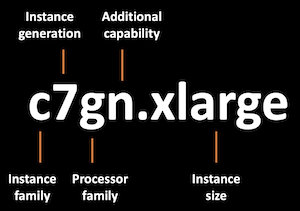
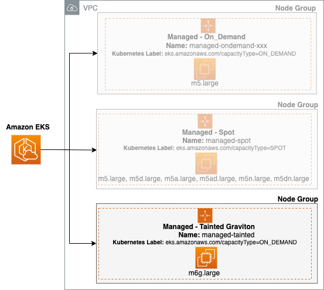

Whether you're using On-demand or Spot instances, AWS offers 3 processor types for EC2 as well as EC2-backed EKS managed node groups. Customers have the choice of Intel, AMD, and ARM (AWS Graviton) processors. [AWS Graviton processors](https://aws.amazon.com/ec2/graviton/) are designed by AWS to deliver the best price performance for your cloud workloads running in Amazon EC2.

Graviton-based instances can be identified by the letter `g` in the Processor family section of the [Instance type naming convention](https://docs.aws.amazon.com/AWSEC2/latest/UserGuide/instance-types.html#instance-type-names).

AWS Graviton processors are built on the [AWS Nitro System](https://aws.amazon.com/ec2/nitro/?p=pm&pd=graviton&z=3). AWS built the AWS Nitro System to deliver practically all of the compute and memory resources of the host hardware to your instances. This is achieved by breaking apart the hypervisor functions and management capabilities from the hosts and offloading them to dedicated hardware and software. This results in better overall performance, unlike traditional virtualization platforms that run the hypervisor software on the same physical host as the virtual machines which means the virtual machines cannot utilize 100% of the host’s resources. AWS Nitro System are supported by popular Linux operating systems along with many popular applications and services from AWS and Independent Software Vendors.

# EKS Managed Node Group Multi-Architecture with Graviton Processors

:::info
AWS Graviton requires ARM compatible container images, ideally multi-architecture (ARM64 and AMD64) allowing cross-compatibility with both Graviton and x86 instance types.
:::

Graviton processors enhance the EKS experience for managed nodegroups with instances delivering up to 20% lower cost, up to 40% better price-performance, and up to 60% less energy consumption than comparable fifth generation x86-based instances. Graviton-based EKS managed node groups launch an EC2 Auto Scaling group with Graviton processors.

Adding Graviton-based instances to your EKS managed node group introduces a multi-architecture infrastructure and the need for your application to run on different CPUs. This means your application code needs to be available in different Instruction Set Architecture (ISA) implementations. There are various resources to help teams plan and port applications to Graviton-based instances. Check out [Graviton adoption plan](https://pages.awscloud.com/rs/112-TZM-766/images/Graviton%20Challenge%20Plan.pdf) and [Porting Advisor for Graviton](https://github.com/aws/porting-advisor-for-graviton) for useful resources.

:::tip
The [retail store sample web application](https://github.com/aws-containers/retail-store-sample-app/tree/main#application-architecture) architecture contains [pre-built container images for both x86-64 and ARM64 CPU architectures](https://gallery.ecr.aws/aws-containers/retail-store-sample-ui).
:::