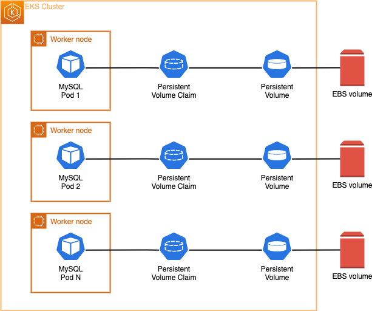
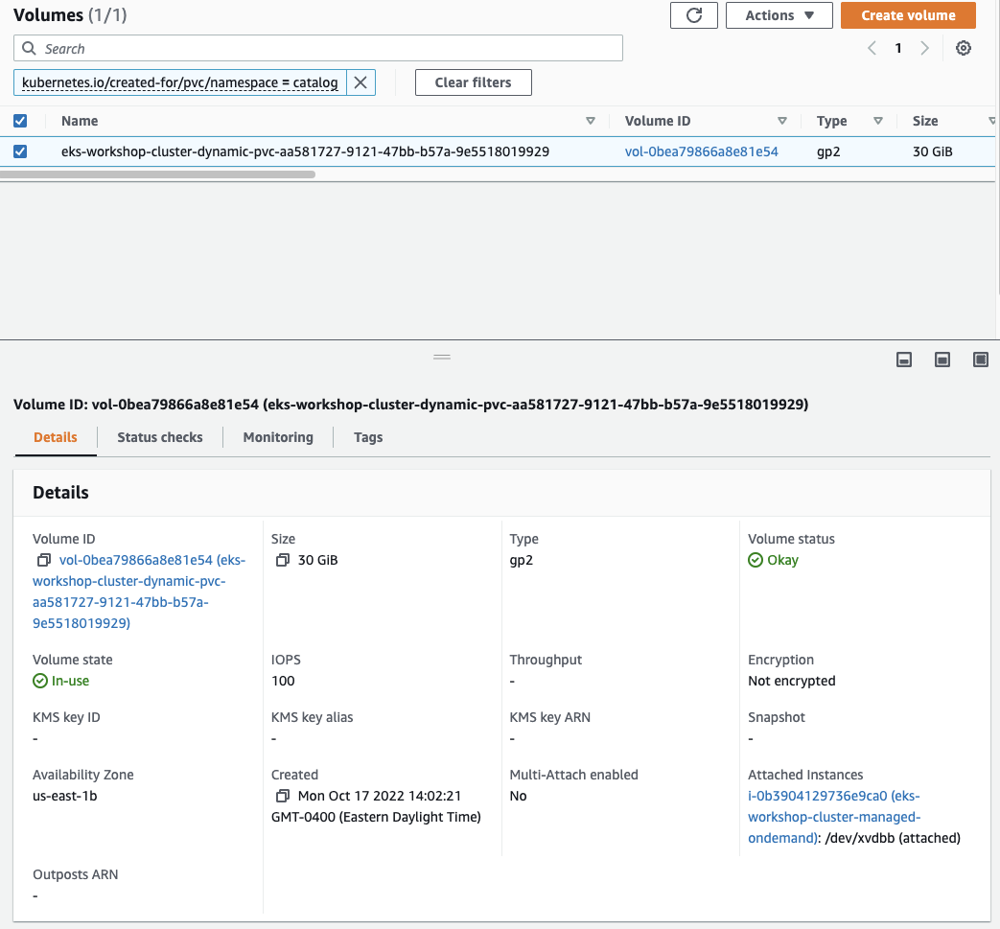

Now that we understand [StatefulSets](https://kubernetes.io/docs/concepts/workloads/controllers/statefulset/) and [Dynamic Volume Provisioning](https://kubernetes.io/docs/concepts/storage/dynamic-provisioning/), let's change our MySQL DB on the Catalog microservice to provision a new EBS volume to store database files persistent.



Utilizing Kustomize, we'll do two things:

* Create a new StatefulSet for the MySQL database used by the catalog component which uses an EBS volume
* Update the `catalog` component to use this new version of the database

:::info
Why are we not updating the existing StatefulSet? The fields we need to update are immutable and cannot be changed.
:::

Here in the new catalog database StatefulSet:

```file
fundamentals/storage/ebs/statefulset-mysql.yaml
```

Notice the `volumeClaimTemplates` field which specifies the instructs Kubernetes to utilize Dynamic Volume Provisioning to create a new EBS Volume, a [PersistentVolume (PV)](https://kubernetes.io/docs/concepts/storage/persistent-volumes/) and a [PersistentVolumeClaim (PVC)](https://kubernetes.io/docs/concepts/storage/persistent-volumes/#persistentvolumeclaims) all automatically.

This is how we'll re-configure the catalog component itself to use the new StatefulSet:

```kustomization
fundamentals/storage/ebs/deployment.yaml
Deployment/catalog
```

Apply the changes and wait for the new Pods to be rolled out:

```bash hook=check-pvc
$ kubectl apply -k /workspace/modules/fundamentals/storage/ebs/
$ kubectl rollout status --timeout=60s statefulset/catalog-mysql-ebs -n catalog
```

Let's now confirm that our newly deployed StatefulSet is running:

```bash
$ kubectl get statefulset -n catalog catalog-mysql-ebs
NAME                READY   AGE
catalog-mysql-ebs   1/1     79s
```

Inspecting our `catalog-mysql-ebs` StatefulSet, we can see that now we have a PersistentVolumeClaim attached to it with 30GiB and with `storageClassName` of gp2. 

```bash
$ kubectl get statefulset -n catalog catalog-mysql-ebs \
  -o jsonpath='{.spec.volumeClaimTemplates}' | jq .
[
  {
    "apiVersion": "v1",
    "kind": "PersistentVolumeClaim",
    "metadata": {
      "creationTimestamp": null,
      "name": "data"
    },
    "spec": {
      "accessModes": [
        "ReadWriteOnce"
      ],
      "resources": {
        "requests": {
          "storage": "30Gi"
        }
      },
      "storageClassName": "gp2",
      "volumeMode": "Filesystem"
    },
    "status": {
      "phase": "Pending"
    }
  }
]
```

We can analyze how the Dynamic Volume Provisioning created a PersistentVolume (PV) automatically for us:

```bash
$ kubectl get pv | grep -i catalog
pvc-1df77afa-10c8-4296-aa3e-cf2aabd93365   30Gi       RWO            Delete           Bound         catalog/data-catalog-mysql-ebs-0          gp2                            10m
```

Utilizing the [AWS CLI](https://aws.amazon.com/cli/), we can check the Amazon EBS volume that got created automatically for us:
```bash
$ aws ec2 describe-volumes \
    --filters Name=tag:kubernetes.io/created-for/pvc/name,Values=data-catalog-mysql-ebs-0 \
    --query "Volumes[*].{ID:VolumeId,Tag:Tags}" \
    --no-cli-pager
```

If you prefer you can also check it via the [AWS console](https://console.aws.amazon.com/ec2/home#Volumes), just look for the EBS volumes with the tag of key  `kubernetes.io/created-for/pvc/name` and value of `data-catalog-mysql-ebs-0`:



If you'd like to inspect the container shell and check out the newly EBS volume attached to the Linux OS, run this instructions to run a shell command into the `catalog-mysql-ebs` container. It'll inspect the filesystems that you have mounted:

```bash
$ kubectl exec --stdin catalog-mysql-ebs-0  -n catalog -- bash -c "df -h"
Filesystem      Size  Used Avail Use% Mounted on
overlay         100G  7.6G   93G   8% /
tmpfs            64M     0   64M   0% /dev
tmpfs           3.8G     0  3.8G   0% /sys/fs/cgroup
/dev/nvme0n1p1  100G  7.6G   93G   8% /etc/hosts
shm              64M     0   64M   0% /dev/shm
/dev/nvme1n1     30G  211M   30G   1% /var/lib/mysql
tmpfs           7.0G   12K  7.0G   1% /run/secrets/kubernetes.io/serviceaccount
tmpfs           3.8G     0  3.8G   0% /proc/acpi
tmpfs           3.8G     0  3.8G   0% /sys/firmware
```

Check the disk that is currently being mounted on the `/var/lib/mysql`. This is the EBS Volume for the stateful MySQL database files that being stored in a persistent way.

Let's now test if our data is in fact persistent. We'll create the same `test.txt` file exactly the same way as we did on the first section of this module:

```bash
$ kubectl exec catalog-mysql-ebs-0 -n catalog -- bash -c  "echo 123 > /var/lib/mysql/test.txt"
```

Now, let's verify that our `test.txt` file got created on the `/var/lib/mysql` directory:

```bash
$ kubectl exec catalog-mysql-ebs-0 -n catalog -- ls -larth /var/lib/mysql/ | grep -i test
-rw-r--r-- 1 root  root     4 Oct 18 13:57 test.txt
```

Now, let's remove the current `catalog-mysql-ebs` Pod, which will force the StatefulSet controller to automatically re-create it:

```bash hook=pod-delete
$ kubectl delete pods -n catalog catalog-mysql-ebs-0
pod "catalog-mysql-ebs-0" deleted
```

Wait for a few seconds, and run the command below to check if the `catalog-mysql-ebs` Pod has been re-created:

```bash
$ kubectl wait --for=condition=Ready pod -n catalog \
  -l app.kubernetes.io/component=mysql-ebs --timeout=60s
pod/catalog-mysql-ebs-0 condition met
$ kubectl get pods -n catalog -l app.kubernetes.io/component=mysql-ebs
NAME                  READY   STATUS    RESTARTS   AGE
catalog-mysql-ebs-0   1/1     Running   0          29s
```

Finally, let's exec back into the MySQL container shell and run a `ls` command on the `/var/lib/mysql` path trying to look for the `test.txt` file that we created, and see if the file has now persisted:

```bash
$ kubectl exec catalog-mysql-ebs-0 -n catalog -- ls -larth /var/lib/mysql/ | grep -i test
-rw-r--r-- 1 mysql root     4 Oct 18 13:57 test.txt
$ kubectl exec catalog-mysql-ebs-0 -n catalog -- cat /var/lib/mysql/test.txt
123
```

As you can see the `test.txt` file is still available after a Pod delete and restart and with the right text on it `123`. This is the main functionality of Persistent Volumes (PVs). Amazon EBS is storing the data and keeping our data safe and available within an AWS availability zone.
