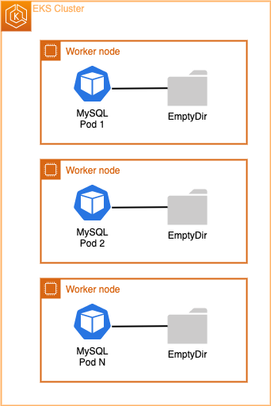

Kubernetes  [StatefulSets](https://kubernetes.io/docs/concepts/workloads/controllers/statefulset/) are like a Deployment, a StatefulSet manages Pods that are based on an identical container spec. Unlike a Deployment, a StatefulSet maintains a sticky identity for each of their Pods. These Pods are created from the same spec, but are not interchangeable: each has a persistent identifier that it maintains across any rescheduling.

If you want to use storage volumes to provide persistence for your workload, you can use a StatefulSet as part of the solution. Although individual Pods in a StatefulSet are susceptible to failure, the persistent Pod identifiers make it easier to match existing volumes to the new Pods that replace any that have failed.

StatefulSets are valuable for applications that require one or more of the following.

* Stable, unique network identifiers.
* Stable, persistent storage.
* Ordered, graceful deployment and scaling.
* Ordered, automated rolling updates.


On our ecommerce application, we have a StatefulSet already deployed part of our Catalog microservice. The Catalog microservice utilizes a MySQL database running on EKS. Databases are a great example for the use of StatefulSet because they require **persistent storage**. We can analyze our MySQL DB Pod to see its current volume configuration:

```bash
$ kubectl describe statefulset -n catalog catalog-mysql
Name:               catalog-mysql
Namespace:          catalog
[...]
  Containers:
   mysql:
    Image:      public.ecr.aws/docker/library/mysql:5.7
    Port:       3306/TCP
    Host Port:  0/TCP
    Args:
      --ignore-db-dir=lost+found
    Environment:
      MYSQL_ROOT_PASSWORD:  my-secret-pw
      MYSQL_USER:           <set to the key 'username' in secret 'catalog-db'>  Optional: false
      MYSQL_PASSWORD:       <set to the key 'password' in secret 'catalog-db'>  Optional: false
      MYSQL_DATABASE:       <set to the key 'name' in secret 'catalog-db'>      Optional: false
    Mounts:
      /var/lib/mysql from data (rw)
  Volumes:
   data:
    Type:       EmptyDir (a temporary directory that shares a pod's lifetime)
    Medium:     
    SizeLimit:  <unset>
Volume Claims:  <none>
[...]
```

As you can see the [`Volumes`](https://kubernetes.io/docs/concepts/storage/volumes/#emptydir-configuration-example) section of our StatefulSet shows that we're only using an [EmptyDir volume type](https://kubernetes.io/docs/concepts/storage/volumes/#emptydir) which "shares the Pod's lifetime". 



An `emptyDir` volume is first created when a Pod is assigned to a node, and exists as long as that Pod is running on that node. As the name says, the emptyDir volume is initially empty. All containers in the Pod can read and write the same files in the emptyDir volume, though that volume can be mounted at the same or different paths in each container. **When a Pod is removed from a node for any reason, the data in the emptyDir is deleted permanently.** Therefore EmptyDir is not a good fit for our MySQL Database. 

We can test by creating a shell inside the container that is running MySQL and creating a test file. Then after that, we'll delete the Pod that is running our StatefulSet. Because that Pod is not using a Persistent Volume (PV), it's using a EmptyDir, the file will not survive a Pod restart. First let's run a command inside our MySQL container to create a file on the emptyDir `/var/lib/mysql` path (where MySQL saves database files): 

```bash
$ kubectl exec catalog-mysql-0 -n catalog -- bash -c  "echo 123 > /var/lib/mysql/test.txt"
```

Now, let's verify that our `test.txt` file got created on the `/var/lib/mysql` directory:

```bash
$ kubectl exec catalog-mysql-0 -n catalog -- ls -larth /var/lib/mysql/ | grep -i test
-rw-r--r-- 1 root  root     4 Oct 18 13:38 test.txt
```

Now, let's remove the current `catalog-mysql` Pod. This will force the StatefulSet controller to automatically re-create a new catalog-mysql Pod:

```bash
$ kubectl delete pods -n catalog -l app.kubernetes.io/component=mysql
pod "catalog-mysql-0" deleted
```

Wait for a few seconds, and run the command below to check if the `catalog-mysql` Pod has been re-created:

```bash
$ kubectl wait --for=condition=Ready pod -n catalog \
  -l app.kubernetes.io/component=mysql --timeout=30s
pod/catalog-mysql-0 condition met
$ kubectl get pods -n catalog -l app.kubernetes.io/component=mysql
NAME              READY   STATUS    RESTARTS   AGE
catalog-mysql-0   1/1     Running   0          29s
```

Finally, let's exec back into the MySQL container shell and run a `ls` command on the `/var/lib/mysql` path trying to look for the `test.txt` file that we created:

```bash expectError=true
$ kubectl exec catalog-mysql-0 -n catalog -- cat /var/lib/mysql/test.txt
cat: /var/lib/mysql/test.txt: No such file or directory
command terminated with exit code 1
```

As you can see the `test.txt` file is no longer there, because `emptyDir` volumes are ephemeral. On future sections, we'll run the same experiment and demostrate how Persistent Volumes (PVs) will keep the `test.txt` file and survive Pod restarts and/or failures. 

On the next page, we'll on understanding the main concepts of Storage on Kubernetes and its integration with the AWS cloud ecosystem. 
