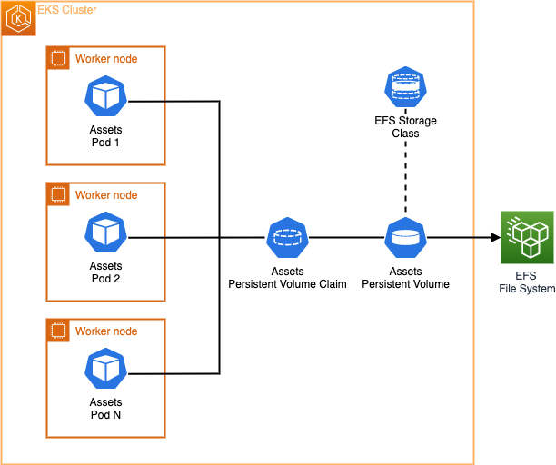

On our ecommerce application, we have a deployment already created as part of our assets microservice. The assets microservice utilizes a webserver running on EKS. Web servers are a great example for the use of deployments because they **scale horizontally** and **declare the new state** of the Pods. 

Assets component is a container which serves static images for products, these product images are added as part of the container image build. However with this setup everytime the team wants to update the product images they have to recreate and redeploy the container image. In this exercise we'll utilize [EFS File System](https://docs.aws.amazon.com/efs/latest/ug/whatisefs.html) and Kubernetes [Persistent Volume](https://kubernetes.io/docs/concepts/storage/persistent-volumes/) to update old product images and add new product images without the need to rebuild the containers images.

We can start by describing the Deployment to take a look at its initial volume configuration:

```bash
$ kubectl describe deployment -n assets
Name:                   assets
Namespace:              assets
[...]
  Containers:
   assets:
    Image:      public.ecr.aws/aws-containers/retail-store-sample-assets:latest
    Port:       8080/TCP
    Host Port:  0/TCP
    Limits:
      memory:  128Mi
    Requests:
      cpu:     128m
      memory:  128Mi
    Liveness:  http-get http://:8080/health.html delay=30s timeout=1s period=3s #success=1 #failure=3
    Environment Variables from:
      assets      ConfigMap  Optional: false
    Environment:  <none>
    Mounts:
      /tmp from tmp-volume (rw)
  Volumes:
   tmp-volume:
    Type:       EmptyDir (a temporary directory that shares a pod's lifetime)
    Medium:     Memory
    SizeLimit:  <unset>
[...]
```

As you can see the [`Volumes`](https://kubernetes.io/docs/concepts/storage/volumes/#emptydir-configuration-example) section of our StatefulSet shows that we're only using an [EmptyDir volume type](https://kubernetes.io/docs/concepts/storage/volumes/#emptydir) which "shares the Pod's lifetime". 


An `emptyDir` volume is first created when a Pod is assigned to a node, and exists as long as that Pod is running on that node. As the name says, the emptyDir volume is initially empty. All containers in the Pod can read and write the same files in the emptyDir volume, though that volume can be mounted at the same or different paths in each container. **When a Pod is removed from a node for any reason, the data in the emptyDir is deleted permanently.** This means that if we want to share data between multiple Pods in the same Deployment and make changes to that data then EmptyDir is not a good fit.

The container has some initial product images copied to it as part of the container build under the folder `/usr/share/nginx/html/assets`, we can check by running the below command:

```bash
$ kubectl exec --stdin deployment/assets \
  -n assets -- bash -c "ls /usr/share/nginx/html/assets/" 
chrono_classic.jpg
gentleman.jpg
pocket_watch.jpg
smart_1.jpg
smart_2.jpg
wood_watch.jpg
```

First lets scale up the `assets` Deployment so it has multiple replicas:

```bash
$ kubectl scale -n assets --replicas=2 deployment/assets
$ kubectl rollout status -n assets deployment/assets --timeout=60s
```

Now let us try to put a new product image named `newproduct.png` in the directory `/usr/share/nginx/html/assets` of the first Pod using the below command:

```bash
$ POD_NAME=$(kubectl -n assets get pods -o jsonpath='{.items[0].metadata.name}')
$ kubectl exec --stdin deployment/assets $POD_NAME \
  -n assets -- bash -c 'touch /usr/share/nginx/html/assets/newproduct.png'
```

Now confirm the new product image `newproduct.png` isn't present on the file system of the second Pod:

```bash
$ POD_NAME=$(kubectl -n assets get pods -o jsonpath='{.items[1].metadata.name}')
$ kubectl exec --stdin deployment/assets $POD_NAME \
  -n assets -- bash -c 'ls /usr/share/nginx/html/assets'
```

As you see the newly created image `newproduct.png` does not exist on the second Pod. In order to help solve this issue we need a file system that can be shared across multiple Pods if the service needs to scale horizontally while still making updates to the files without re-deploying.


