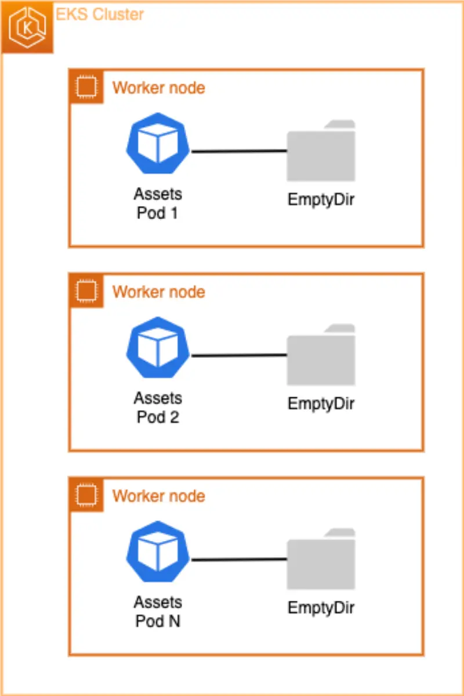

In this section, we'll explore how to handle storage in Kubernetes deployments using a simple image hosting example. We'll start with an existing deployment from our sample store application and modify it to serve as an image host. The assets microservice runs a webserver on EKS, which is an excellent example for demonstrating deployments since they enable **horizontal scaling** and **declarative state management** of Pods.

The assets component serves static product images from a container. These images are bundled into the container during the build process. However, this approach has a limitation - when new images are added to one container, they don't automatically appear in other containers. To address this, we'll implement a solution using [Amazon FSx for Lustre](https://aws.amazon.com/fsx/lustre/) combined with [Amazon S3](https://docs.aws.amazon.com/AmazonS3/latest/userguide/Welcome.html) and Kubernetes [Persistent Volume](https://kubernetes.io/docs/concepts/storage/persistent-volumes/) to create a shared storage environment. This will allow multiple web server containers to serve assets while scaling to meet demand.

Let's examine the current Deployment's volume configuration:

```bash
$ kubectl describe deployment -n assets
Name:                   assets
Namespace:              assets
[...]
  Containers:
   assets:
    Image:      public.ecr.aws/aws-containers/retail-store-sample-assets:0.4.0
    Port:       8080/TCP
    Host Port:  0/TCP
    Limits:
      memory:  128Mi
    Requests:
      cpu:     128m
      memory:  128Mi
    Liveness:  http-get http://:8080/health.html delay=0s timeout=1s period=3s #success=1 #failure=3
    Environment Variables from:
      assets      ConfigMap  Optional: false
    Environment:  <none>
    Mounts:
      /tmp from tmp-volume (rw)
  Volumes:
   tmp-volume:
    Type:          EmptyDir (a temporary directory that shares a pod's lifetime)
    Medium:        Memory
    SizeLimit:     <unset>
[...]
```

Looking at the [`Volumes`](https://kubernetes.io/docs/concepts/storage/volumes/#emptydir-configuration-example) section, we can see that the Deployment currently uses an [EmptyDir volume type](https://kubernetes.io/docs/concepts/storage/volumes/#emptydir) that exists only for the Pod's lifetime.



An `emptyDir` volume is created when a Pod is assigned to a node and persists only while that Pod runs on that node. As its name suggests, the volume starts empty. While all containers within the Pod can read and write files in the emptyDir volume (even when mounted at different paths), **when a Pod is removed from a node for any reason, the data in the emptyDir is deleted permanently.** This makes EmptyDir unsuitable for sharing data between multiple Pods in the same Deployment when that data needs to persist.

The container comes with some initial product images, which are copied during the build process to `/usr/share/nginx/html/assets`. We can verify this by running:

```bash
$ kubectl exec --stdin deployment/assets \
  -n assets -- bash -c "ls /usr/share/nginx/html/assets/"
chrono_classic.jpg
gentleman.jpg
pocket_watch.jpg
smart_1.jpg
smart_2.jpg
wood_watch.jpg
```

To demonstrate the limitations of EmptyDir storage, let's scale up the `assets` Deployment to multiple replicas:

```bash
$ kubectl scale -n assets --replicas=2 deployment/assets
deployment.apps/assets scaled

$ kubectl rollout status -n assets deployment/assets --timeout=60s
deployment "assets" successfully rolled out
```

Now, let's add a new product image called `divewatch.png` to the `/usr/share/nginx/html/assets` directory of the first Pod and verify it exists:

```bash
$ POD_NAME=$(kubectl -n assets get pods -o jsonpath='{.items[0].metadata.name}')
$ kubectl exec --stdin $POD_NAME \
  -n assets -- bash -c 'touch /usr/share/nginx/html/assets/divewatch.jpg'
$ kubectl exec --stdin $POD_NAME \
  -n assets -- bash -c 'ls /usr/share/nginx/html/assets'
chrono_classic.jpg
divewatch.jpg <-----------
gentleman.jpg
pocket_watch.jpg
smart_1.jpg
smart_2.jpg
wood_watch.jpg
```

Let's check if the new product image `divewatch.jpg` appears in the second Pod:

```bash
$ POD_NAME=$(kubectl -n assets get pods -o jsonpath='{.items[1].metadata.name}')
$ kubectl exec --stdin $POD_NAME \
  -n assets -- bash -c 'ls /usr/share/nginx/html/assets'
chrono_classic.jpg
gentleman.jpg
pocket_watch.jpg
smart_1.jpg
smart_2.jpg
wood_watch.jpg
```

As we can see, `divewatch.jpg` doesn't exist in the second Pod. This demonstrates why we need a shared filesystem that persists across multiple Pods when scaling horizontally, allowing file updates without requiring redeployment.
