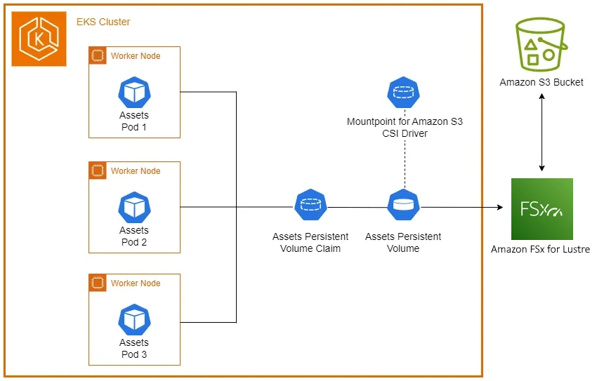

Before proceeding with this section, it's important to understand the Kubernetes storage concepts (volumes, persistent volumes (PV), persistent volume claims (PVC), dynamic provisioning, and ephemeral storage) that were covered in the [Storage](../index.md) main section.

The [Amazon FSx for Lustre Container Storage Interface (CSI) driver](https://github.com/kubernetes-sigs/aws-fsx-csi-driver) enables Kubernetes applications to access files in an FSx for Lustre fils system. The driver implements the [CSI](https://github.com/container-storage-interface/spec/blob/master/spec.md) specification, allowing container orchestrators (CO) to manage storage volumes effectively.

The following architecture diagram illustrates how we will use FSx for Lustre linked with an Amazon S3 bucket as persistent storage for our EKS pods:




Let's begin by creating a [Data Respository Association (DRA)](https://docs.aws.amazon.com/fsx/latest/LustreGuide/create-dra-linked-data-repo.html) between the FSx for Lustre file system and an S3 bucket. This will create the association and notify you when it is complete, which takes approximately eight minutes:

```bash
$ ASSOCIATION_ID=$(aws fsx create-data-repository-association \
    --file-system-id $FSX_ID \
    --file-system-path "/" \
    --data-repository-path "s3://$BUCKET_NAME" \
    --s3 "AutoImportPolicy={Events=[NEW,CHANGED,DELETED]},AutoExportPolicy={Events=[NEW,CHANGED,DELETED]}" \
    --query 'Association.AssociationId' \
    --output text)

echo "Creating Data Repository Association..."

while true; do
    STATUS=$(aws fsx describe-data-repository-associations --association-ids $ASSOCIATION_ID --query 'Associations[0].Lifecycle' --output text)
    
    if [ "$STATUS" = "AVAILABLE" ]; then
        echo "Data Repository Association is now AVAILABLE."
        break
    elif [ "$STATUS" = "FAILED" ]; then
        echo "Data Repository Association creation FAILED."
        break
    fi
    sleep 5
done
Creating Data Repository Association...
Data Repository Association is now AVAILABLE.
$ 
```

Now that the S3 data repository association has been created, let's create a staging directory with the images needed in our watch store scenario:

```bash
$ mkdir ~/environment/assets-images/
$ cd ~/environment/assets-images/
$ curl --remote-name-all https://raw.githubusercontent.com/aws-containers/retail-store-sample-app/main/src/assets/public/assets/{chrono_classic.jpg,gentleman.jpg,pocket_watch.jpg,smart_2.jpg,wood_watch.jpg}
  % Total    % Received % Xferd  Average Speed   Time    Time     Time  Current
                                 Dload  Upload   Total   Spent    Left  Speed
100    14  100    14    0     0     61      0 --:--:-- --:--:-- --:--:--    62
  % Total    % Received % Xferd  Average Speed   Time    Time     Time  Current
                                 Dload  Upload   Total   Spent    Left  Speed
100    14  100    14    0     0    100      0 --:--:-- --:--:-- --:--:--   100
  % Total    % Received % Xferd  Average Speed   Time    Time     Time  Current
                                 Dload  Upload   Total   Spent    Left  Speed
100    14  100    14    0     0    133      0 --:--:-- --:--:-- --:--:--   133
  % Total    % Received % Xferd  Average Speed   Time    Time     Time  Current
                                 Dload  Upload   Total   Spent    Left  Speed
100    14  100    14    0     0    103      0 --:--:-- --:--:-- --:--:--   103
  % Total    % Received % Xferd  Average Speed   Time    Time     Time  Current
                                 Dload  Upload   Total   Spent    Left  Speed
100    14  100    14    0     0    108      0 --:--:-- --:--:-- --:--:--   109
$ 
```

Next, we'll copy these image assets to our S3 bucket using the `aws s3 cp` command:

```bash
$ cd ~/environment/
$ aws s3 cp ~/environment/assets-images/ s3://$BUCKET_NAME/ --recursive
upload: assets-images/wood_watch.jpg to s3://eks-workshop-s3-data20250619213912331100000003/wood_watch.jpg
upload: assets-images/smart_2.jpg to s3://eks-workshop-s3-data20250619213912331100000003/smart_2.jpg
upload: assets-images/pocket_watch.jpg to s3://eks-workshop-s3-data20250619213912331100000003/pocket_watch.jpg
upload: assets-images/chrono_classic.jpg to s3://eks-workshop-s3-data20250619213912331100000003/chrono_classic.jpg
upload: assets-images/gentleman.jpg to s3://eks-workshop-s3-data20250619213912331100000003/gentleman.jpg
$ 
```

We can verify the uploaded objects in our bucket using the `aws s3 ls` command:

```bash
$ aws s3 ls $BUCKET_NAME
2024-10-14 19:29:05      98157 chrono_classic.jpg
2024-10-14 19:29:05      58439 gentleman.jpg
2024-10-14 19:29:05      58655 pocket_watch.jpg
2024-10-14 19:29:05      20795 smart_2.jpg
2024-10-14 19:29:05      43122 wood_watch.jpg
$
```

With our initial objects now in the Amazon S3 bucket, we cam now configure the FSx for Lustre CSI driver and add it to our EKS cluster. This operation will take a few minutes to complete:

```bash
$ helm repo add aws-fsx-csi-driver https://kubernetes-sigs.github.io/aws-fsx-csi-driver/
"aws-fsx-csi-driver" has been added to your repositories
$ helm upgrade --install aws-fsx-csi-driver \
    --namespace kube-system \
    aws-fsx-csi-driver/aws-fsx-csi-driver
Release "aws-fsx-csi-driver" does not exist. Installing it now.
NAME: aws-fsx-csi-driver
LAST DEPLOYED: Thu Jun 19 22:10:58 2025
NAMESPACE: kube-system
STATUS: deployed
REVISION: 1
TEST SUITE: None
$
```

Once completed, we can verify what the addon created in our EKS cluster:

```bash
$ kubectl get daemonset fsx-csi-node -n kube-system
NAME           DESIRED   CURRENT   READY   UP-TO-DATE   AVAILABLE   NODE SELECTOR            AGE
fsx-csi-node   3         3         0       3            0           kubernetes.io/os=linux   5s
$ 
```
