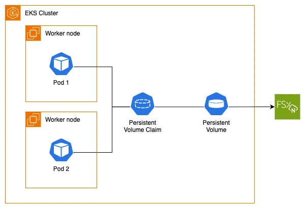

Before diving into this section, you should be familiar with the Kubernetes storage objects (volumes, persistent volumes (PV), persistent volume claims (PVC), dynamic provisioning and ephemeral storage) that were introduced in the main [Storage](../index.md) section.

The [Amazon FSx for NetApp ONTAP Container Storage Interface (CSI) Driver](https://github.com/NetApp/trident) enables you to run stateful containerized applications by providing a CSI interface that allows Kubernetes clusters running on AWS to manage the lifecycle of Amazon FSx for NetApp ONTAP file systems.

The following architecture diagram illustrates how we will use FSx for NetApp ONTAP as persistent storage for our EKS pods:



To utilize Amazon FSx for NetApp ONTAP with dynamic provisioning on our EKS cluster, we first need to confirm that we have the FSx for NetApp ONTAP CSI Driver installed. The driver implements the CSI specification which allows container orchestrators to manage Amazon FSx for NetApp ONTAP file systems throughout their lifecycle.

We can install the Amazon FSxN for NetApp ONTAP Trident CSI driver using helm. We will need to provide a required IAM role that has already been created for us as part fo the preparation for the workshop.

```bash wait=60
$ helm repo add netapp-trident https://netapp.github.io/trident-helm-chart
$ helm install trident-operator netapp-trident/trident-operator \
  --version 100.2410.0 --namespace trident --create-namespace --wait
```

We can confirm the installation like so:

```bash
$ kubectl get pods -n trident
NAME                                READY   STATUS    RESTARTS   AGE
trident-controller-b6b5899-kqdjh    6/6     Running   0          87s
trident-node-linux-9q4sj            2/2     Running   0          86s
trident-node-linux-bxg5s            2/2     Running   0          86s
trident-node-linux-z92x2            2/2     Running   0          86s
trident-operator-588c7c854d-t4c4x   1/1     Running   0          102s
```

An FSx for NetApp ONTAP file system has been provisioned for us, along with the Storage Virtual Machine (SVM) and the required security group that includes an inbound rule allowing NFS traffic to the FSx mount points. Let's get its ID which we'll need later:

```bash
$ export FSXN_ID=$(aws fsx describe-file-systems --output json | jq -r --arg cluster_name "${EKS_CLUSTER_NAME}-fsxn" '.FileSystems[] | select(.Tags[] | select(.Key=="Name" and .Value==$cluster_name)) | .FileSystemId')
$ echo $FSXN_ID
fs-0123456789abcdef0
```

The FSx for NetApp ONTAP CSI driver supports both dynamic and static provisioning:

- **Dynamic provisioning**: The driver creates volumes on the existing FSx for NetApp ONTAP file system. This requires an existing AWS FSx for NetApp ONTAP file system that must be specified in the StorageClass parameters.
- **Static provisioning**: This also requires a pre-created AWS FSx for NetApp ONTAP file system, which can then be mounted as a volume inside a container using the driver.

Next, we'll create a TridentBackendConfig object configured to use the pre-provisioned FSx for NetApp ONTAP file system. We'll be using Kustomize to create the backend and inject the following environment variables:

- `FSXN_ID` in the parameter `fsxFilesystemID` - This is the FSxN filesystem we're going to connect our CSI driver to.
- `FSXN_SECRET_ARN` in the parameter `credentials.name` - This is the secret ARN with the credentials to connect to the ONTAP API interface.

```file
manifests/modules/fundamentals/storage/fsxn/backend/fsxn-backend-nas.yaml
```

Apply the backend configuration:

```bash
$ kubectl kustomize ~/environment/eks-workshop/modules/fundamentals/storage/fsxn/backend \
  | envsubst | kubectl apply -f-
tridentbackendconfig.trident.netapp.io/backend-tbc-ontap-nas created
```

Verify that the TridentBackendConfig was created:

```bash
$ kubectl get tbc -n trident
NAME                    BACKEND NAME    BACKEND UUID                           PHASE   STATUS
backend-tbc-ontap-nas   tbc-ontap-nas   bbae8686-25e4-4fca-a4c7-7ab664c7db9c   Bound   Success
```

Now let's create the [StorageClass](https://kubernetes.io/docs/concepts/storage/storage-classes/) object:

```file
manifests/modules/fundamentals/storage/fsxn/storageclass/fsxnstorageclass.yaml
```

Apply the StorageClass:

```bash
$ kubectl apply -f ~/environment/eks-workshop/modules/fundamentals/storage/fsxn/storageclass/fsxnstorageclass.yaml
storageclass.storage.k8s.io/fsxn-sc-nfs created
```

Let's examine the StorageClass. Note that it uses the FSx for NetApp ONTAP CSI driver as the provisioner and is configured for ONTAP NAS provisioning mode:

```bash
$ kubectl get storageclass
NAME            PROVISIONER                RECLAIMPOLICY   VOLUMEBINDINGMODE      ALLOWVOLUMEEXPANSION   AGE
fsxn-sc-nfs     csi.trident.netapp.io      Delete          Immediate              true                   8m29s
$ kubectl describe sc fsxn-sc-nfs
Name:            fsxn-sc-nfs
IsDefaultClass:  No
Annotations:     kubectl.kubernetes.io/last-applied-configuration={"allowVolumeExpansion":true,"apiVersion":"storage.k8s.io/v1","kind":"StorageClass","metadata":{"annotations":{},"name":"fsxn-sc-nfs"},"parameters":{"backendType":"ontap-nas"},"provisioner":"csi.trident.netapp.io"}

Provisioner:           csi.trident.netapp.io
Parameters:            backendType=ontap-nas
AllowVolumeExpansion:  True
MountOptions:          <none>
ReclaimPolicy:         Delete
VolumeBindingMode:     Immediate
Events:                <none>
```

Now that we understand the FSx for NetApp ONTAP StorageClass and how the FSx for NetApp ONTAP CSI driver works, we're ready to proceed to the next step where we'll modify the UI component to use the FSx for NetApp ONTAP `StorageClass` with Kubernetes dynamic volume provisioning and a PersistentVolume for storing product images.
