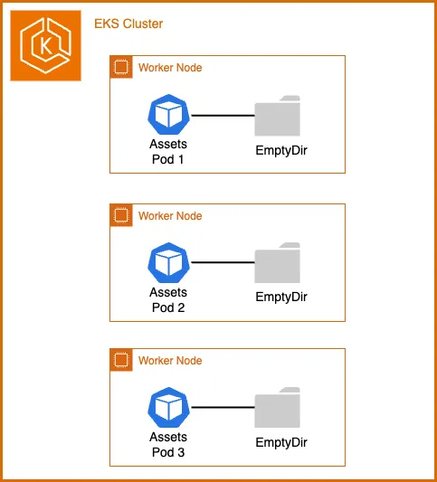

Our ecommerce application includes a deployment for the assets microservice, which runs a webserver on EKS. Web servers are an excellent use case for deployments as they can **scale horizontally** and **declare the new state** of the Pods.

The assets component serves static product images that are currently bundled into the container image during build time. This means that whenever the team needs to update product images, they must rebuild and redeploy the container image. In this exercise, we'll use [Amazon FSx for OpenZFS](https://docs.aws.amazon.com/fsx/latest/OpenZFSGuide/what-is-fsx.html) and a Kubernetes [Persistent Volume](https://kubernetes.io/docs/concepts/storage/persistent-volumes/) to enable updating existing product images and adding new ones without rebuilding container images.

Let's start by examining the Deployment's initial volume configuration:

```bash
$ kubectl describe deployment -n assets
Name:                   assets
Namespace:              assets
[...]
  Containers:
   assets:
    Image:      public.ecr.aws/aws-containers/retail-store-sample-assets:0.4.0
    Port:       8080/TCP
    Host Port:  0/TCP
    Limits:
      memory:  128Mi
    Requests:
      cpu:     128m
      memory:  128Mi
    Liveness:  http-get http://:8080/health.html delay=30s timeout=1s period=3s #success=1 #failure=3
    Environment Variables from:
      assets      ConfigMap  Optional: false
    Environment:  <none>
    Mounts:
      /tmp from tmp-volume (rw)
  Volumes:
   tmp-volume:
    Type:       EmptyDir (a temporary directory that shares a pod's lifetime)
    Medium:     Memory
    SizeLimit:  <unset>
[...]
```

The [`Volumes`](https://kubernetes.io/docs/concepts/storage/volumes/#emptydir-configuration-example) section shows we're only using an [EmptyDir volume type](https://kubernetes.io/docs/concepts/storage/volumes/#emptydir) which is tied to the Pod's lifetime.



An `emptyDir` volume is created when a Pod is assigned to a node and exists only while that Pod runs on that node. As the name suggests, the emptyDir volume is initially empty. While all containers in the Pod can read and write files in the emptyDir volume, **when a Pod is removed from a node for any reason, the data in the emptyDir is deleted permanently.** This makes EmptyDir unsuitable for sharing data between multiple Pods in the same Deployment when that data needs to be modified.

The container includes some initial product images copied during the build process to `/usr/share/nginx/html/assets`. We can verify this with:

```bash
$ kubectl exec --stdin deployment/assets \
  -n assets -- bash -c "ls /usr/share/nginx/html/assets/"
chrono_classic.jpg
gentleman.jpg
pocket_watch.jpg
smart_1.jpg
smart_2.jpg
wood_watch.jpg
```

Let's scale up the `assets` Deployment to multiple replicas:

```bash
$ kubectl scale -n assets --replicas=2 deployment/assets
$ kubectl rollout status -n assets deployment/assets --timeout=60s
```

Now let's try creating a new product image file `newproduct.png` in the `/usr/share/nginx/html/assets` directory of the first Pod and then confirm it exists using `ls`:

```bash
$ POD_NAME=$(kubectl -n assets get pods -o jsonpath='{.items[0].metadata.name}')
$ kubectl exec --stdin $POD_NAME \
  -n assets -- bash -c 'touch /usr/share/nginx/html/assets/newproduct.png'
$ kubectl exec --stdin $POD_NAME \
  -n assets -- bash -c 'ls /usr/share/nginx/html/assets'
chrono_classic.jpg
gentleman.jpg
newproduct.png  <-----------
pocket_watch.jpg
smart_1.jpg
smart_2.jpg
wood_watch.jpg
```

Let's verify if the new product image `newproduct.png` exists in the second Pod's file system:

```bash
$ POD_NAME=$(kubectl -n assets get pods -o jsonpath='{.items[1].metadata.name}')
$ kubectl exec --stdin $POD_NAME \
  -n assets -- bash -c 'ls /usr/share/nginx/html/assets'
chrono_classic.jpg
gentleman.jpg
pocket_watch.jpg
smart_1.jpg
smart_2.jpg
wood_watch.jpg
```

As we can see, the newly created image `newproduct.png` doesn't exist on the second Pod. To address this limitation, we need a file system that can be shared across multiple Pods when the service scales horizontally while allowing file updates without redeployment.
