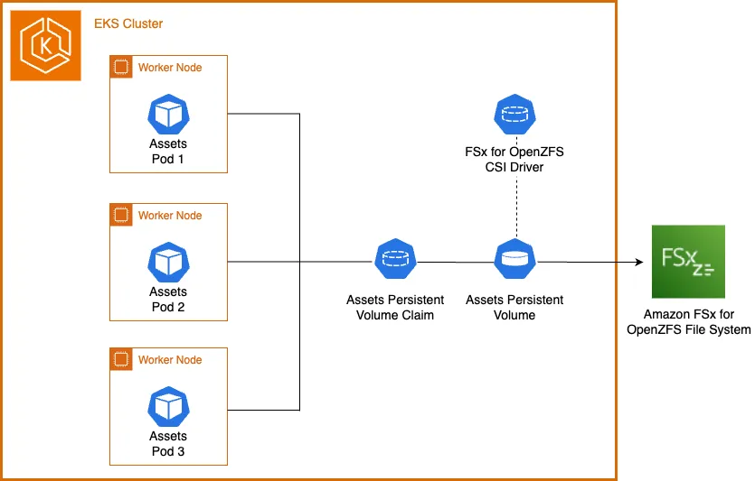

Before diving into this section, you should be familiar with the Kubernetes storage objects (volumes, persistent volumes (PV), persistent volume claims (PVC), dynamic provisioning and ephemeral storage) that were introduced in the [Storage](../index.md) main section.

The [Amazon FSx for OpenZFS Container Storage Interface (CSI) Driver](https://github.com/kubernetes-sigs/aws-fsx-openzfs-csi-driver) enables you to run stateful containerized applications by providing a CSI interface that allows Kubernetes clusters running on AWS to manage the lifecycle of Amazon FSx for OpenZFS file systems and volumes.  The following architecture diagram illustrates how we will use Amazon FSx for OpenZFS as persistent storage for our EKS pods:



To utilize Amazon FSx for OpenZFS with dynamic provisioning on our EKS cluster, we first need to create an IAM role allowed to interact with FSx.  Once the IAM role has been created we can install the CSI driver.  The driver implements the CSI specification which allows container orchestrators to manage Amazon FSx for OpenZFS file systems and volumes throughout their lifecycle.

First create the IAM role and attach the policy:

```bash timeout=300 wait=60
$ eksctl create iamserviceaccount \
    --name fsx-openzfs-csi-controller-sa \
    --namespace kube-system \
    --cluster $EKS_CLUSTER_NAME \
    --attach-policy-arn arn:aws:iam::aws:policy/AmazonFSxFullAccess \
    --approve \
    --role-name eks-workshop-FSxOpenZFSCSIDriverFullAccess \
    --region $REGION
```

Now that the IAM role has been created and the FSx policy attached, use Helm to add the repository and install the FSx for OpenZFS CSI driver:

```bash timeout=300 wait=60
$ helm repo add aws-fsx-openzfs-csi-driver https://kubernetes-sigs.github.io/aws-fsx-openzfs-csi-driver
$ helm repo update
$ helm upgrade --install aws-fsx-openzfs-csi-driver \
    --namespace kube-system \
    --set controller.serviceAccount.create=false \
    aws-fsx-openzfs-csi-driver/aws-fsx-openzfs-csi-driver
```

Let's examine what the driver has created in our EKS cluster. For example, a DaemonSet that runs a pod on each node in our cluster:

```bash
$ kubectl get daemonset fsx-openzfs-csi-node -n kube-system
NAME                   DESIRED   CURRENT   READY   UP-TO-DATE   AVAILABLE   NODE SELECTOR                 AGE
fsx-openzfs-csi-node   3         3         3       3            3           kubernetes.io/os=linux        52s
```

The FSx for OpenZFS CSI driver supports both dynamic and static provisioning. For dynamic provisioning, the driver can create both an FSx for OpenZFS file system as well as a volume on an existing file system.  Static provisioning allows association of a pre-created FSx for OpenZFS file system or volume with a PersistentVolume (PV) for consumption within Kubernetes.  The driver also supports creation of NFS mount options, volume snapshots, and allows for volume resizing.

In this lab we'll use dynamic provisioning by creating a [StorageClass](https://kubernetes.io/docs/concepts/storage/storage-classes/) object configured to deploy an FSx for OpenZFS file system.  Once deployed we'll again use dynamic provisioning to create an additional StorageClass object configured to deploy a volume on our newly created FSx for OpenZFS file system.

Using Kustomize, we'll create the file system storage class and inject the `PRIVATE_SUBNET0`, `VPC_CIDR`, and `FSXZ_SG` environment variables into the `SubnetIds`, `RootVolumeConfiguration`, and `SecurityGroupIds` parameters respectively:

```file
manifests/modules/fundamentals/storage/fsxz/storageclass-fs/fsxz-fs-sc.yaml
```

Apply the kustomization:

```bash
$ kubectl kustomize ~/environment/eks-workshop/modules/fundamentals/storage/fsxz/storageclass-fs \
  | envsubst | kubectl apply -f-
```

Let's examine the StorageClass. Note that it uses the FSx OpenZFS CSI driver as the provisioner and is updated with the Subnet ID, VPC CIDR, and Security Group ID we exported earlier:

```bash
$ kubectl describe sc fsxz-fs-sc
Name:            fsxz-fs-sc
IsDefaultClass:  No
Annotations:     kubectl.kubernetes.io/last-applied-configuration={"allowVolumeExpansion":true,"apiVersion":"storage.k8s.io/v1","kind":"StorageClass","metadata":{"annotations":{},"name":"fsxz-fs-sc"},"mountOptions":["nfsvers=4.1","rsize=1048576","wsize=1048576","timeo=600"],"parameters":{"AutomaticBackupRetentionDays":"0","CopyTagsToBackups":"false","CopyTagsToVolumes":"false","DailyAutomaticBackupStartTime":"\"00:00\"","DeploymentType":"\"SINGLE_AZ_HA_2\"","DiskIopsConfiguration":"{\"Mode\": \"AUTOMATIC\"}","OptionsOnDeletion":"[\"DELETE_CHILD_VOLUMES_AND_SNAPSHOTS\"]","ResourceType":"filesystem","RootVolumeConfiguration":"{\"CopyTagsToSnapshots\": false, \"DataCompressionType\": \"LZ4\", \"NfsExports\": [{\"ClientConfigurations\": [{\"Clients\": \"10.42.0.0/16\", \"Options\": [\"rw\",\"crossmnt\",\"no_root_squash\"]}]}], \"ReadOnly\": false, \"RecordSizeKiB\": 128}","SecurityGroupIds":"sg-08a44ccd82ced2a2d","SkipFinalBackupOnDeletion":"true","SubnetIds":"subnet-0aeb35fb3c5f0041a","Tags":"[{\"Key\": \"Name\", \"Value\": \"FSxZ-EKS\"}]","ThroughputCapacity":"640","WeeklyMaintenanceStartTime":"\"7:09:00\""},"provisioner":"fsx.openzfs.csi.aws.com","reclaimPolicy":"Delete"}

Provisioner:           fsx.openzfs.csi.aws.com
Parameters:            AutomaticBackupRetentionDays=0,CopyTagsToBackups=false,CopyTagsToVolumes=false,DailyAutomaticBackupStartTime="00:00",DeploymentType="SINGLE_AZ_HA_2",DiskIopsConfiguration={"Mode": "AUTOMATIC"},OptionsOnDeletion=["DELETE_CHILD_VOLUMES_AND_SNAPSHOTS"],ResourceType=filesystem,RootVolumeConfiguration={"CopyTagsToSnapshots": false, "DataCompressionType": "LZ4", "NfsExports": [{"ClientConfigurations": [{"Clients": "10.42.0.0/16", "Options": ["rw","crossmnt","no_root_squash"]}]}], "ReadOnly": false, "RecordSizeKiB": 128},SecurityGroupIds=sg-08a44ccd82ced2a2d,SkipFinalBackupOnDeletion=true,SubnetIds=subnet-0aeb35fb3c5f0041a,Tags=[{"Key": "Name", "Value": "FSxZ-EKS"}],ThroughputCapacity=640,WeeklyMaintenanceStartTime="7:09:00"
AllowVolumeExpansion:  True
MountOptions:
  nfsvers=4.1
  rsize=1048576
  wsize=1048576
  timeo=600
ReclaimPolicy:      Delete
VolumeBindingMode:  Immediate
Events:             <none>
```
Now that we understand EKS StorageClasses and the FSx for OpenZFS CSI driver, we'll proceed to modify the assets microservice to use the FSx for OpenZFS StorageClass with Kubernetes dynamic provisioning to create a new Amazon FSx for OpenZFS file system.  Once the file system creation completes, we can update the volume StorageClass and again use Kubernetes dynamic provisioning to create a PersistentVolume for storing product images.