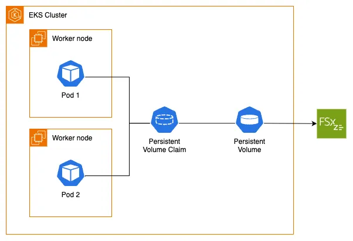

Before diving into this section, you should be familiar with the Kubernetes storage objects (volumes, persistent volumes (PV), persistent volume claims (PVC), dynamic provisioning and ephemeral storage) that were introduced in the main [Storage](../index.md) section.

The [Amazon FSx for OpenZFS Container Storage Interface (CSI) Driver](https://github.com/kubernetes-sigs/aws-fsx-openzfs-csi-driver) enables you to run stateful containerized applications by providing a CSI interface that allows Kubernetes clusters running on AWS to manage the lifecycle of Amazon FSx for OpenZFS file systems and volumes.

The following architecture diagram illustrates how we will use FSx for OpenZFS as persistent storage for our EKS pods:



To utilize Amazon FSx for OpenZFS with dynamic provisioning on our EKS cluster, we first need to confirm that we have the FSx for OpenZFS CSI Driver installed. The driver implements the CSI specification which allows container orchestrators to manage Amazon FSx for OpenZFS file systems and volumes throughout their lifecycle.

As part of the lab preparation, an IAM role has already been created for the CSI driver to call the appropriate AWS APIs.

We'll use Helm to add the repository and install the FSx for OpenZFS CSI driver with a chart:

```bash timeout=300 wait=60
$ helm repo add aws-fsx-openzfs-csi-driver https://kubernetes-sigs.github.io/aws-fsx-openzfs-csi-driver
$ helm repo update
$ helm upgrade --install aws-fsx-openzfs-csi-driver \
    --namespace kube-system --wait \
    --set "controller.serviceAccount.annotations.eks\\.amazonaws\\.com/role-arn"="$FSXZ_IAM_ROLE" \
    aws-fsx-openzfs-csi-driver/aws-fsx-openzfs-csi-driver
```

Let's examine what the chart has created in our EKS cluster. For example, a DaemonSet that runs a pod on each node in our cluster:

```bash
$ kubectl get daemonset fsx-openzfs-csi-node -n kube-system
NAME                   DESIRED   CURRENT   READY   UP-TO-DATE   AVAILABLE   NODE SELECTOR                 AGE
fsx-openzfs-csi-node   3         3         3       3            3           kubernetes.io/os=linux        52s
```

The FSx for OpenZFS CSI driver supports both dynamic and static provisioning. For dynamic provisioning, the driver can create both an FSx for OpenZFS file system as well as a volume on an existing file system. Static provisioning allows association of a pre-created FSx for OpenZFS file system or volume with a PersistentVolume (PV) for consumption within Kubernetes. The driver also supports creation of NFS mount options, volume snapshots, and allows for volume resizing.

As a part of the lab preparation, the FSx for OpenZFS file system has already been created for your use. In this lab you'll use dynamic provisioning by creating a [StorageClass](https://kubernetes.io/docs/concepts/storage/storage-classes/) object configured to deploy an FSx for OpenZFS volume.

An FSx for OpenZFS file system has been provisioned for us, along with the required security group that includes an inbound rule allowing NFS traffic to the FSx mount points. Let's get its ID which we'll need later:

```bash
$ export FSXZ_FS_ID=$(aws fsx describe-file-systems --query "FileSystems[?Tags[?Key=='Name' && Value=='$EKS_CLUSTER_NAME-FSxZ']] | [0].FileSystemId" --output text)
$ echo $FSXZ_FS_ID
fs-0123456789abcdef0
```

The FSx for OpenZFS CSI driver supports both dynamic and static provisioning:

- **Dynamic provisioning**: The driver can create both an FSx for OpenZFS file system as well as a volume on an existing file system. This requires an existing AWS FSx for OpenZFS file system that must be specified in the StorageClass parameters.
- **Static provisioning**: This also requires a pre-created AWS FSx for OpenZFS file system or volume, which can then be mounted as a volume inside a container using the driver.

When the FSx for OpenZFS file system was created by the workshop, a root volume for the file system was created as well. It is best practice not to store data in the root volume, but instead create separate child volumes of the root and store data in them. Since the root volume was created by the workshop, you can obtain its volume ID and create a child volume below it within the file system.

Run the following to obtain the root volume ID and set it to an environment variable we'll inject into the volume StorageClass using Kustomize:

```bash
$ export ROOT_VOL_ID=$(aws fsx describe-file-systems --file-system-id $FSXZ_FS_ID | jq -r '.FileSystems[] | .OpenZFSConfiguration.RootVolumeId')
$ echo $ROOT_VOL_ID
fsvol-0123456789abcdef0
```

Next, we'll create a [StorageClass](https://kubernetes.io/docs/concepts/storage/storage-classes/) object configured to use our pre-provisioned FSx for OpenZFS file system and create child volumes in provisioning mode.

Using Kustomize, we'll create the storage class and inject the `ROOT_VOL_ID`, `VPC_CIDR`, and `EKS_CLUSTER_NAME` environment variables into the `ParentVolumeId`, `NfsExports`, and `Name` parameters respectively:

```file
manifests/modules/fundamentals/storage/fsxz/storageclass/fsxzstorageclass.yaml
```

Apply the kustomization:

```bash
$ kubectl kustomize ~/environment/eks-workshop/modules/fundamentals/storage/fsxz/storageclass \
  | envsubst | kubectl apply -f-
storageclass.storage.k8s.io/fsxz-vol-sc created
```

Let's examine the StorageClass. Note that it uses the FSx for OpenZFS CSI driver as the provisioner and is configured for volume provisioning mode with the root volume ID we exported earlier:

```bash
$ kubectl get storageclass
NAME            PROVISIONER                RECLAIMPOLICY   VOLUMEBINDINGMODE      ALLOWVOLUMEEXPANSION   AGE
fsxz-vol-sc     fsx.openzfs.csi.aws.com    Delete          Immediate              false                  8m29s
$ kubectl describe sc fsxz-vol-sc
Name:            fsxz-vol-sc
IsDefaultClass:  No
Annotations:     kubectl.kubernetes.io/last-applied-configuration={"allowVolumeExpansion":false,"apiVersion":"storage.k8s.io/v1","kind":"StorageClass","metadata":{"annotations":{},"name":"fsxz-vol-sc"},"mountOptions":["nfsvers=4.1","rsize=1048576","wsize=1048576","timeo=600","nconnect=16"],"parameters":{"CopyTagsToSnapshots":"false","DataCompressionType":"\"LZ4\"","NfsExports":"[{\"ClientConfigurations\": [{\"Clients\": \"10.42.0.0/16\", \"Options\": [\"rw\",\"crossmnt\",\"no_root_squash\"]}]}]","OptionsOnDeletion":"[\"DELETE_CHILD_VOLUMES_AND_SNAPSHOTS\"]","ParentVolumeId":"\"fsvol-0efa720c2c77956a4\"","ReadOnly":"false","RecordSizeKiB":"128","ResourceType":"volume","Tags":"[{\"Key\": \"Name\", \"Value\": \"eks-workshop-data\"}]"},"provisioner":"fsx.openzfs.csi.aws.com","reclaimPolicy":"Delete"}

Provisioner:           fsx.openzfs.csi.aws.com
Parameters:            CopyTagsToSnapshots=false,DataCompressionType="LZ4",NfsExports=[{"ClientConfigurations": [{"Clients": "10.42.0.0/16", "Options": ["rw","crossmnt","no_root_squash"]}]}],OptionsOnDeletion=["DELETE_CHILD_VOLUMES_AND_SNAPSHOTS"],ParentVolumeId="fsvol-0efa720c2c77956a4",ReadOnly=false,RecordSizeKiB=128,ResourceType=volume,Tags=[{"Key": "Name", "Value": "eks-workshop-data"}]
AllowVolumeExpansion:  False
MountOptions:
  nfsvers=4.1
  rsize=1048576
  wsize=1048576
  timeo=600
  nconnect=16
ReclaimPolicy:      Delete
VolumeBindingMode:  Immediate
Events:             <none>
```

Now that we understand the FSx for OpenZFS StorageClass and how the FSx for OpenZFS CSI driver works, we're ready to proceed to the next step where we'll modify the UI component to use the FSx for OpenZFS `StorageClass` with Kubernetes dynamic volume provisioning and a PersistentVolume for storing product images.
