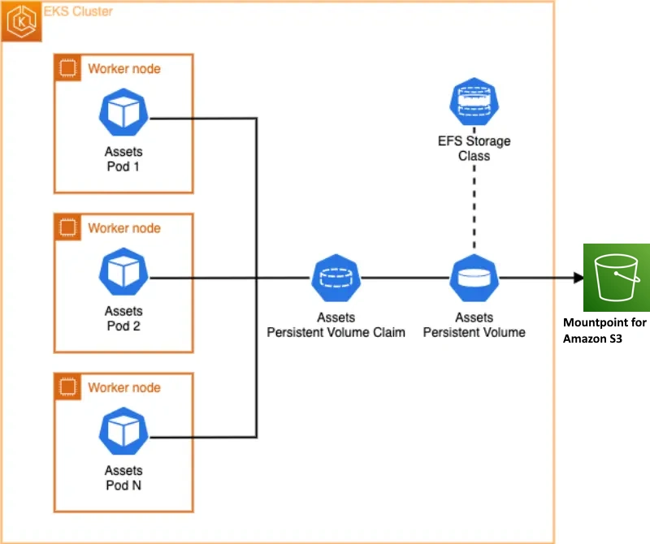

Before we dive into this section, make sure to familiarized yourself with the Kubernetes storage objects (volumes, persistent volumes (PV), persistent volume claim (PVC), dynamic provisioning and ephemeral storage) that were introduced on the [Storage](../index.md) main section.

The [Mountpoint for Amazon S3 Container Storage Interface (CSI) Driver](https://github.com/awslabs/mountpoint-s3-csi-driver) allows your Kubernetes applications to access Amazon S3 objects through a file system interface. Built on [Mountpoint for Amazon S3](https://github.com/awslabs/mountpoint-s3), the Mountpoint CSI driver presents an Amazon S3 bucket as a storage volume accessible by containers in your Kubernetes cluster. The Mountpoint CSI driver implements the [CSI](https://github.com/container-storage-interface/spec/blob/master/spec.md) specification for container orchestrators (CO) to manage storage volumes.

Here is a basic architecture diagram that shows we will be using Mountpoint for Amazon S3 as the persistent storage for our EKS pods:



We will start by creating a directory to stage the images that we need for our image hosting web application:

```bash
$ mkdir assets-images
$ cd assets-images
$ curl --remote-name-all https://raw.githubusercontent.com/aws-containers/retail-store-sample-app/main/src/assets/public/assets/{chrono_classic.jpg,gentleman.jpg,pocket_watch.jpg,smart_2.jpg,wood_watch.jpg}
  % Total    % Received % Xferd  Average Speed   Time    Time     Time  Current
                                 Dload  Upload   Total   Spent    Left  Speed
100 98157  100 98157    0     0   242k      0 --:--:-- --:--:-- --:--:--  242k
  % Total    % Received % Xferd  Average Speed   Time    Time     Time  Current
                                 Dload  Upload   Total   Spent    Left  Speed
100 58439  100 58439    0     0   214k      0 --:--:-- --:--:-- --:--:--  214k
  % Total    % Received % Xferd  Average Speed   Time    Time     Time  Current
                                 Dload  Upload   Total   Spent    Left  Speed
100 58655  100 58655    0     0   260k      0 --:--:-- --:--:-- --:--:--  260k
  % Total    % Received % Xferd  Average Speed   Time    Time     Time  Current
                                 Dload  Upload   Total   Spent    Left  Speed
100 20795  100 20795    0     0  96273      0 --:--:-- --:--:-- --:--:-- 96273
  % Total    % Received % Xferd  Average Speed   Time    Time     Time  Current
                                 Dload  Upload   Total   Spent    Left  Speed
100 43122  100 43122    0     0   244k      0 --:--:-- --:--:-- --:--:--  243k
$ ls 
chrono_classic.jpg  gentleman.jpg  pocket_watch.jpg  smart_2.jpg  wood_watch.jpg
```

Now we can copy our image host assets into the S3 bucket using `aws s3`:

```bash
$ cd ..
$ aws s3 cp assets-images/ s3://$BUCKET_NAME/ --recursive
upload: assets-images/smart_2.jpg to s3://eks-workshop-mountpoint-s320241014192132282600000002/smart_2.jpg
upload: assets-images/wood_watch.jpg to s3://eks-workshop-mountpoint-s320241014192132282600000002/wood_watch.jpg
upload: assets-images/gentleman.jpg to s3://eks-workshop-mountpoint-s320241014192132282600000002/gentleman.jpg
upload: assets-images/pocket_watch.jpg to s3://eks-workshop-mountpoint-s320241014192132282600000002/pocket_watch.jpg
upload: assets-images/chrono_classic.jpg to s3://eks-workshop-mountpoint-s320241014192132282600000002/chrono_classic.jpg
````

We can also use `aws s3 ls` to view the objects in the bucket we just uploaded:

```bash
$ aws s3 ls $BUCKET_NAME
2024-10-14 19:29:05      98157 chrono_classic.jpg
2024-10-14 19:29:05      58439 gentleman.jpg
2024-10-14 19:29:05      58655 pocket_watch.jpg
2024-10-14 19:29:05      20795 smart_2.jpg
2024-10-14 19:29:05      43122 wood_watch.jpg
```
Now that we have uploaded our initial objects to the Amazon S3 bucket, we will use the Mountpoint for Amazon S3 CSI driver to provide persistent, shared storage for our pods.

Let's attach the Mountpoint for Amazon S3 CSI addon to EKS cluster. This step will take a few minutes:

```bash
$ eksctl create addon --name aws-mountpoint-s3-csi-driver --cluster $EKS_CLUSTER_NAME --service-account-role-arn $S3_CSI_ADDON_ROLE --force
2024-10-14 19:31:00 [ℹ]  Kubernetes version "1.30" in use by cluster "eks-workshop"
2024-10-14 19:31:01 [ℹ]  IRSA is set for "aws-mountpoint-s3-csi-driver" addon; will use this to configure IAM permissions
2024-10-14 19:31:01 [ℹ]  using provided ServiceAccountRoleARN "arn:aws:iam::010526255481:role/eks-workshop-s3-csi-20241014192132277700000001"
2024-10-14 19:31:01 [ℹ]  creating addon
2024-10-14 19:31:47 [ℹ]  addon "aws-mountpoint-s3-csi-driver" active
```
After the command has completed, we can show what it created in the EKS cluster by the addon:

```bash
$ kubectl get daemonset s3-csi-node -n kube-system
NAME          DESIRED   CURRENT   READY   UP-TO-DATE   AVAILABLE   NODE SELECTOR            AGE
s3-csi-node   3         3         3       3            3           kubernetes.io/os=linux   61s
```