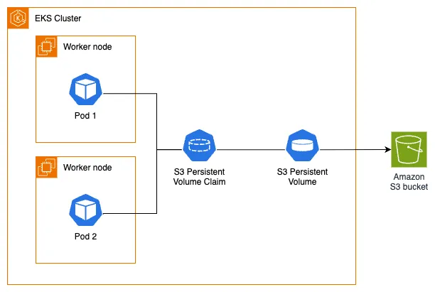

Before proceeding with this section, it's important to understand the Kubernetes storage concepts (volumes, persistent volumes (PV), persistent volume claims (PVC), dynamic provisioning, and ephemeral storage) that were covered in the main [Storage](../index.md) section.

The [Mountpoint for Amazon S3 Container Storage Interface (CSI) Driver](https://github.com/awslabs/mountpoint-s3-csi-driver) enables Kubernetes applications to access Amazon S3 objects through a standard file system interface. Built on [Mountpoint for Amazon S3](https://github.com/awslabs/mountpoint-s3), the Mountpoint CSI driver exposes an Amazon S3 bucket as a storage volume that containers in your Kubernetes cluster can seamlessly access. The driver implements the [CSI](https://github.com/container-storage-interface/spec/blob/master/spec.md) specification, allowing container orchestrators (CO) to efficiently manage storage volumes.

The following architecture diagram illustrates how we will use Mountpoint for Amazon S3 as persistent storage for our Pods:



Let's begin by creating a staging directory for the images needed by our image hosting web application:

```bash
$ mkdir ~/environment/assets-images/
$ wget https://github.com/aws-containers/retail-store-sample-app/releases/download/v1.2.1/sample-images.zip \
  -O /tmp/sample-images.zip
$ unzip /tmp/sample-images.zip -d ~/environment/assets-images/
Archive:  /tmp/sample-images.zip
  inflating: /home/ec2-user/environment/assets-images/1ca35e86-4b4c-4124-b6b5-076ba4134d0d.jpg
  inflating: /home/ec2-user/environment/assets-images/4f18544b-70a5-4352-8e19-0d070f46745d.jpg
  inflating: /home/ec2-user/environment/assets-images/631a3db5-ac07-492c-a994-8cd56923c112.jpg
  inflating: /home/ec2-user/environment/assets-images/79bce3f3-935f-4912-8c62-0d2f3e059405.jpg
  inflating: /home/ec2-user/environment/assets-images/8757729a-c518-4356-8694-9e795a9b3237.jpg
  inflating: /home/ec2-user/environment/assets-images/87e89b11-d319-446d-b9be-50adcca5224a.jpg
  inflating: /home/ec2-user/environment/assets-images/a1258cd2-176c-4507-ade6-746dab5ad625.jpg
  inflating: /home/ec2-user/environment/assets-images/cc789f85-1476-452a-8100-9e74502198e0.jpg
  inflating: /home/ec2-user/environment/assets-images/d27cf49f-b689-4a75-a249-d373e0330bb5.jpg
  inflating: /home/ec2-user/environment/assets-images/d3104128-1d14-4465-99d3-8ab9267c687b.jpg
  inflating: /home/ec2-user/environment/assets-images/d4edfedb-dbe9-4dd9-aae8-009489394955.jpg
  inflating: /home/ec2-user/environment/assets-images/d77f9ae6-e9a8-4a3e-86bd-b72af75cbc49.jpg
```

Next, we'll copy these image assets to our S3 bucket using the `aws s3 cp` command:

```bash
$ aws s3 cp ~/environment/assets-images/ s3://$BUCKET_NAME/
upload: assets-images/79bce3f3-935f-4912-8c62-0d2f3e059405.jpg to s3://eks-workshop-mountpoint-s320250709143521722200000002/79bce3f3-935f-4912-8c62-0d2f3e059405.jpg
[...]
```

We can verify the uploaded objects in our bucket using the `aws s3 ls` command to list the contents:

```bash
$ aws s3 ls $BUCKET_NAME
2025-07-09 14:43:36     102950 1ca35e86-4b4c-4124-b6b5-076ba4134d0d.jpg
2025-07-09 14:43:36     118546 4f18544b-70a5-4352-8e19-0d070f46745d.jpg
2025-07-09 14:43:36     147820 631a3db5-ac07-492c-a994-8cd56923c112.jpg
2025-07-09 14:43:36     100117 79bce3f3-935f-4912-8c62-0d2f3e059405.jpg
2025-07-09 14:43:36     106911 8757729a-c518-4356-8694-9e795a9b3237.jpg
2025-07-09 14:43:36     113010 87e89b11-d319-446d-b9be-50adcca5224a.jpg
2025-07-09 14:43:36     171045 a1258cd2-176c-4507-ade6-746dab5ad625.jpg
2025-07-09 14:43:36     170438 cc789f85-1476-452a-8100-9e74502198e0.jpg
2025-07-09 14:43:36      97592 d27cf49f-b689-4a75-a249-d373e0330bb5.jpg
2025-07-09 14:43:36     169246 d3104128-1d14-4465-99d3-8ab9267c687b.jpg
2025-07-09 14:43:36     151884 d4edfedb-dbe9-4dd9-aae8-009489394955.jpg
2025-07-09 14:43:36     134344 d77f9ae6-e9a8-4a3e-86bd-b72af75cbc49.jpg
```

With our initial objects now in the Amazon S3 bucket, we'll configure the Mountpoint for Amazon S3 CSI driver to provide persistent, shared storage for our Pods.

Let's install the Mountpoint for Amazon S3 CSI addon to our EKS cluster. This operation will take a few minutes to complete:

```bash
$ aws eks create-addon --cluster-name $EKS_CLUSTER_NAME --addon-name aws-mountpoint-s3-csi-driver \
  --service-account-role-arn $S3_CSI_ADDON_ROLE
$ aws eks wait addon-active --cluster-name $EKS_CLUSTER_NAME --addon-name aws-mountpoint-s3-csi-driver
```

Once completed, we can verify what the addon created in our EKS cluster by checking the DaemonSet that was deployed:

```bash
$ kubectl get daemonset s3-csi-node -n kube-system
NAME          DESIRED   CURRENT   READY   UP-TO-DATE   AVAILABLE   NODE SELECTOR            AGE
s3-csi-node   3         3         3       3            3           kubernetes.io/os=linux   61s
```
