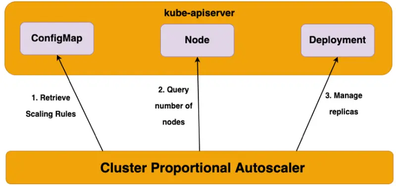

::required-time

:::tip Before you start
Prepare your environment for this section:

```bash timeout=300 wait=30
$ prepare-environment autoscaling/workloads/cpa
```

:::

In this lab, we'll learn about [Cluster Proportional Autoscaler](https://github.com/kubernetes-sigs/cluster-proportional-autoscaler) and how to scale applications proportional to the size of the cluster compute.

Cluster Proportional Autoscaler (CPA) is a horizontal pod autoscaler that scales replicas based on the number of nodes in a cluster. The proportional autoscaler container watches over the number of schedulable nodes and cores of a cluster and resizes the number of replicas accordingly. This functionality is desirable for applications that need to be autoscaled with the size of the cluster, such as CoreDNS and other services that scale with the number of nodes/pods in a cluster.

CPA works by running Golang API clients inside pods that connect to the API Server and poll the number of nodes and cores in the cluster. The scaling parameters and data points are provided via a ConfigMap to the autoscaler, which refreshes its parameters table every poll interval to use the latest desired scaling parameters. Unlike other autoscalers, CPA does not rely on the Metrics API and does not require the Metrics Server.



Some of the main use cases for CPA include:

- Over-provisioning
- Scaling core platform services
- Simple and easy mechanism to scale workloads as it does not require metrics server or prometheus adapter

## Scaling Methods used by Cluster Proportional Autoscaler

### Linear

- This scaling method will scale the application in direct proportion to how many nodes or cores are available in a cluster
- Either one of the `coresPerReplica` or `nodesPerReplica` could be omitted
- When `preventSinglePointFailure` is set to `true`, the controller ensures at least 2 replicas if there are more than one node
- When `includeUnschedulableNodes` is set to `true`, the replicas will be scaled based on the total number of nodes. Otherwise, the replicas will only scale based on the number of schedulable nodes (i.e., cordoned and draining nodes are excluded)
- All of `min`, `max`, `preventSinglePointFailure`, `includeUnschedulableNodes` are optional. If not set, `min` will be defaulted to 1, `preventSinglePointFailure` will be defaulted to `false` and `includeUnschedulableNodes` will be defaulted to `false`
- Both `coresPerReplica` and `nodesPerReplica` are float values

### ConfigMap for Linear

```text
data:
  linear: |-
    {
      "coresPerReplica": 2,
      "nodesPerReplica": 1,
      "min": 1,
      "max": 100,
      "preventSinglePointFailure": true,
      "includeUnschedulableNodes": true
    }
```

**The Equation of Linear Control Mode:**

```text
replicas = max( ceil( cores * 1/coresPerReplica ) , ceil( nodes * 1/nodesPerReplica ) )
replicas = min(replicas, max)
replicas = max(replicas, min)
```

### Ladder

- This scaling method uses a step function to determine the ratio of nodes:replicas and/or cores:replicas
- The step ladder function uses the data point for core and node scaling from the ConfigMap. The lookup which yields the higher number of replicas will be used as the target scaling number
- Either one of the `coresPerReplica` or `nodesPerReplica` could be omitted
- Replicas can be set to 0 (unlike in linear mode)
- Scaling to 0 replicas could be used to enable optional features as a cluster grows

### ConfigMap for Ladder

```text
data:
  ladder: |-
    {
      "coresToReplicas":
      [
        [ 1, 1 ],
        [ 64, 3 ],
        [ 512, 5 ],
        [ 1024, 7 ],
        [ 2048, 10 ],
        [ 4096, 15 ]
      ],
      "nodesToReplicas":
      [
        [ 1, 1 ],
        [ 2, 2 ]
      ]
    }
```

### Comparison to Horizontal Pod Autoscaler

Horizontal Pod Autoscaler is a top level Kubernetes API resource. HPA is a closed feedback loop autoscaler which monitors CPU/Memory utilization of the pods and scales the number of replicas automatically. HPA relies on the Metrics API and requires Metrics Server, whereas Cluster Proportional Autoscaler does not use Metrics Server nor the Metrics API.

Cluster Proportional Autoscaler is not configured with a Kubernetes resource but instead uses flags to identify target workloads and a ConfigMap for scaling configuration. CPA provides a simple control loop that watches the cluster size and scales the target controller. The inputs for CPA are the number of schedulable cores and nodes in the cluster.

In this lab, we'll demonstrate scaling the CoreDNS system component of the EKS cluster proportional to the amount of compute in the cluster.
