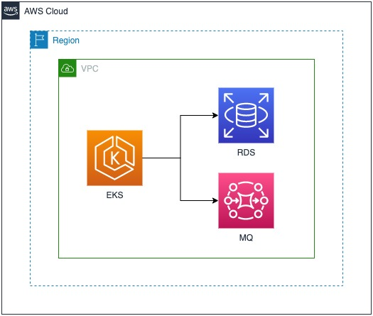

[AWS Controllers for Kubernetes (ACK)](https://aws-controllers-k8s.github.io/community/) lets you define and use AWS service resources directly from Kubernetes. 
With ACK, you can take advantage of AWS-managed services for your Kubernetes applications without needing to define resources outside of the cluster or run services that provide supporting capabilities like databases or message queues within the cluster.

The sample application can be can be run completly inside the cluster including stateful workloads like database and message workers, this is a good
approach when you are developing the application. When the team wants to make the application available in other stages like testing and production
they will use AWS managed services such as Amazon RDS database and Amazon MQ broker. This allows you to focus on your customers and business projects and not worrring on managing a database or message broker yourself.

In this module we will leverage ACK to provision these services and create
secrets and configmaps containing the binding information connecting the application to these AWS managed services.

