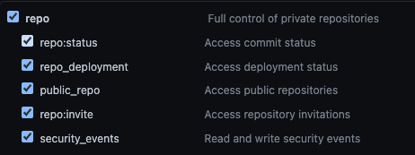

In this section we will connect our cluster to a GitHub configuration repository for GitOps based delivery. This repository will hold the application deployment configuration.
Follow the below steps to complete the process.

## Generate GitHub token

As part of the bootstrap process of flux (described below), Flux commit changes into the target git configurartion repository (or create it if it doesn't exists). For that we will have to create a ["personal access token"](https://docs.github.com/en/authentication/keeping-your-account-and-data-secure/creating-a-personal-access-token) for GitHub. This is described in the [Flux documentation](https://fluxcd.io/flux/installation/#github-and-github-enterprise) as well.
Grant your created access token a `repo` permission as shown in the image below ("Full control of private repositories"):



Keep this token in a safe location, and set it up as environment variable on your terminal (replace the `<YOUR-TOKEN>` with your actual token value). It will later be used by the Flux CLI.

```bash
export GITHUB_TOKEN=<YOUR-TOKEN>
```

Configure your GitHub username as environment variable as well. Replace the `<GITHUB_USER>`

```bash
export GITHUB_USER=<GITHUB_USER>
```

## Install the Flux v2 CLI

First we will install the Flux CLI. Following Flux [documentation](https://fluxcd.io/flux/installation/), we will use the general script that can be run from Mac or Linux

```bash
curl -s https://fluxcd.io/install.sh | sudo bash
[INFO]  Downloading metadata https://api.github.com/repos/fluxcd/flux2/releases/latest
[INFO]  Using 0.34.0 as release
[INFO]  Downloading hash https://github.com/fluxcd/flux2/releases/download/v0.34.0/flux_0.34.0_checksums.txt
[INFO]  Downloading binary https://github.com/fluxcd/flux2/releases/download/v0.34.0/flux_0.34.0_linux_amd64.tar.gz
[INFO]  Verifying binary download
which: no shasum in (/sbin:/bin:/usr/sbin:/usr/bin)
[INFO]  Installing flux to /usr/local/bin/flux
```

Verify your installation. You should expect a version equal to or higher than the version shown below

```bash
flux --version
flux version 0.34.0
```

## Bootstrap the cluster

The bootstrap process, install Flux components on your cluster, create a GitHub repository if it's not already exists, and create the relevant files within the repository for managing clusters object using GitOps with Flux.

```bash
export GITHUB_REPO=eksworkshop-gitops-config-flux
```

Before bootstraping the cluster, Flux allows us to run pre-bootstrap checks verify that everything is set up correctly. Run the following command for Flux CLI to perform the checks

```bash
flux check --pre
► checking prerequisites
✔ Kubernetes 1.23.7-eks-4721010 >=1.20.6-0
✔ prerequisites checks passed
```

After setting up all the relevant environment variables, use the following command to bootstrap Flux v2 to the cluster:

```bash
flux bootstrap github --owner=${GITHUB_USER} --repository=${GITHUB_REPO} --branch=main --path=clusters/production --personal
► connecting to github.com
✔ repository "https://github.com/aws-samples/eksworkshop-gitops-config-flux" created
► cloning branch "main" from Git repository "https://github.com/aws-samples/eksworkshop-gitops-config-flux.git"
✔ cloned repository
► generating component manifests
✔ generated component manifests
✔ committed sync manifests to "main" ("9c4c88c70850de286e2a69c7f294126f2cccc001")
► pushing component manifests to "https://github.com/aws-samples/eksworkshop-gitops-config-flux.git"
► installing components in "flux-system" namespace
✔ installed components
✔ reconciled components
► determining if source secret "flux-system/flux-system" exists
► generating source secret
✔ public key: ecdsa-sha2-nistp384 AAAAE2VjZHNhLXNoYTItbmlzdHAzODQAAAAIbmlzdHAzODQAAABhBBW/iTTFHicYwKpRkqd1kaoN7rx3HVixEhR2VRs9Tq1+NRfB2KuON+EzJ1thsEdhmhQ8tA6290Stgh41/dV0FfCQgH2mUbPrKdq8hLg10zN46EAUyg++115zH/ObLzhm6Q==
✔ configured deploy key "flux-system-main-flux-system-./clusters/production" for "https://github.com/aws-samples/eksworkshop-gitops-config-flux"
► applying source secret "flux-system/flux-system"
✔ reconciled source secret
► generating sync manifests
✔ generated sync manifests
✔ committed sync manifests to "main" ("6e6ae1d1fdd56f2db44cc3af4f51cb282201b13d")
► pushing sync manifests to "https://github.com/aws-samples/eksworkshop-gitops-config-flux.git"
► applying sync manifests
✔ reconciled sync configuration
◎ waiting for Kustomization "flux-system/flux-system" to be reconciled
✔ Kustomization reconciled successfully
► confirming components are healthy
✔ helm-controller: deployment ready
✔ kustomize-controller: deployment ready
✔ notification-controller: deployment ready
✔ source-controller: deployment ready
✔ all components are healthy
```

Let's break down the command above:
First we tell Flux to bootstrap a GitHub repository. Flux support several git hosting services as described here.
After that, we are passing the GitHub user (`owner`), `repository`, and `branch` that we want flux to point its controllers to for reconciliation process.
We are also passing the path within the repository, where flux will store the configuration for the specific cluster. It means, that a single repository, can store multiple paths that will be connected to multiple repository. A more complex example of Flux implementation of multiple environment exists in this [flux-eks-gitops-config](https://github.com/aws-samples/flux-eks-gitops-config) sample. For the simplicity of this workshop, we will use a single environment called `prodcution`, that its configuration within the repository stored under the path `clusters/production`

Now we can verify that the bootstrap process completed successfully by running the following command:

```bash
flux get kustomization
NAME            REVISION        SUSPENDED       READY   MESSAGE
flux-system     main/6e6ae1d    False           True    Applied revision: main/6e6ae1d
```

That shows that flux created the basic kustomization, and that it's in sync with the cluster.

Next step - clone our newly created repository, and deploy our application using Flux with GitOps based delivery
