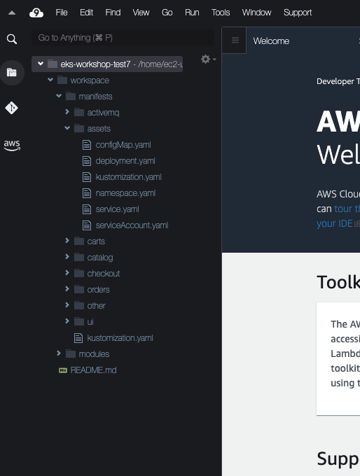

The sample application is composed of a set of Kubernetes manifests organized in a way that can be easily applied with Kustomize. Kustomize is an open-source tool also provided as a native feature of the `kubectl` CLI. This workshop uses Kustomize to apply changes to Kubernetes manifests, making it easier to understand changes to manifest files without needing to manually edit YAML. As we work through the various modules of this workshop, we'll incrementally apply overlays and patches with Kustomize.

The easiest way to browse the YAML manifests for the sample application and the modules in this workshop is using the file browser in Cloud9. Expanding the `workspace` directory and then the `manifests` directory will show all of the components in the sample application:



Before we do anything lets inspect the current Namespaces in our EKS cluster:

```bash
$ kubectl get namespaces
NAME                            STATUS   AGE
aws-for-fluent-bit              Active   1h
aws-load-balancer-controller    Active   1h
cert-manager                    Active   1h
default                         Active   1h
grafana                         Active   1h
karpenter                       Active   1h
kube-node-lease                 Active   1h
kube-public                     Active   1h
kube-system                     Active   1h
kubecost                        Active   1h
opentelemetry-operator-system   Active   1h
```

All of the entries listed are Namespaces for system components that were pre-installed for us. We'll ignore these by using [Kubernetes labels](https://kubernetes.io/docs/concepts/overview/working-with-objects/labels/) to filter the Namespaces down to only those we've created:

```bash
$ kubectl get namespaces -l app.kubernetes.io/created-by=eks-workshop
No resources found
```

The first thing we'll do is deploy the catalog component by itself. The manifests for this component can be found in `/workspace/manifests/catalog`.

```bash
$ ls /workspace/manifests/catalog
configMap.yaml
deployment.yaml
kustomization.yaml
namespace.yaml
secrets.yaml
service-mysql.yaml
service.yaml
serviceAccount.yaml
statefulset-mysql.yaml
```

These manifests include the Deployment for the catalog API:

```file
../manifests/catalog/deployment.yaml
```

This Deployment expresses the desired state of the catalog API component:

* Use the `public.ecr.aws/aws-containers/retail-store-sample-catalog` container image
* Run a single replica
* Expose the container on port 8080 named `http`
* Run [probes/healthchecks](https://kubernetes.io/docs/tasks/configure-pod-container/configure-liveness-readiness-startup-probes/) against the `/health` path
* [Requests](https://kubernetes.io/docs/concepts/configuration/manage-resources-containers/) a specific amount of CPU and memory so the Kubernetes scheduler can place it on a node with enough available resources
* Apply labels to the Pods so other resources can refer to them

The manifests also include the Service used by other components to access the catalog API:

```file
../manifests/catalog/service.yaml
```

This Service:

* Selects catalog Pods using labels that match what we expressed in the Deployment above
* Exposes itself on port 80
* Targets the `http` port exposed by the Deployment, which translates to port 8080

Let's create the catalog component:

```bash
$ kubectl apply -k /workspace/manifests/catalog
namespace/catalog created
serviceaccount/catalog created
configmap/catalog created
secret/catalog-db created
service/catalog created
service/catalog-mysql created
deployment.apps/catalog created
statefulset.apps/catalog-mysql created
```

Now we'll see a new Namespace:

```bash
$ kubectl get namespaces -l app.kubernetes.io/created-by=eks-workshop
NAME      STATUS   AGE
catalog   Active   15s
```

We can take a look at the Pods running in this namespace:

```bash
$ kubectl get pod -n catalog
NAME                       READY   STATUS    RESTARTS      AGE
catalog-846479dcdd-fznf5   1/1     Running   2 (43s ago)   46s
catalog-mysql-0            1/1     Running   0             46s
```

Notice we have a Pod for our catalog API and another for the MySQL database. The `catalog` Pod is showing a status of `CrashLoopBackOff`. This is because it needs to be able to connect to the `catalog-mysql` Pod before it will start, and Kubernetes will keep restarting it until this is the case. Luckily we can use [kubectl wait](https://kubernetes.io/docs/reference/generated/kubectl/kubectl-commands#wait) to monitor specific Pods until they are in a Ready state:

```bash
$ kubectl wait --for=condition=Ready pods --all -n catalog --timeout=180s
```

Now that the Pods are running we can [check their logs](https://kubernetes.io/docs/reference/generated/kubectl/kubectl-commands#logs), for example the catalog API:

```bash
$ kubectl logs -n catalog deployment/catalog
```

Kubernetes also allows us to easily scale the number of catalog Pods horizontally:

```bash
$ kubectl scale -n catalog --replicas 3 deployment/catalog
deployment.apps/catalog scaled
$ kubectl wait --for=condition=Ready pods --all -n catalog --timeout=180s
```

The manifests we applied also create a Service for each of our application and MySQL Pods that can be used by other components in the cluster to connect:

```bash
$ kubectl get svc -n catalog
NAME            TYPE        CLUSTER-IP       EXTERNAL-IP   PORT(S)    AGE
catalog         ClusterIP   172.20.83.84     <none>        80/TCP     2m48s
catalog-mysql   ClusterIP   172.20.181.252   <none>        3306/TCP   2m48s
```

These Services are internal to the cluster, so we cannot access them from the Internet or even the VPC. However, we can use [exec](https://kubernetes.io/docs/tasks/debug/debug-application/get-shell-running-container/) to access an existing Pod in the EKS cluster to check the catalog API is working:

```bash
$ kubectl -n catalog exec -it \
  deployment/catalog -- curl catalog.catalog.svc/catalogue | jq .
```

You should receive back a JSON payload with product information. Congratulations, you've just deployed your first microservice to Kubernetes with EKS!
