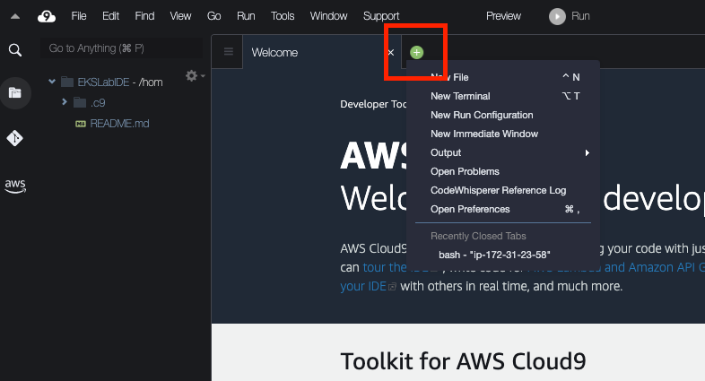
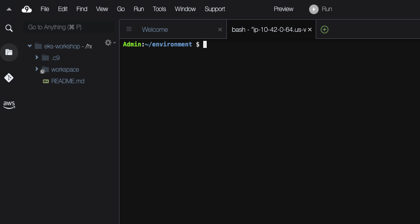

As part of the lab environment you have access to an AWS Cloud9 IDE.

To access the Cloud9 IDE, log into your [AWS console](https://console.aws.amazon.com/). Search for Cloud9 in the menu bar at the top of the screen:


When the main Cloud9 screen opens expand the menu on the left side of the screen:


There will be a Cloud9 environment available, click the **Open** button to launch the IDE:


Once the IDE has loaded, we recommend you use the **+** button and select **New Terminal** to open a new full screen terminal window.



This will open a new tab with a fresh terminal.



You may also close the small terminal at the bottom if you wish.

Your IDE comes pre-configured to access the workshop EKS cluster and also provides a set of tools you will need like the `aws` and `kubectl` CLI tools.

For example, run the following command to get details about your EKS cluster:

```bash
$ aws eks describe-cluster --name $EKS_CLUSTER_NAME
{
    "cluster": {
        "name": "eks-workshop",
        "arn": "arn:aws:eks:us-west-2:1234567890:cluster/eks-workshop",
        "createdAt": 1662084731.367,
        "endpoint": "https://7C18D86993E776387BB6C040FBA9D359.sk1.us-west-2.eks.amazonaws.com",
[...]
}
```

You can also check that you can connect to your EKS cluster like so:

```bash
$ kubectl get nodes
NAME                                         STATUS   ROLES    AGE     VERSION
ip-10-42-10-176.us-west-2.compute.internal   Ready    <none>   18h     v1.23.9-eks-ba74326
ip-10-42-10-56.us-west-2.compute.internal    Ready    <none>   18h     v1.23.9-eks-ba74326
ip-10-42-11-123.us-west-2.compute.internal   Ready    <none>   18h     v1.23.9-eks-ba74326
```
