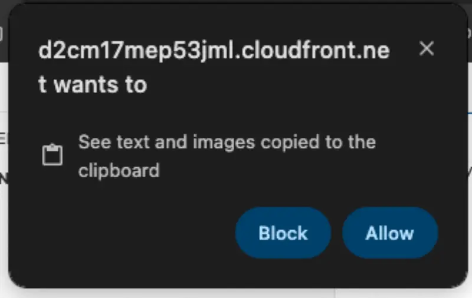

import Tabs from '@theme/Tabs';
import TabItem from '@theme/TabItem';

Let’s review how to navigate this website and the content provided.

## Structure

The content of this workshop is made up of:

1. Individual lab exercises
2. Supporting content that explains concepts related to the labs

The lab exercises are designed in a way that you can run any modules as a self-contained exercise. Lab exercises will be displayed in the sidebar to the left and are designated by the `LAB` icon.

## Prepare Environment

The `prepare-environment` tool helps you set up and configure your lab environment for each section. Simply run:

```bash test=false
$ prepare-environment <name>
```

For example, `getting-started` section in `introduction` module can be initialized using the following command - 

::required-time

:::tip Before you start
Prepare your environment for this section:

```bash timeout=300 wait=10
$ prepare-environment introduction/getting-started
```

:::

This command for getting-started lab will clone the EKS Workshop Git repository into the IDE environment, so the Kubernetes manifest files we need are present on the filesystem.


:::caution
You should start each lab from the page indicated by "BEFORE YOU START" badge. Starting in the middle of a lab will cause unpredictable behavior.
:::

## Resetting Your Cluster
In the event that you accidentally configure your cluster or module in a way that is not functioning you have been provided with a mechanism to reset your EKS cluster as best we can which can be run at any time. Simply run the command prepare-environment and wait until it completes. This may take several minutes depending on the state of your cluster when it is run.

```bash test=false
$ prepare-environment
```

## Tips

### Copy/Paste Permission
Depending on your browser the first time you copy/paste content in to the VSCode terminal you may be presented with a prompt that looks like this:


### Terminal commands

Most of the interaction you will do in this workshop will be done with terminal commands, which you can either manually type or copy/paste to the IDE terminal. You will see this terminal commands displayed like this:

```bash test=false
$ echo "This is an example command"
```

Hover your mouse over `echo "This is an example command"` and click to copy that command to your clipboard.

You will also come across commands with sample output like this:

```bash test=false
$ date
Fri Aug 30 12:25:58 MDT 2024
```

Using the 'click to copy' function will only copy the command and ignore the sample output.

Another pattern used in the content is presenting several commands in a single terminal:

```bash test=false
$ echo "This is an example command"
This is an example command
$ date
Fri Aug 30 12:26:58 MDT 2024
```

In this case you can either copy each command individually or copy all of the commands using the clipboard icon in the top right of the terminal window. Give it a shot!

## Next Steps

Now that you're familiar with the format of this workshop, head to the [Getting started](/docs/introduction/getting-started) lab or skip ahead to any module in the workshop with the top navigation bar.
