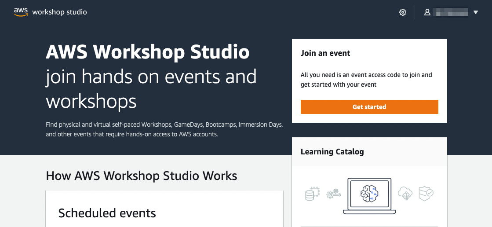
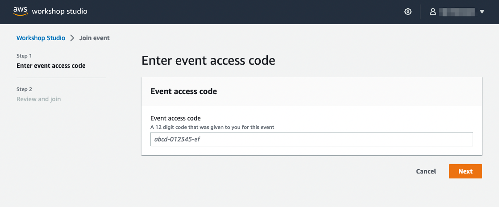
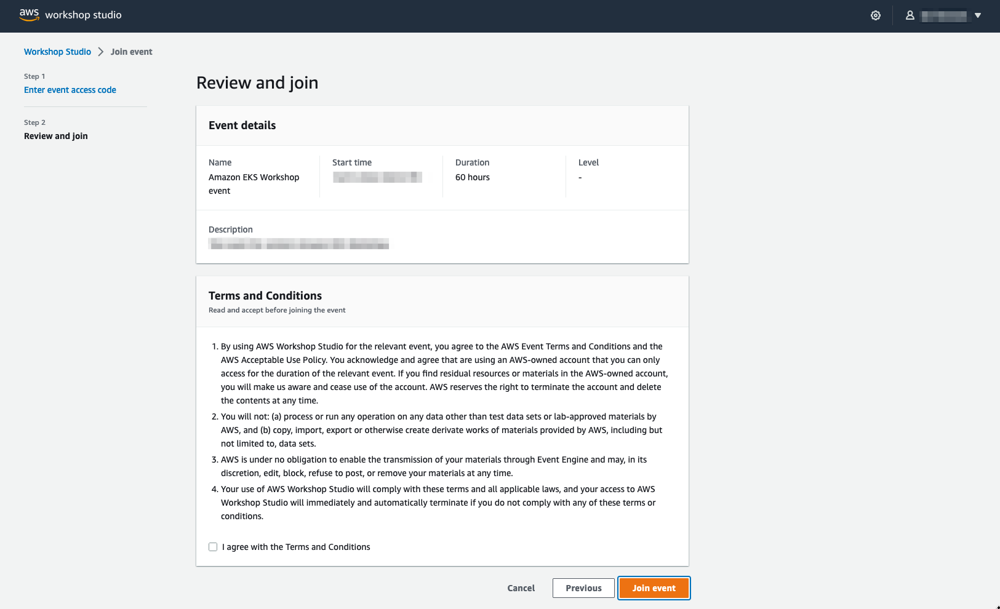
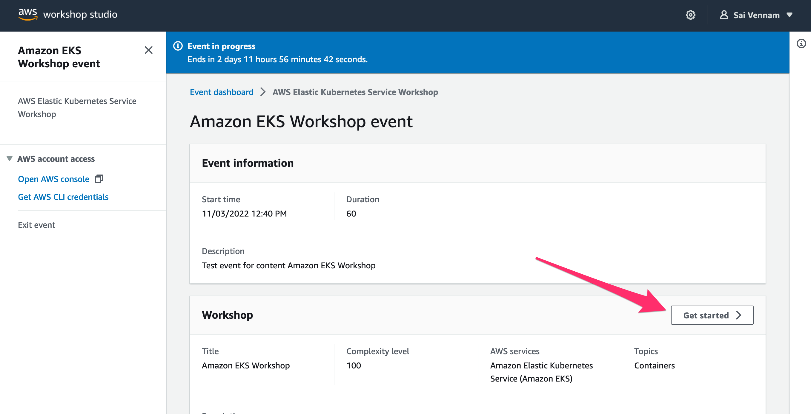
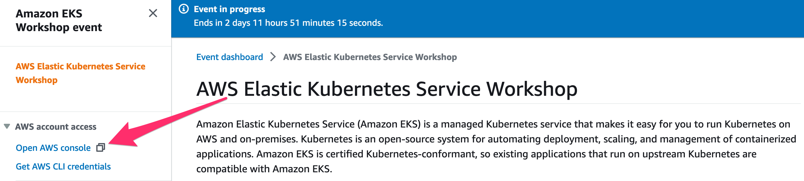

By participating in this workshop you will be provided with an AWS account to use to complete the lab material. Connect to the portal by browsing to [https://catalog.workshops.aws/](https://catalog.workshops.aws/), where the following screen shows up.

Click on **Get Started** and select the option **Email One-Time Password(OTP)** to proceed.

Enter your email address and press **Send passcode**, which will send a one-time passcode to your inbox. When the email arrives you can enter the passcode and log-in.

Your instructor should have provided you with an **Event access code** prior the starting these exercises. Enter the provided hash in the text box and hit **Next**.

Read and accept the Terms and Conditions and click **Join event** to continue.

You will be presented with your personal dashboard. Press **Get Started** for basic information about the workshop.

Select the **Open AWS Console** button to be taken to your AWS account console:

Proceed to the [Accessing the IDE](../ide) section to access your Cloud9 IDE environment.
