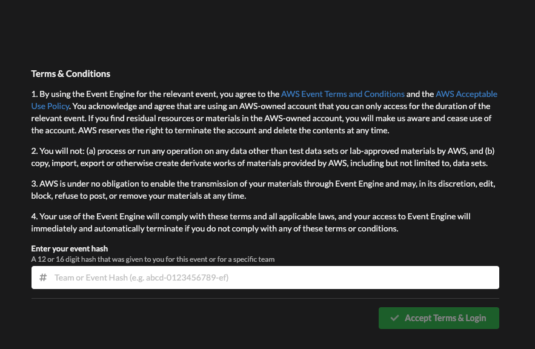
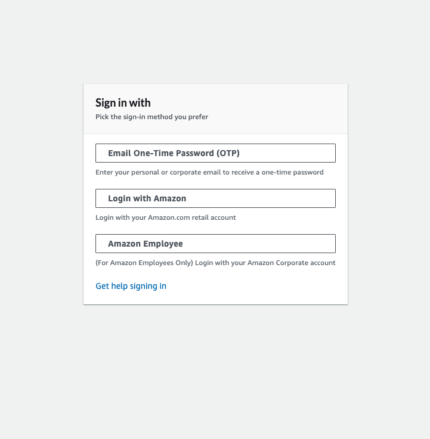
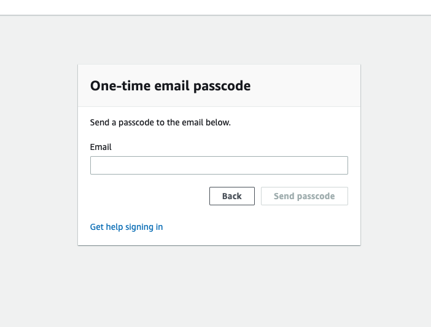
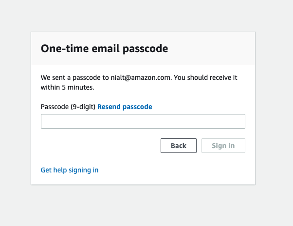

By participating in this workshop you will be provided with an AWS account to use to complete the lab material. Connect to the portal by browsing to [https://dashboard.eventengine.run/](https://dashboard.eventengine.run/), where the following screen shows up.

Your instructor should have provided you with an **Event Hash** prior the starting these exercises. Enter the provided hash in the text box. The button on the bottom right corner changes to **Accept Terms & Login**. Click on that button to continue.

You will be presented with a sign-in screen that looks like this:

Select the option **Email One-Time Password(OTP)** to proceed, and the next screen will display:

Enter your email address and press **Send passcode**, which will send a one-time passcode to your inbox. When the email arrives you can enter the passcode:

When you press **Sign in** you will be presented with your personal dashboard:

Select the **AWS Console** button to be taken to your AWS account console:

