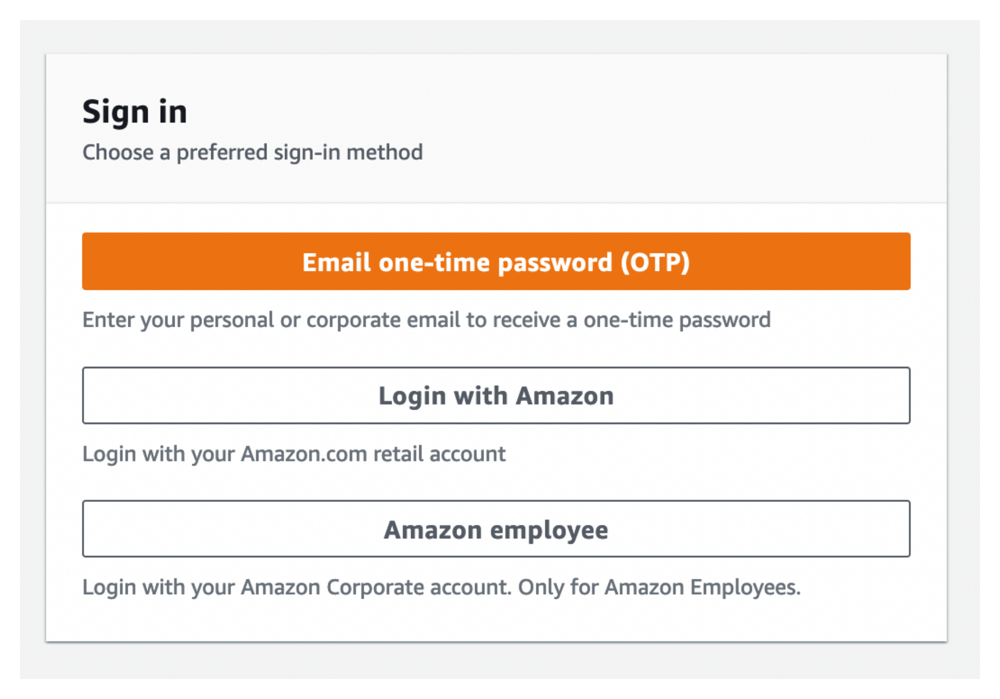
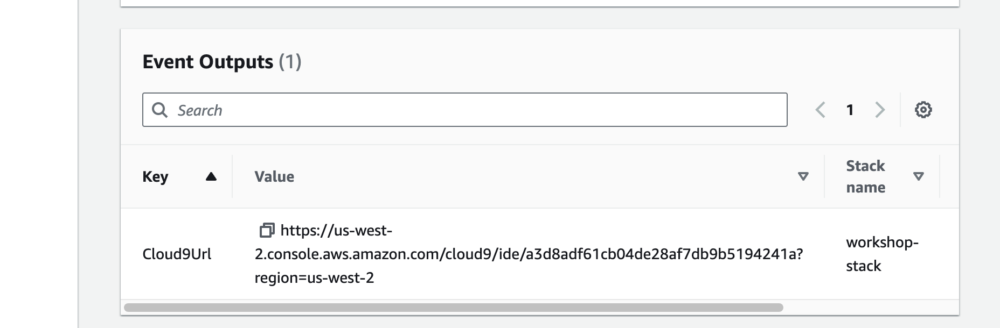

By participating in this workshop you will be provided with an AWS account to use to complete the lab material. Connect to the portal by browsing to [https://catalog.workshops.aws/](https://catalog.workshops.aws/). Click on **Get Started**.

You will be prompted to sign in. Select the option **Email One-Time Password(OTP)**.

Enter your email address and press **Send passcode**, which will send a one-time passcode to your inbox. When the email arrives you can enter the passcode and log-in.

Your instructor should have provided you with an **Event access code** prior the starting these exercises. Enter the provided hash in the text box and hit **Next**.

Read and accept the Terms and Conditions and click **Join event** to continue.

You will be presented with your personal dashboard. Select the **Open AWS Console** button to be taken to your AWS account console:

Next return to the personal dashboard page and scroll down to the **Event Outputs** section to get a quickstart link to your Cloud9 IDE. Open this in a new browser tab:

Press **Get started** to access the workshop splash page:

You can now proceed to the [Navigating the labs section](/docs/introduction/navigating-labs).