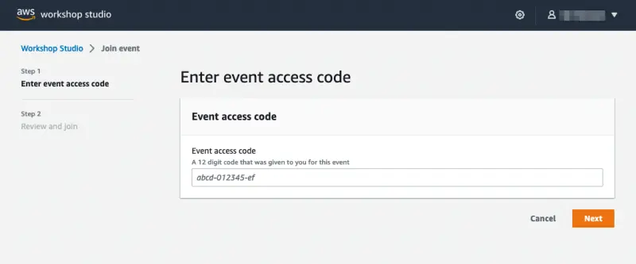

By participating in this workshop, you will be provided with an AWS account to use to complete the lab material. Connect to the portal by browsing to [https://catalog.workshops.aws/](https://catalog.workshops.aws/). Click on **Get Started**.

You will be prompted to sign in. Select the option **Email One-Time Password(OTP)**.

Enter your email address and press **Send passcode**, which will send a one-time passcode to your inbox. When the email arrives, enter the passcode and log in.

Your instructor should have provided you with an **Event access code** prior to starting these exercises. Enter the provided code in the text box and click **Next**.

Read and accept the Terms and Conditions and click **Join event** to continue.

You will be presented with your personal dashboard. Select the **Open AWS Console** button to be taken to your AWS account console:

Next, return to the personal dashboard page and scroll down to the **Event Outputs** section. Copy the URL from the **IdeUrl** field and open it in a new browser tab:

You will be prompted for a password:

Enter the value from the **IdePassword** field from the outputs and the web IDE will load.

Press **Get started** to access the workshop splash page:

You can now proceed to the [Navigating the labs section](/docs/introduction/navigating-labs).
