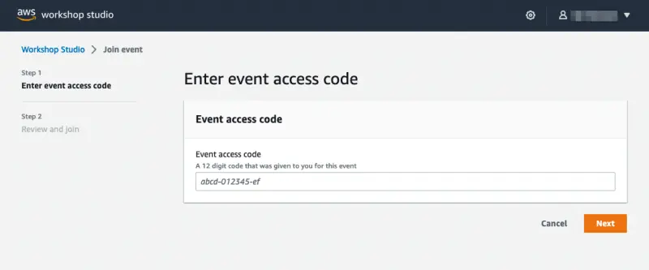
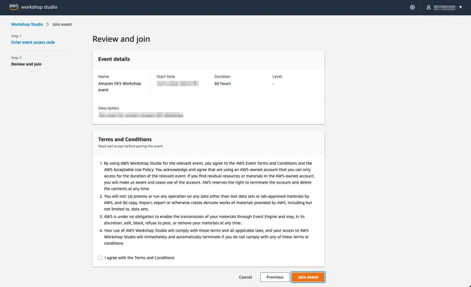
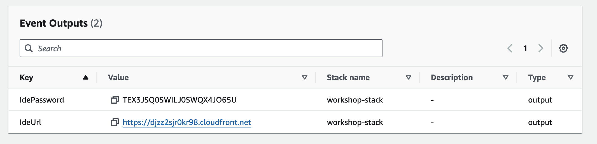
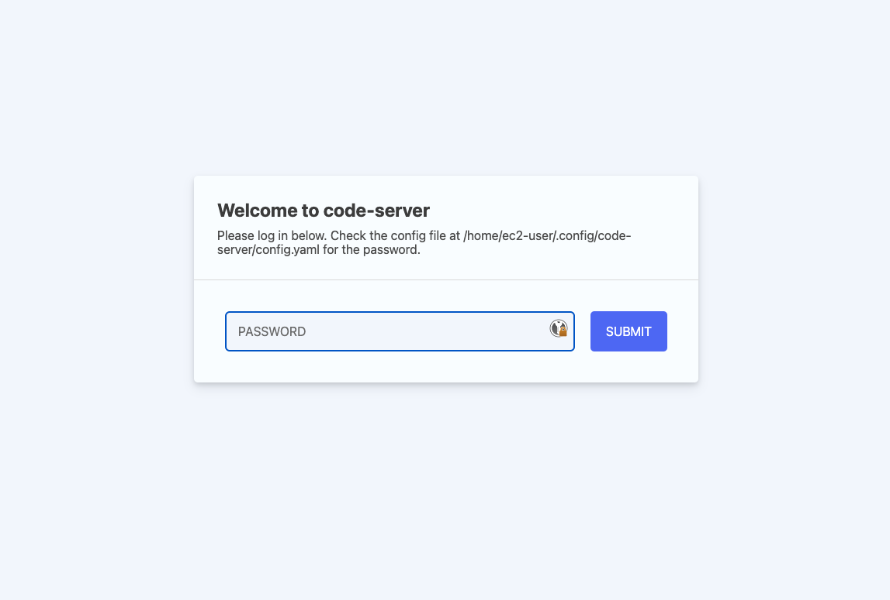
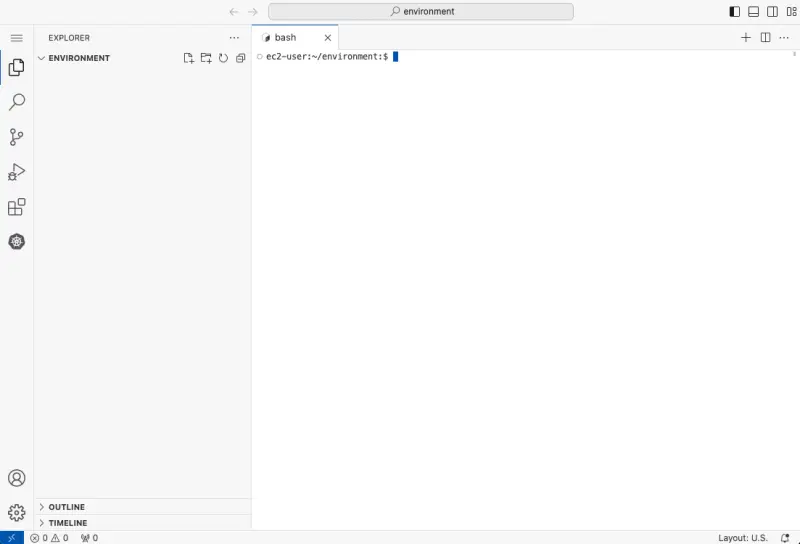
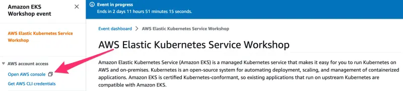

By participating in this workshop you will be provided with an AWS account to use to complete the lab material. Connect to the portal by browsing to https://catalog.us-east-1.prod.workshops.aws/join?access-code=eb68-0b4886-1d.

You will be prompted to sign in. Select the option **Email One-Time Password(OTP)**.

Enter your email address and press **Send passcode**, which will send a one-time passcode to your inbox. When the email arrives you can enter the passcode and log-in.

If you need the access code, you click reuse this link: https://catalog.us-east-1.prod.workshops.aws/join?access-code=eb68-0b4886-1d or copy/paste it *eb68-0b4886-1d*. Enter the provided hash in the text box and hit **Next**.

Read and accept the Terms and Conditions and click **Join event** to continue.

You will be presented with your personal dashboard. Select the **Open AWS Console** button to be taken to your AWS account console:
1 - In the **Event Outputs** section. Copy the password from the IdePassword field and use the URL from the **IdeUrl** field and open it in a new browser tab, this will be the main windows you'll use for this workshop :

When you will prompted for a password, use the IdePassword field from that output.

The IDE will load and should look similar to this:

2 - Press **Get started** to access the workshop splash page, the last item on the page will be the link to the full workshop instructions.

3 - **Open AWS Console** button will take you to your AWS account console:

You can now proceed to the [Navigating the labs section](/docs/introduction/navigating-labs).
