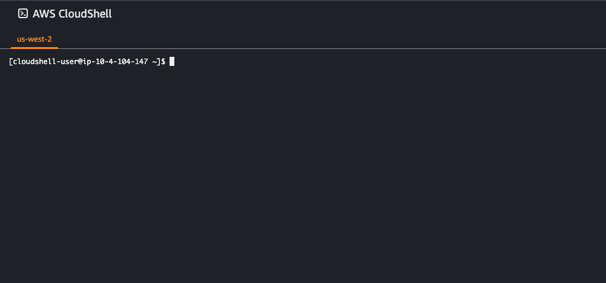
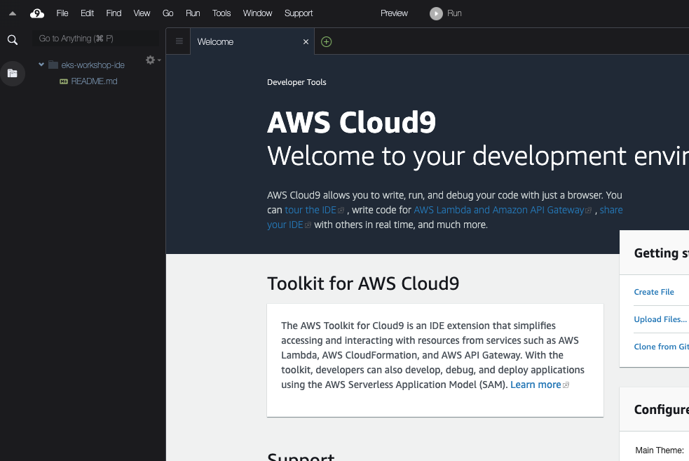

:::danger Warning
Provisioning this workshop environment in your AWS account will create resources and **there will be cost associated with them**. The cleanup section provides a guide to remove them, preventing further charges.
:::

This section outlines how to set up the environment to run the labs in your own AWS account. These instructions have been tested in the following AWS regions and are not guaranteed to work in others without modification:

- `us-west-2`
- `eu-west-1`

The first step is to create an IDE with the provided CloudFormation template. The easiest way to do this is using AWS CloudShell in the account you will be running the lab exercises. Open CloudShell with the link below or following [this documentation](https://docs.aws.amazon.com/cloudshell/latest/userguide/getting-started.html#launch-region-shell):

https://console.aws.amazon.com/cloudshell/home

:::tip

If using the link above make sure the AWS console has opened in the region that you wish to run the labs in.

:::



Once CloudShell has loaded run the following commands:

```bash test=false
$ wget -q https://raw.githubusercontent.com/VAR::MANIFESTS_OWNER/VAR::MANIFESTS_REPOSITORY/VAR::MANIFESTS_REF/lab/cfn/eks-workshop-ide-cfn.yaml -O eks-workshop-ide-cfn.yaml
$ aws cloudformation deploy --stack-name eks-workshop-ide \
    --template-file ./eks-workshop-ide-cfn.yaml \
    --parameter-overrides RepositoryRef=VAR::MANIFESTS_REF \
    --capabilities CAPABILITY_NAMED_IAM
Waiting for changeset to be created..
Waiting for stack create/update to complete
Successfully created/updated stack - eks-workshop-ide
```

The CloudFormation stack will take roughly 5 minutes to deploy, and once completed you can retrieve the URL for the Cloud9 IDE like so:

```bash test=false
$ aws cloudformation describe-stacks --stack-name eks-workshop-ide \
    --query 'Stacks[0].Outputs[?OutputKey==`Cloud9Url`].OutputValue' --output text
https://us-west-2.console.aws.amazon.com/cloud9/ide/7b05513358534d11afeb7119845c5461?region=us-west-2
```

Open this URL in a web browser to access the IDE. 



You can now close CloudShell, all further commands will be run in the terminal section at the bottom of the Cloud9 IDE. The AWS CLI is already installed and will assume the credentials attached to the Cloud9 IDE:

```bash test=false
$ aws sts get-caller-identity
```

The next step is to create an EKS cluster to perform the lab exercises in. Please follow one of the guides below to provision a cluster that meets the requirements for these labs:
- **(Recommended)** [eksctl](./using-eksctl.md)
- (Coming soon!) Terraform 
- (Coming soon!) CDK
