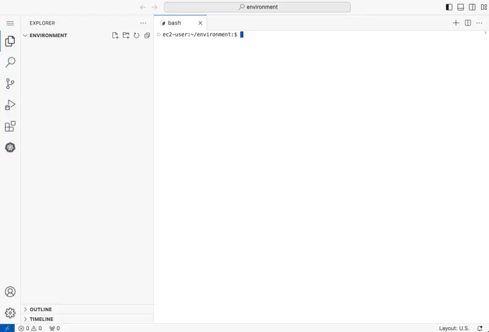

import Tabs from '@theme/Tabs';
import TabItem from '@theme/TabItem';

:::danger Warning
Provisioning this workshop environment in your AWS account will create resources and **there will be cost associated with them**. The cleanup section provides a guide to remove them, preventing further charges.
:::

This section outlines how to set up the environment to run the labs in your own AWS account.

The first step is to create an IDE with the provided CloudFormation templates. You have the choice between using AWS Cloud9 or a browser-accessible instance of VSCode that will run on an EC2 instance in your AWS account.

:::tip

After careful consideration, we have made the decision to close new customer access to AWS Cloud9, effective July 25, 2024. AWS Cloud9 existing customers can continue to use the service as normal. AWS continues to invest in security, availability, and performance improvements for AWS Cloud9, but we do not plan to introduce new features.

If you cannot access Cloud9 in your AWS account you must use the VSCode option.

:::

Use the AWS CloudFormation quick-create links below to launch the desired template in the appropriate AWS region.

| Region           | Cloud9 Link                                                                                                                                                                                                                                                                                                                        | VSCode Link (Preview)                                                                                                                                                                                                                                                                                                           |
| ---------------- | ---------------------------------------------------------------------------------------------------------------------------------------------------------------------------------------------------------------------------------------------------------------------------------------------------------------------------------- | ------------------------------------------------------------------------------------------------------------------------------------------------------------------------------------------------------------------------------------------------------------------------------------------------------------------------------- |
| `us-west2`       | [Launch](https://us-west-2.console.aws.amazon.com/cloudformation/home#/stacks/quickcreate?templateUrl=https://ws-assets-prod-iad-r-pdx-f3b3f9f1a7d6a3d0.s3.us-west-2.amazonaws.com/39146514-f6d5-41cb-86ef-359f9d2f7265/eks-workshop-ide-cfn.yaml&stackName=eks-workshop-ide&param_RepositoryRef=VAR::MANIFESTS_REF)               | [Launch](https://us-west-2.console.aws.amazon.com/cloudformation/home#/stacks/quickcreate?templateUrl=https://ws-assets-prod-iad-r-pdx-f3b3f9f1a7d6a3d0.s3.us-west-2.amazonaws.com/39146514-f6d5-41cb-86ef-359f9d2f7265/eks-workshop-vscode-cfn.yaml&stackName=eks-workshop-ide&param_RepositoryRef=VAR::MANIFESTS_REF)         |
| `eu-west-1`      | [Launch](https://eu-west-1.console.aws.amazon.com/cloudformation/home#/stacks/quickcreate?templateUrl=https://ws-assets-prod-iad-r-dub-85e3be25bd827406.s3.eu-west-1.amazonaws.com/39146514-f6d5-41cb-86ef-359f9d2f7265/eks-workshop-ide-cfn.yaml&stackName=eks-workshop-ide&param_RepositoryRef=VAR::MANIFESTS_REF)               | [Launch](https://eu-west-1.console.aws.amazon.com/cloudformation/home#/stacks/quickcreate?templateUrl=https://ws-assets-prod-iad-r-dub-85e3be25bd827406.s3.eu-west-1.amazonaws.com/39146514-f6d5-41cb-86ef-359f9d2f7265/eks-workshop-vscode-cfn.yaml&stackName=eks-workshop-ide&param_RepositoryRef=VAR::MANIFESTS_REF)         |
| `ap-southeast-1` | [Launch](https://ap-southeast-1.console.aws.amazon.com/cloudformation/home#/stacks/quickcreate?templateUrl=https://ws-assets-prod-iad-r-sin-694a125e41645312.s3.ap-southeast-1.amazonaws.com/39146514-f6d5-41cb-86ef-359f9d2f7265/eks-workshop-vscode-cfn.yaml&stackName=eks-workshop-ide&param_RepositoryRef=VAR::MANIFESTS_REF") | [Launch](https://ap-southeast-1.console.aws.amazon.com/cloudformation/home#/stacks/quickcreate?templateUrl=https://ws-assets-prod-iad-r-sin-694a125e41645312.s3.ap-southeast-1.amazonaws.com/39146514-f6d5-41cb-86ef-359f9d2f7265/eks-workshop-ide-cfn.yaml&stackName=eks-workshop-ide&param_RepositoryRef=VAR::MANIFESTS_REF) |

These instructions have been tested in the AWS regions listed above and are not guaranteed to work in others without modification.

:::warning

The nature of the workshop material means that the IDE EC2 instance requires broad IAM permissions in your account, for example creating IAM roles. Before continuing please review the IAM permissions that will be provided to the IDE instance in the CloudFormation template.

We are continuously working to optimize the IAM permissions. Please raise a [GitHub issue](https://github.com/aws-samples/eks-workshop-v2/issues) with any suggestions for improvement.

:::

Now select that tab that corresponds to the IDE that you have installed.

<Tabs groupId="ide">
<TabItem value="cloud9" label="AWS Cloud9">

Scroll to the bottom of the screen and acknowledge the IAM notice:


Then click the **Create stack** button:


The CloudFormation stack will take roughly 5 minutes to deploy, and once completed you can retrieve the URL for the Cloud9 IDE from the **Outputs** tab:


Open this URL in a web browser to access the IDE.


You can now close CloudShell, all further commands will be run in the terminal section at the bottom of the Cloud9 IDE. The AWS CLI is already installed and will assume the credentials attached to the Cloud9 IDE:

```bash test=false
$ aws sts get-caller-identity
```

</TabItem>
<TabItem value="vscode" label="VSCode">

Scroll to the bottom of the screen and acknowledge the IAM notice:


Then click the **Create stack** button:


The CloudFormation stack will take roughly 5 minutes to deploy, and once completed you can retrieve information required to continue from the **Outputs** tab:


The `IdeUrl` output contains the URL to enter in your browser to access the IDE. The `IdePasswordSecret` contains a link to an AWS Secrets Manger secret that contains a generated password for the IDE.

To retrieve the password open that URL and click the **Retrieve** button:


The password will then be available for you to copy:


Open the IDE URL provided and you will be prompted for the password:


After submitting your password you will be presented with the initial VSCode screen:



</TabItem>
</Tabs>

The next step is to create an EKS cluster to perform the lab exercises in. Please follow one of the guides below to provision a cluster that meets the requirements for these labs:

- **(Recommended)** [eksctl](./using-eksctl.md)
- [Terraform](./using-terraform.md)
- (Coming soon!) CDK
