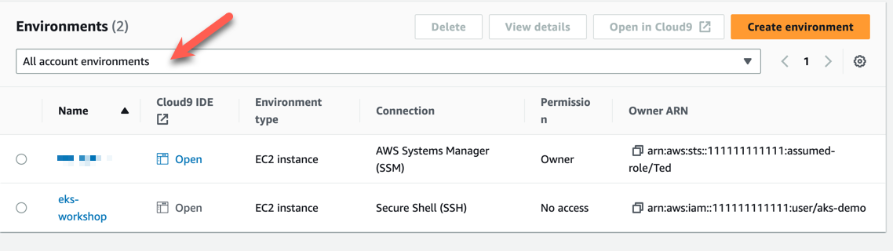
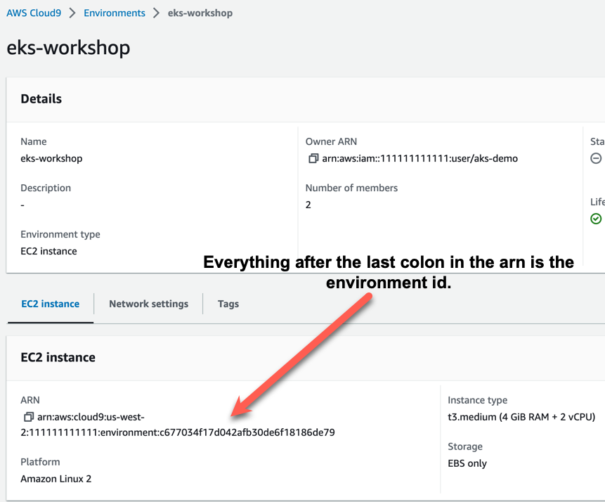

If after running the Terraform script you do not see the Cloud9 instance named **eks-workshop** do the following:

Change the Environments dropdown to show **All account environments**.

Under **Cloud9 IDE** Click **Open**.

If the Open link does not work, you will need to grant your user access to the Cloud9 instance.

From the AWS CLI modify the following code to give your user access to the Cloud9 instance:

```
aws cloud9 create-environment-membership --environment-id environment_id_from_arn  --user-arn arn:aws:sts::1234567890:assumed-role/Admin/somerole --permissions read-write
```

Two replacements will need to be made:

```
arn:aws:sts::1234567890:assumed-role/Admin/somerole
```

The above arn should be replaced with the arn of the user or role that needs access to the Cloud9 instance.

```
environment_id_from_arn
```

The environment_id_from_arn should be replaced with the environment-id from the arn of the instance you want to manage. 
The arn can be found by clicking on the instance name.  Everything after the last colon in the arn is the environment-id.



After entering the code with the replaced text in the CLI you should now be able to access the Cloud9 Instance.

```
$ aws cloud9 create-environment-membership --environment-id environment_id_from_arn  --user-arn arn:aws:sts::1234567890:assumed-role/Admin/somerole --permissions read-write
{
    "membership": {
        "permissions": "read-write",
        "userId": "XXXXXXXXXXXXXXXXXXX:someone",
        "userArn": "arn:aws:sts::111111111111:assumed-role/Admin/someone",
        "environmentId": "environment_id_from_arn",
        "lastAccess": "2023-04-07T09:27:56-04:00"
    }
}
```

[Click here](/introduction/ide.md) to return to "Accessing the IDE".