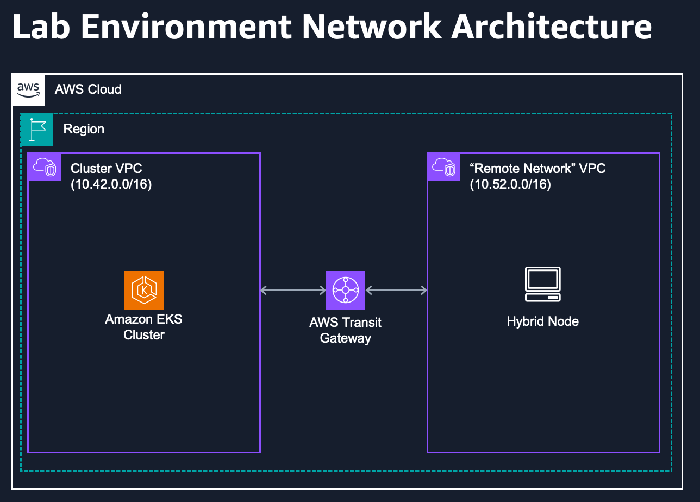

::required-time{estimatedLabExecutionTimeMinutes="30"}

:::caution Preview
This module is currently in preview, please [report any issues](https://github.com/aws-samples/eks-workshop-v2/issues) encountered.
:::

Amazon EKS Hybrid Nodes unifies management of Kubernetes across cloud, on-premises and edge environments, giving you the flexibility to run your workloads anywhere, while driving higher availability, scalability, and efficiency. It standardizes Kubernetes operations and tooling across environments and natively integrates with AWS services for centralized monitoring, logging, and identity management. EKS Hybrid Nodes reduces the time and effort required for managing Kubernetes on premises and at the edge by offloading the availability and scalability of the Kubernetes control plane to AWS. EKS Hybrid Nodes can run on your existing infrastructure to accelerate modernization without additional hardware investment.

With Amazon EKS Hybrid Nodes, there are no upfront commitments or minimum fees, and you are charged per hour for the vCPU resources of your hybrid nodes when they are attached to your Amazon EKS clusters. For more pricing information, see [Amazon EKS Pricing](https://aws.amazon.com/eks/pricing/).

:::danger
Running EKS Hybrid Nodes on EC2 is not a supported configuration.
This module runs EKS Hybrid Nodes on EC2 for lab and demonstration purposes only. Users should run Amazon EKS in the regions of their choice, and EKS Hybrid Nodes on-premises and at the edge.
:::

:::tip Before you start
Prepare your environment for this section:

```bash timeout=600 wait=30
$ prepare-environment networking/eks-hybrid-nodes
```

:::

The architecture diagram below is a high-level example of what we are building. We're going to connect our EKS cluster to a simulated "remote" network via AWS Transit Gateway. In production, your remote network would commonly be connected via AWS Direct Connect or AWS Site-to-Site VPN. In turn, those connections would be attached to a Transit Gateway in our cluster VPC. Our "remote" network will have a single EC2 node running that will be used as our EKS Hybrid Node for lab purposes. You will run commands on this node via SSH from your IDE. It is important to note that running EKS Hybrid Nodes on EC2 is **not** supported, we are only doing it here for demo purposes.


