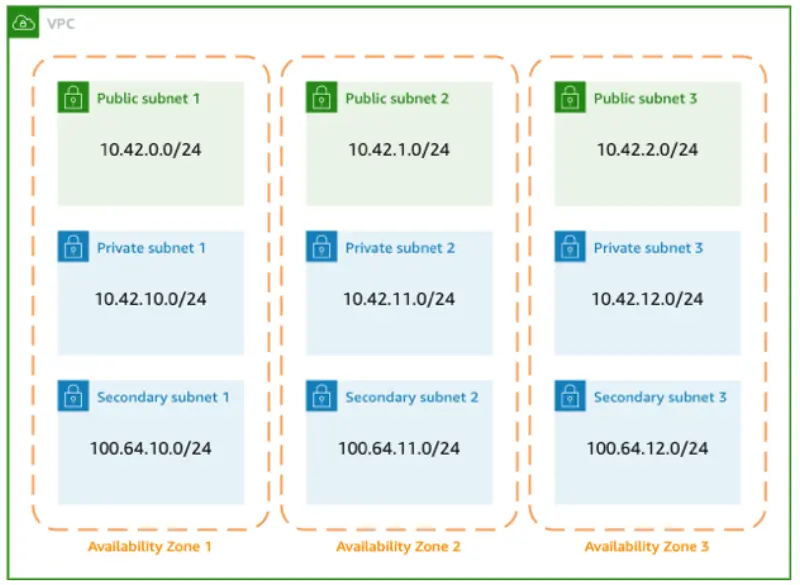

We can start by inspecting the VPC that has been set up. For example describe the VPC:

```bash
$ aws ec2 describe-vpcs --vpc-ids $VPC_ID
{
    "Vpcs": [
        {
            "CidrBlock": "10.42.0.0/16",
            "DhcpOptionsId": "dopt-0b9864a5c5bbe59bf",
            "State": "available",
            "VpcId": "vpc-0512db3d3af8fa5b0",
            "OwnerId": "188130284088",
            "InstanceTenancy": "default",
            "CidrBlockAssociationSet": [
                {
                    "AssociationId": "vpc-cidr-assoc-04cf2a625fa24724b",
                    "CidrBlock": "10.42.0.0/16",
                    "CidrBlockState": {
                        "State": "associated"
                    }
                },
                {
                    "AssociationId": "vpc-cidr-assoc-0453603b1ab691914",
                    "CidrBlock": "100.64.0.0/16",
                    "CidrBlockState": {
                        "State": "associated"
                    }
                }
            ],
            "IsDefault": false,
            "Tags": [
                {
                    "Key": "created-by",
                    "Value": "eks-workshop-v2"
                },
                {
                    "Key": "env",
                    "Value": "cluster"
                },
                {
                    "Key": "Name",
                    "Value": "eks-workshop-vpc"
                }
            ]
        }
    ]
}
```

Here we see there are two CIDR ranges associated with the VPC:

1. The `10.42.0.0/16` range which is the "primary" CIDR
2. The `100.64.0.0/16` range which is the "secondary" CIDR

You can also view this in the AWS console:

<ConsoleButton url="https://console.aws.amazon.com/vpc/home#vpcs:tag:created-by=eks-workshop-v2" service="vpc" label="Open VPC console"/>

Describing the subnets associated with the VPC will show 9 subnets:

```bash
$ aws ec2 describe-subnets --filters "Name=tag:created-by,Values=eks-workshop-v2" \
  --query "Subnets[*].CidrBlock"
[
    "10.42.64.0/19",
    "100.64.32.0/19",
    "100.64.0.0/19",
    "100.64.64.0/19",
    "10.42.160.0/19",
    "10.42.0.0/19",
    "10.42.96.0/19",
    "10.42.128.0/19",
    "10.42.32.0/19"
]
```

These are split between:

- Public subnets: One for each availability zones using a CIDR block from the primary CIDR range
- Private subnets: One for each availability zones using a CIDR block from the primary CIDR range
- Secondary private subnets: One for each availability zones using a CIDR block from the **secondary** CIDR range



You can view these subnets in the AWS console:

<ConsoleButton url="https://console.aws.amazon.com/vpc/home#subnets:tag:created-by=eks-workshop-v2;sort=desc:CidrBlock" service="vpc" label="Open VPC console"/>

Currently our pods are leveraging the private subnets `10.42.96.0/19`, `10.42.128.0/19` and `10.42.160.0/19`. In this lab exercise, we'll move them to consume IP addresses from the `100.64` subnets.
