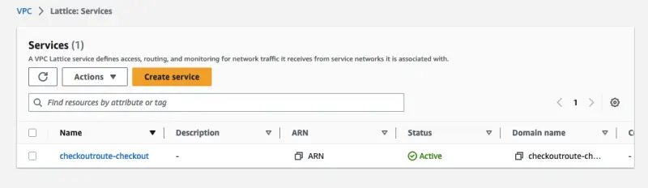

In this section we will show how to use Amazon VPC Lattice for advanced traffic management with weighted routing for blue/green and canary-style deployments.

Let's deploy a modified version of the `checkout` microservice with an added prefix _"Lattice"_ in the shipping options. Let's deploy this new version in a new namespace (`checkoutv2`) using Kustomize.

```bash
$ kubectl apply -k ~/environment/eks-workshop/modules/networking/vpc-lattice/abtesting/
$ kubectl rollout status deployment/checkout -n checkoutv2
```

The `checkoutv2` namespace now contains a second version of the application, while using the same `redis` instance in the `checkout` namespace.

```bash
$ kubectl get pods -n checkoutv2
NAME                        READY   STATUS    RESTARTS   AGE
checkout-854cd7cd66-s2blp   1/1     Running   0          26s
```

Now let's demonstrate how weighted routing works by creating `HTTPRoute` resources. First we'll create a `TargetGroupPolicy` that tells Lattice how to properly perform health checks on our checkout service:

::yaml{file="manifests/modules/networking/vpc-lattice/target-group-policy/target-group-policy.yaml" paths="spec.targetRef,spec.healthCheck,spec.healthCheck.intervalSeconds,spec.healthCheck.timeoutSeconds,spec.healthCheck.healthyThresholdCount,spec.healthCheck.unhealthyThresholdCount,spec.healthCheck.path,spec.healthCheck.port,spec.healthCheck.protocol,spec.healthCheck.statusMatch"}

1. `targetRef` applies this policy to the `checkout` Service  
2. The settings in the `healthCheck` section defines how VPC Lattice monitors service health
3. `intervalSeconds: 10` : Check every 10 seconds
4. `timeoutSeconds: 1` : 1-second timeout per check
5. `healthyThresholdCount: 3` : 3 consecutive successes = healthy
6. `unhealthyThresholdCount: 2` : 2 consecutive failures = unhealthy
7. `path: "/health"`: Health check endpoint path
8. `port: 8080` : Health check endpoint port
9. `protocol: HTTP` : Health check endpoint protocol
10. `statusMatch: "200"` : Expects HTTP 200 response


Apply this resource:

```bash wait=10
$ kubectl apply -k ~/environment/eks-workshop/modules/networking/vpc-lattice/target-group-policy
```

Now create the Kubernetes `HTTPRoute` route that distributes 75% traffic to `checkoutv2` and remaining 25% traffic to `checkout`:

::yaml{file="manifests/modules/networking/vpc-lattice/routes/checkout-route.yaml" paths="spec.parentRefs.0,spec.rules.0.backendRefs.0,spec.rules.0.backendRefs.1"}

1. `parentRefs` attaches this `HTTPRoute` route to the `http` listener on the gateway named `${EKS_CLUSTER_NAME}`
2. This `backendRefs` rule sends `25%` of the traffic to the `checkout` Service in the `checkout` namespace on port `80`
3. This `backendRefs` rule sends `75%` of the traffic to the `checkout` Service in the `checkoutv2` namespace on port `80`

Apply this resource:

```bash hook=route
$ cat ~/environment/eks-workshop/modules/networking/vpc-lattice/routes/checkout-route.yaml \
  | envsubst | kubectl apply -f -
```

This creation of the associated resources may take 2-3 minutes, run the following command to wait for it to complete:

```bash wait=10 timeout=400
$ kubectl wait -n checkout --timeout=3m \
  --for=jsonpath='{.metadata.annotations.application-networking\.k8s\.aws\/lattice-assigned-domain-name}' httproute/checkoutroute
```

Once completed you will find the `HTTPRoute`'s DNS name from `HTTPRoute` annotation `application-networking.k8s.aws/lattice-assigned-domain-name`:

```bash
$ kubectl describe httproute checkoutroute -n checkout
Name:         checkoutroute
Namespace:    checkout
Labels:       <none>
Annotations:  application-networking.k8s.aws/lattice-assigned-domain-name:
                checkoutroute-checkout-0d8e3f4604a069e36.7d67968.vpc-lattice-svcs.us-east-2.on.aws
API Version:  gateway.networking.k8s.io/v1beta1
Kind:         HTTPRoute
...
```

Now you can see the associated Service created in the [VPC Lattice console](https://console.aws.amazon.com/vpc/home#Services) under the Lattice resources.


:::tip Traffic is now handled by Amazon VPC Lattice
Amazon VPC Lattice can now automatically redirect traffic to this service from any source, including different VPCs! You can also take full advantage of other VPC Lattice [features](https://aws.amazon.com/vpc/lattice/features/).
:::
