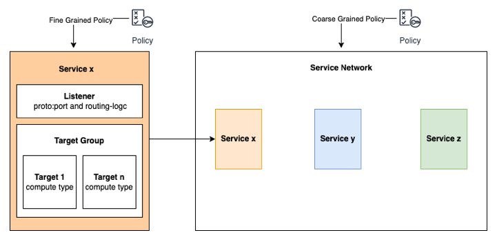

{}

:::caution Preview

This module is currently in preview, please [report any issues](https://github.com/aws-samples/eks-workshop-v2/issues) encountered.

:::

:::tip Before you start
Prepare your environment for this section:

```bash timeout=300 wait=30
$ prepare-environment networking/vpc-lattice
```

This will make the following changes to your lab environment:
- Create an IAM role for the Gateway API controller to access AWS APIs
- Install the AWS Load Balancer Controller in the Amazon EKS cluster

You can view the Terraform that applies these changes [here](https://github.com/VAR::MANIFESTS_OWNER/VAR::MANIFESTS_REPOSITORY/tree/VAR::MANIFESTS_REF/manifests/modules/networking/vpc-lattice/.workshop/terraform).

:::

[Amazon VPC Lattice](https://aws.amazon.com/vpc/lattice/) is an application layer networking service that gives you a consistent way to connect, secure, and monitor service-to-service communication without any prior networking expertise. With VPC Lattice, you can configure network access, traffic management, and network monitoring to enable service-to-service communication consistently across VPCs, and accounts, regardless of the underlying compute type including Kubernetes clusters.

Amazon VPC Lattice takes care of common networking tasks such as discovering components, routing  traffic between individual workloads, and authorizing access, eliminating the need for developers to do this themselves through additional software or code. In a few clicks or API calls, developers can configure policies to define how their applications should communicate without any prior networking expertise.

The primary benefits of using Lattice are:

* **Increased developer productivity**:  Lattice boosts developer productivity by letting them focus on building features that matters to their business, while it handles networking, security and observability challenges in a uniform way across all compute platforms
* **Improved Security Posture**: Lattice  enables  developers  to  easily  authenticate  and  secure  communication  across  applications, without the operational overhead of current mechanisms (e.g. certificate management). With Lattice access policies, developers and cloud admins can enforce granular access control. Lattice can also enforce encryption for traffic in-transit, further increasing security posture
* **Improved application scalability and resilience**: Lattice makes it easy to create a network of deployed applications with rich routing, authentication, authorization, monitoring, and more. Lattice provides all of these benefits with no resource overhead on workloads and can support large scale deployments and many requests per second without adding significant latency.
* **Deployment flexibility with heterogeneous infrastructure**: Lattice  provides  consistent  features  across  all  compute  services – EC2, ECS, EKS, Lambda, and can include services living on-premises, allowing organizations the flexibility to choose the optimal compute infrastructure for their use-case.

The [components](https://docs.aws.amazon.com/vpc-lattice/latest/ug/what-is-vpc-service-network.html#vpc-service-network-components-overview) of Amazon VPC Lattices include:

* **Service network**:
A shareable, managed logical grouping that contains Services and Policy.

* **Service**:
Represents an Application Unit with a DNS name and can extend across all compute – instances, containers, serverless. It is made up of Listener, Target Groups, Target.

* **Service directory**:
A registry within an AWS account that holds a global view of Services by version and their DNS names.

* **Security policies**:
A declarative policy that determines how Services are permitted to communicate. These can be defined at the Service level or the Service Network level.


