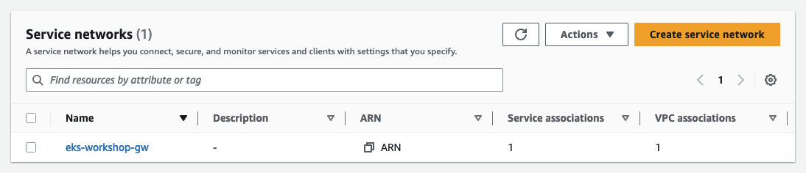
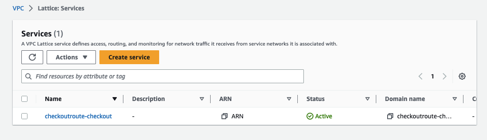
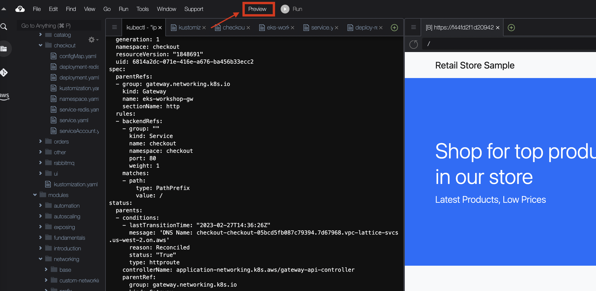
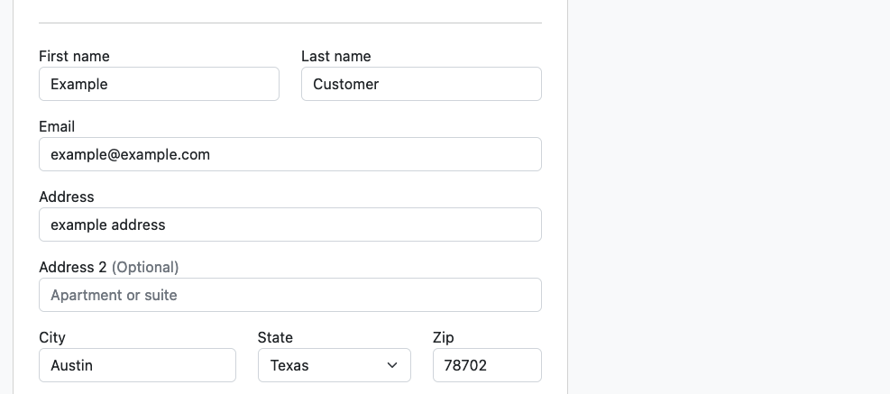
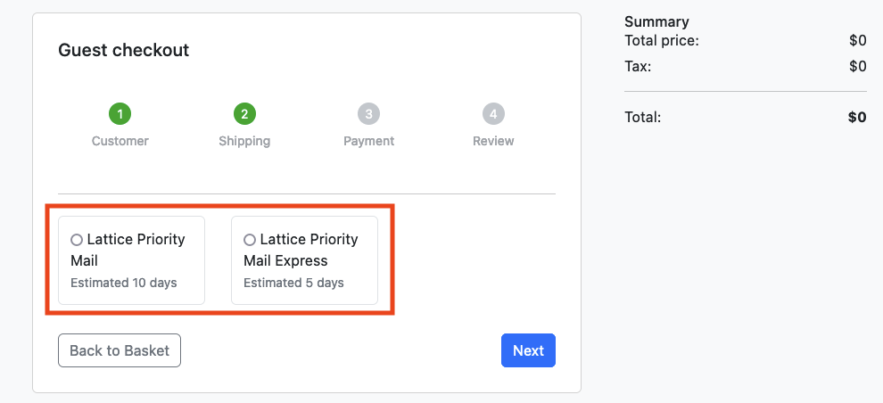

In this section we will show how to use Amazon VPC Lattice for advanced traffic management with weighted routing for blue/green and canary-style deployments.

Let's deploy a modified version of the `checkout` microservice with an added prefix *"Lattice"* in the shipping options. Let's deploy this new version in a new namespace (`checkoutv2`) using Kustomize.

```bash
$ kubectl apply -k ~/environment/eks-workshop/modules/networking/vpc-lattice/abtesting/
```

The `checkoutv2` namespace now contains a second version of the application, while using the same `redis` instance in the `checkout` namespace.

```bash
$ kubectl get pods -n checkoutv2
NAME                        READY   STATUS    RESTARTS   AGE
checkout-854cd7cd66-s2blp   1/1     Running   0          26s
```

# Set up Lattice Service Network

The following YAML will create a Kubernetes gateway resource which is associated with a VPC Lattice **Service Network**.

```file
manifests/modules/networking/vpc-lattice/controller/eks-workshop-gw.yaml
```

Apply it with the following command:

```bash
$ kubectl apply -f ~/environment/eks-workshop/modules/networking/vpc-lattice/controller/eks-workshop-gw.yaml
```

Verify that `eks-workshop-gw` gateway is created:

```bash
$ kubectl get gateway
NAME              CLASS         ADDRESS   READY   AGE
eks-workshop-gw   aws-lattice                     12min
```

Once the gateway is created, find the VPC Lattice service network. Wait until the status is `Reconciled` (this could take about five minutes).

```bash
$ kubectl describe gateway eks-workshop-gw
apiVersion: gateway.networking.k8s.io/v1alpha2
kind: Gateway
status:
   conditions:
      message: 'aws-gateway-arn: arn:aws:vpc-lattice:us-west-2:<YOUR_ACCOUNT>:servicenetwork/sn-03015ffef38fdc005'
      reason: Reconciled
      status: "True"

$ kubectl wait --for=jsonpath='{.status.conditions[-1:].reason}'=Reconciled gateway/eks-workshop-gw
```

 Now you can see the associated **Service Network** created in the VPC console under the Lattice resources in the [AWS console](https://console.aws.amazon.com/vpc/home#ServiceNetworks).


# Create Routes to targets
Let's demonstrate how weighted routing works by creating  `HTTPRoutes`.

```bash
$ kubectl patch svc checkout -n checkout --patch '{"spec": { "type": "ClusterIP", "ports": [ { "name": "http", "port": 80, "protocol": "TCP", "targetPort": "http" } ] } }'
```

Create the Kubernetes `HTTPRoute` route that distributes 75% traffic to `checkoutv2` and remaining 25% traffic to `checkout`:

```bash
$ kubectl apply -f ~/environment/eks-workshop/modules/networking/vpc-lattice/routes/checkout-route.yaml
```

```file
manifests/modules/networking/vpc-lattice/routes/checkout-route.yaml
```

This step may take 2-3 minutes, run the following command to wait for it to completed:

```bash
$ kubectl wait --for=jsonpath='{.status.parents[-1:].conditions[-1:].reason}'=Reconciled httproute/checkoutroute -n checkout
```

Once completed you will find the `HTTPRoute`'s DNS name from `HTTPRoute` status (highlighted here on the `message` line):

```bash
$ kubectl describe httproute checkoutroute -n checkout
Name:         checkoutroute
Namespace:    checkout
Labels:       <none>
Annotations:  application-networking.k8s.aws/lattice-assigned-domain-name:
                checkoutroute-checkout-0d8e3f4604a069e36.7d67968.vpc-lattice-svcs.us-east-2.on.aws
API Version:  gateway.networking.k8s.io/v1beta1
Kind:         HTTPRoute
...
Status:
  Parents:
    Conditions:
      Last Transition Time:  2023-06-12T16:42:08Z
      Message:               DNS Name: checkoutroute-checkout-0d8e3f4604a069e36.7d67968.vpc-lattice-svcs.us-east-2.on.aws
      Reason:                Reconciled
      Status:                True
      Type:                  httproute
...
```

 Now you can see the associated Service created in the [VPC Lattice console](https://console.aws.amazon.com/vpc/home#Services) under the Lattice resources.


Patch the `configmap` to point to the new endpoint.

```bash
$ export CHECKOUT_ROUTE_DNS='http://'$(kubectl get httproute checkoutroute -n checkout -o json | jq -r '.status.parents[0].conditions[0].message' | cut  -c 11-)
$ kubectl patch configmap/ui -n ui --type merge -p '{"data":{"ENDPOINTS_CHECKOUT": "'${CHECKOUT_ROUTE_DNS}'"}}'
```

:::tip Traffic is now handled by Amazon VPC Lattice
Amazon VPC Lattice can now automatically redirect traffic to this service from any source, including different VPCs! You can also take full advantage of other VPC Lattice [features](https://aws.amazon.com/vpc/lattice/features/).
:::

# Check weighted routing is working

In the real world, canary deployments are regularly used to release a feature to a subset of users. In this scenario, we are artifically routing 75% of users to the new version of the checkout service. Completing the checkout procedure multiple times with different objects in the cart should present the users with the 2 version of the applications.

Let's ensure that the UI pods are restarted and then port-forward to the preview of your application with Cloud9.

```bash
$ kubectl delete --all po -n ui
$ kubectl port-forward svc/ui 8080:80 -n ui
```

Click on the **Preview** button on the top bar and select **Preview Running Application** to preview the UI application on the right:



:::info
If you see an error with previewing the application, try repeating the `kubectl port-forward` step, and preview it again.
:::

Now, try to checkout multiple times with a sample customer (with different items in the cart):


You'll notice that the checkout now uses the "Lattice checkout" pods about 75% of the time:


:::danger Don't forget to clean-up

This module is currently in beta, so you must manually run the [Cleanup](cleanup.md) steps before proceeding to the next module.
:::
