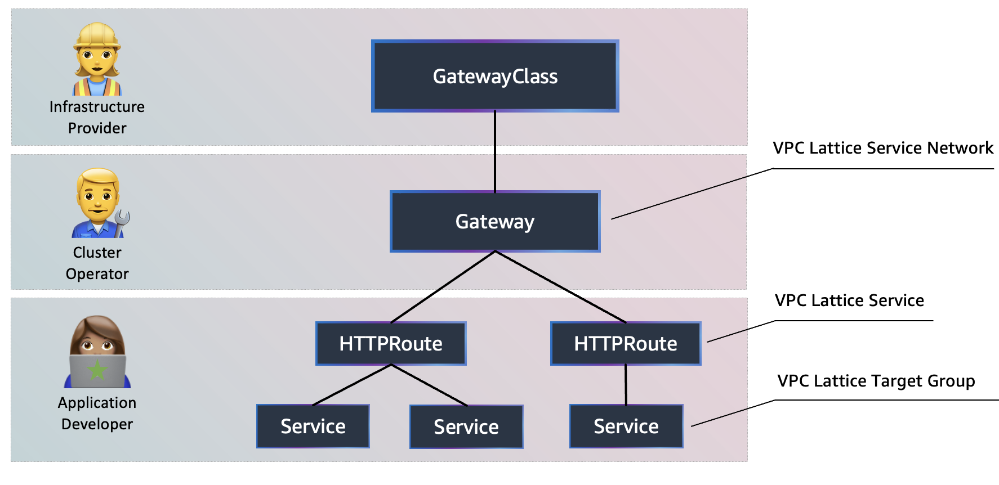

We have built the Kubernetes Lattice Controller to create a Kubernetes-native experience using the VPC Lattice APIs, by leveraging the [Kubernetes Gateway API](https://gateway-api.sigs.k8s.io/) project.

The VPC Lattice Controller detects the creation and changes of Kubernetes Gateway API objects in the cluster and automatically creates/updates VPC Lattice resources. The following figure illustrates how VPC Lattice objects connect to Kubernetes Gateway API objects:

As shown in the figure, there are different personas associated with different levels of control in the Kubernetes Gateway API:

* **Infrastructure provider**: Creates the Kubernetes `GatewayClass` to identify VPC Lattice as the GatewayClass.
* **Cluster operator**: Creates the Kubernetes `Gateway`, which gets information from VPC Lattice related to the Service Networks.
* **Application developer**: Creates `HTTPRoute` objects that specifies how the traffic is redirected from the Gateway to backend Kubernetes services.

Common use-cases for using Amazon VPC Lattice with Amazon EKS include:

* Kubernetes multi-cluster connectivity
* Interfacing multiple types of platforms (containers, instances, serverless)
* Overlapping IP addresses and sidecar management problems avoidance

In this chapter we will create a new version of the `checkout` microservice and use Amazon VPC Lattice to seamesly perform A/B testing.

