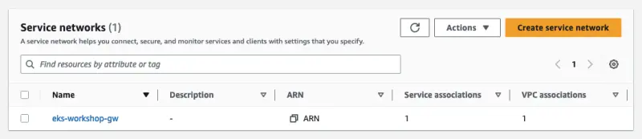

The Gateway API controller has been configured to create a VPC Lattice service network and associate a Kubernetes cluster VPC with it automatically. A service network is a logical boundary that’s used to automatically implement service discovery and connectivity as well as apply access and observability policies to a collection of services. It offers inter-application connectivity over HTTP, HTTPS, and gRPC protocols within a VPC. As of today, the controller supports HTTP and HTTPS.

Before creating a `Gateway`, we need to formalize the types of load balancing implementations that are available via the Kubernetes resource model with a [GatewayClass](https://gateway-api.sigs.k8s.io/concepts/api-overview/#gatewayclass). The controller that listens to the Gateway API relies on an associated `GatewayClass` resource that the user can reference from their `Gateway`:

::yaml{file="manifests/modules/networking/vpc-lattice/controller/gatewayclass.yaml" paths="metadata.name,spec.controllerName"}

1. Set `amazon-vpc-lattice` as the `GatewayClass` name for reference by `Gateway` resources
2. Set `application-networking.k8s.aws/gateway-api-controller` as the `controllerName` to specify the AWS Gateway API controller that manages gateways of this class

Lets create the `GatewayClass`:

```bash
$ kubectl apply -f ~/environment/eks-workshop/modules/networking/vpc-lattice/controller/gatewayclass.yaml
```

The following YAML will create a Kubernetes `Gateway` resource which is associated with a VPC Lattice **Service Network**.

::yaml{file="manifests/modules/networking/vpc-lattice/controller/eks-workshop-gw.yaml" paths="metadata.name,spec.gatewayClassName,spec.listeners.0"}

1. Set the Gateway identifier as the EKS Cluster name by setting `metadata.name` to the `EKS_CLUSTER_NAME` environment variable
2. Set `amazon-vpc-lattice` as the `gatewayClassName` to refer to the VPC Lattice GatewayClass defined earlier
3. This configuration specifies that the `listener` will accept `HTTP` traffic on port `80`

Apply it with the following command:

```bash
$ cat ~/environment/eks-workshop/modules/networking/vpc-lattice/controller/eks-workshop-gw.yaml \
  | envsubst | kubectl apply -f -
```

Verify that `eks-workshop` gateway is created:

```bash
$ kubectl get gateway -n checkout
NAME                CLASS                ADDRESS   PROGRAMMED   AGE
eks-workshop        amazon-vpc-lattice             True         29s
```

Once the gateway is created, find the VPC Lattice service network. Wait until the status is `Reconciled` (this could take about five minutes).

```bash
$ kubectl describe gateway ${EKS_CLUSTER_NAME} -n checkout
apiVersion: gateway.networking.k8s.io/v1beta1
kind: Gateway
status:
   conditions:
      message: 'aws-gateway-arn: arn:aws:vpc-lattice:us-west-2:1234567890:servicenetwork/sn-03015ffef38fdc005'
      reason: Programmed
      status: "True"

$ kubectl wait --for=condition=Programmed gateway/${EKS_CLUSTER_NAME} -n checkout
```

Now you can see the associated **Service Network** created in the VPC console under the Lattice resources in the [AWS console](https://console.aws.amazon.com/vpc/home#ServiceNetworks).


