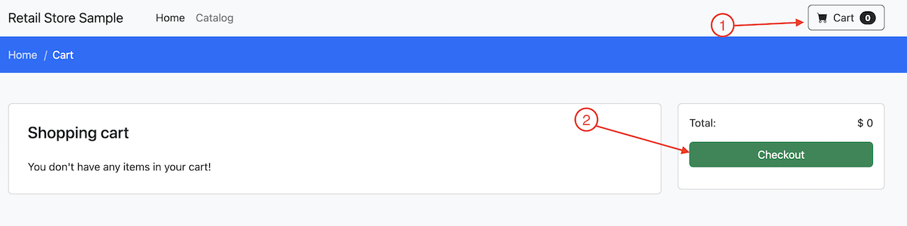
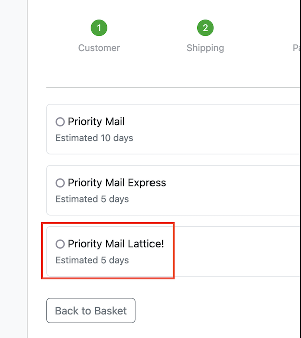

In this section we will create a new version of the `checkout` service and manually perform A/B testing.

Let's deploy a new version of the `checkout` microservice in a new namespace (`checkoutv2`). We will use kustomize to: 

* Change the namespace to `checkoutv2`, 
* Substitute the image with a new version,
* Create a new version of `checkout`.

```bash
$ CHECKOUT_IMG="public.ecr.aws/aws-containers/retail-store-sample-checkout:latest"
$ CHECKOUT_V2="public.ecr.aws/y1b0a4i8/checkoutv2:latest"
$ sed -i 's/checkout/checkoutv2/g' workspace/manifests/checkout/kustomization.yaml
$ sed -i "s|$CHECKOUT_IMG|$CHECKOUT_V2|g" workspace/manifests/checkout/deployment.yaml
$ kubectl apply -k workspace/manifests/checkout/
```

We can check how both namespaces contain a version of the application:

```bash
$ kubectl get pods -n checkout
NAME                              READY   STATUS    RESTARTS   AGE
checkout-698856df4d-nsgrm         1/1     Running   0          19m
checkout-redis-6cfd7d8787-ddfxx   1/1     Running   0          19m
$ kubectl get pods -n checkoutv2
NAME                              READY   STATUS    RESTARTS   AGE
checkout-698856df4d-zdhn7         1/1     Running   0          45s
checkout-redis-6cfd7d8787-cmj6g   1/1     Running   0          45s
```

Now we shift the traffic to the new version. To do so, we will manually update the user interface config map to point to our new service: 
```bash
$ CHECKOUT_V2_SVC="http://checkout.checkoutv2.svc:80"
$ kubectl patch configmap/ui -n ui --type merge -p '{"data":{"ENDPOINTS_CHECKOUT": "'${CHECKOUT_V2_SVC}'"}}'
```

**IMPORTANT**: To ensure nothing is cached and we are using the new image, we will re-create the UI pod:

```bash
$ kubectl delete --all pods --namespace=ui
```

Check that the new pod is in a running state:
```bash
$ kubectl get pods -n ui
```

We can now visit the website and confirm that the new feature we introduced is present.

Port-forward the `ui` pod:  

```bash
$ kubectl port-forward svc/ui 8080:80 -n ui
```

and the preview of your application in `Cloud9`. To do so, click on the `Preview` button on the top bar and select `Preview Running Application` to preview the UI application on the right:


Go to the checkout page:


And fill in the required information (zip code must be 5 numbers):


Checking out items, we can see that a new shipping option is available: 

