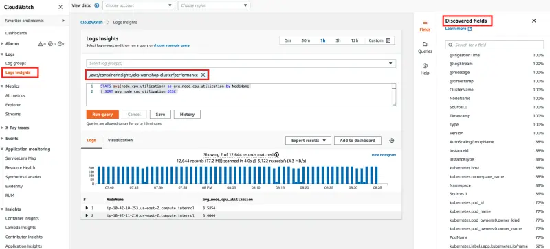
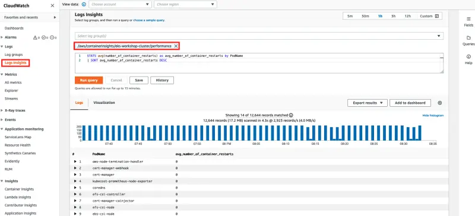

Container Insights collects metrics by using performance log events with using [Embedded Metric Format](https://docs.aws.amazon.com/AmazonCloudWatch/latest/monitoring/CloudWatch_Embedded_Metric_Format.html) stored in CloudWatch Logs. CloudWatch generates several metrics automatically from the logs which you can view in the CloudWatch console. You can also do a deeper analysis of the performance data that is collected by using CloudWatch Logs Insights queries.

First open the CloudWatch Log Insights console:

<ConsoleButton url="https://console.aws.amazon.com/cloudwatch/home#logsV2:logs-insights" service="cloudwatch" label="Open CloudWatch console"/>

Near the top of the screen is the query editor. When you first open CloudWatch Logs Insights this box contains a default query that returns the 20 most recent log events.

When you select a log group and run the query, CloudWatch Logs Insights automatically detects fields in the data in the log group and displays them in **Discovered fields** in the right pane. It also displays a bar graph of log events in this log group over time. This bar graph shows the distribution of events in the log group that matches your query and time range, not only the events displayed in the table. Select the log group for your EKS cluster that ends with `/performance`.

In the query editor, replace the default query with the following query and choose **Run query.**

```text
STATS avg(node_cpu_utilization) as avg_node_cpu_utilization by NodeName
| SORT avg_node_cpu_utilization DESC
```



This query shows a list of nodes, sorted by average node CPU utilization.

To try another example, replace that query with another query and choose **Run query.**

```text
STATS avg(number_of_container_restarts) as avg_number_of_container_restarts by PodName
| SORT avg_number_of_container_restarts DESC
```



This query displays a list of your pods, sorted by average number of container restarts.

If you want to try another query, you can use include fields in the list at the right of the screen. For more information about query syntax, see [CloudWatch Logs Insights Query Syntax](https://docs.aws.amazon.com/AmazonCloudWatch/latest/logs/CWL_QuerySyntax.html).
