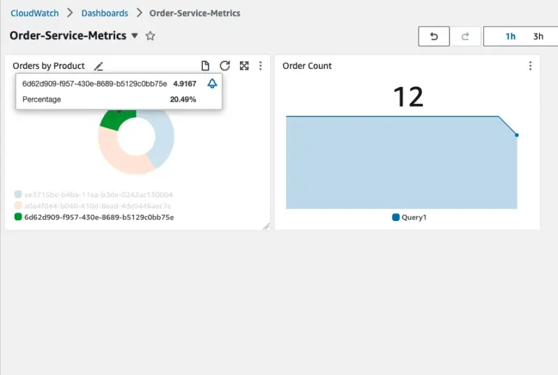
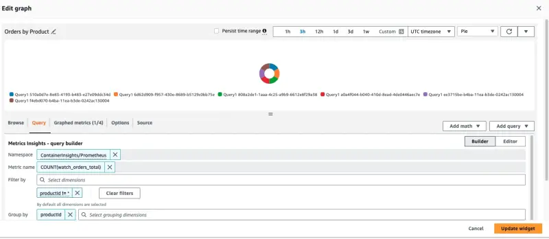

import dashboard from './assets/cw-dashboard.webp';

In this section we'll look at gaining insight into metrics exposed by our workloads and visualizing those metrics using Amazon CloudWatch Insights Prometheus. Some examples of these metrics could be:

- System metrics such as Java heap metrics or database connection pool status
- Application metrics related to business KPIs

Let's look at how to ingest application metrics using AWS Distro for OpenTelemetry and visualize the metrics using Amazon CloudWatch.

Each of the components in this workshop have been instrumented to provide Prometheus metrics using libraries relevant to the particular programming language or framework. We can look at an example of these metrics from the orders service like so:

```bash
$ kubectl -n orders exec deployment/orders -- curl http://localhost:8080/actuator/prometheus
[...]
# HELP jdbc_connections_idle Number of established but idle connections.
# TYPE jdbc_connections_idle gauge
jdbc_connections_idle{name="reader",} 10.0
jdbc_connections_idle{name="writer",} 10.0
[...]
# HELP watch_orders_total The number of orders placed
# TYPE watch_orders_total counter
watch_orders_total{productId="510a0d7e-8e83-4193-b483-e27e09ddc34d",} 2.0
watch_orders_total{productId="808a2de1-1aaa-4c25-a9b9-6612e8f29a38",} 1.0
watch_orders_total{productId="*",} 3.0
watch_orders_total{productId="6d62d909-f957-430e-8689-b5129c0bb75e",} 1.0
```

The output from this command is verbose, for the sake of this lab let us focus on the metric - watch_orders_total:

- `watch_orders_total` - Application metric - How many orders have been placed through the retail store

You can execute similar requests to other components, for example the checkout service:

```bash
$ kubectl -n checkout exec deployment/checkout -- curl http://localhost:8080/metrics
[...]
# HELP nodejs_heap_size_total_bytes Process heap size from Node.js in bytes.
# TYPE nodejs_heap_size_total_bytes gauge
nodejs_heap_size_total_bytes 48668672
[...]
```

You'll recall the collector we've already deployed was a DaemonSet, meaning that it runs on every node. This is not desirable when scraping metrics from the Pods in our cluster since we'd end up with duplicate metrics. Now we'll deploy a second collector running as a Deployment with a single replica.

<details>
  <summary>Expand for full collector manifest</summary>

::yaml{file="manifests/modules/observability/container-insights/adot-deployment/opentelemetrycollector.yaml"}

</details>

We can review this in several parts to make better sense of it.

::yaml{file="manifests/modules/observability/container-insights/adot-deployment/opentelemetrycollector.yaml" zoomPath="spec.image" zoomAfter="1"}

As mentioned this time we're using a Deployment.

Next we can start to break down the collector configuration itself.

::yaml{file="manifests/modules/observability/container-insights/adot-deployment/opentelemetrycollector.yaml" zoomPath="spec.config.receivers.prometheus" zoomBefore="2"}

Rather than the AWS Container Insights Receiver we'll use the [Prometheus receiver](https://github.com/open-telemetry/opentelemetry-collector-contrib/blob/main/receiver/prometheusreceiver/README.md) to scrape all of the pods in the EKS cluster.

::yaml{file="manifests/modules/observability/container-insights/adot-deployment/opentelemetrycollector.yaml" zoomPath="spec.config.processors"}

We'll use the same batch processor as in the previous collector.

::yaml{file="manifests/modules/observability/container-insights/adot-deployment/opentelemetrycollector.yaml" zoomPath="spec.config.exporters.awsemf/prometheus"}

We'll use the AWS CloudWatch EMF Exporter for OpenTelemetry Collector but this time we'll use the namespace `ContainerInsights/Prometheus`.

::yaml{file="manifests/modules/observability/container-insights/adot-deployment/opentelemetrycollector.yaml" zoomPath="spec.config.service.pipelines"}

And as before we put these together in a pipeline.

Create the resources we've explored above:

```bash
$ kubectl kustomize ~/environment/eks-workshop/modules/observability/container-insights/adot-deployment \
  | envsubst | kubectl apply -f- && sleep 5
$ kubectl rollout status -n other deployment/adot-container-ci-deploy-collector --timeout=120s
```

We can confirm that our collector is running by inspecting the Pods created by the DaemonSet:

```bash
$ kubectl get pod -n other -l app.kubernetes.io/name=adot-container-ci-deploy-collector
NAME                                      READY   STATUS    RESTARTS   AGE
adot-container-ci-deploy-collector-5lp5g  1/1     Running   0          15s
```

Now we have the setup complete, we will use the below script to run a load generator which will place orders through the store and generate application metrics:

```bash test=false
$ cat <<EOF | kubectl apply -f -
apiVersion: v1
kind: Pod
metadata:
  name: load-generator
  namespace: other
spec:
  containers:
  - name: artillery
    image: artilleryio/artillery:2.0.0-31
    args:
    - "run"
    - "-t"
    - "http://ui.ui.svc"
    - "/scripts/scenario.yml"
    volumeMounts:
    - name: scripts
      mountPath: /scripts
  initContainers:
  - name: setup
    image: public.ecr.aws/aws-containers/retail-store-sample-utils:load-gen.0.4.0
    command:
    - bash
    args:
    - -c
    - "cp /artillery/* /scripts"
    volumeMounts:
    - name: scripts
      mountPath: "/scripts"
  volumes:
  - name: scripts
    emptyDir: {}
EOF
```

Open the CloudWatch console and navigate to the Dashboards section:

<ConsoleButton url="https://console.aws.amazon.com/cloudwatch/home#dashboards" service="cloudwatch" label="Open CloudWatch console"/>

Choose the dashboard **Order-Service-Metrics** to review the panels within the dashboard:



We can see how the dashboard was configured to query CloudWatch by hovering over the title of the "Orders by Product" panel and clicking the "Edit" button:



The query used to create this panel is displayed at the bottom of the page:

```text
SELECT COUNT(watch_orders_total) FROM "ContainerInsights/Prometheus" WHERE productId != '*' GROUP BY productId
```

Which is doing the following:

- Query for the metric `watch_orders_total`
- Ignore metrics with a `productId` value of `*`
- Sum these metrics and group them by `productId`

Once you're satisfied with observing the metrics, you can stop the load generator using the below command.

```bash timeout=180 test=false
$ kubectl delete pod load-generator -n other
```
