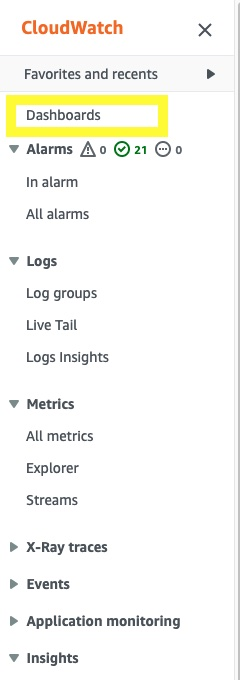
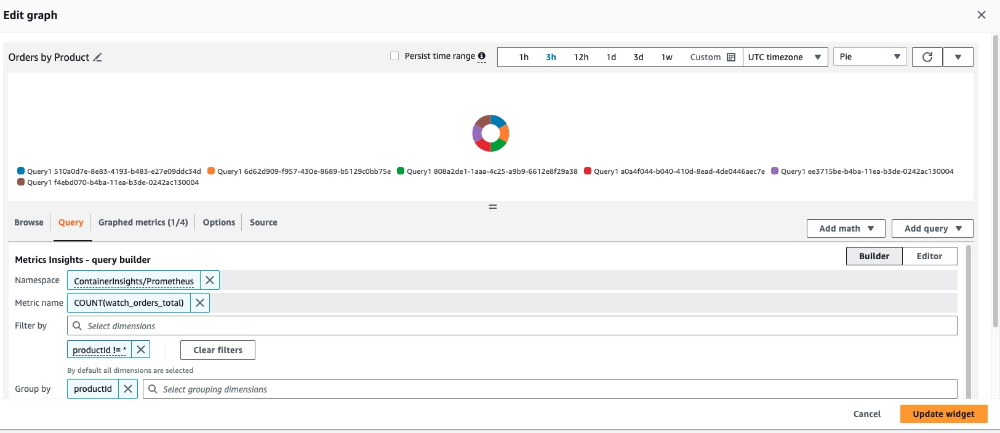

In this section we'll look at gaining insight into metrics exposed by our workloads and visualizing those metrics using Amazon CloudWatch Dashboards. Some examples of these metrics could be:

* System metrics such as Java heap metrics or database connection pool status
* Application metrics related to business KPIs

Let's look at how to ingest application metrics using AWS Distro for OpenTelemetry and visualize the metrics using Amazon CloudWatch.

Each of the components in this workshop have been instrumented to provide Prometheus metrics using libraries relevant to the particular programming language or framework. We can look at an example of these metrics from the orders service like so:

```bash
$ kubectl -n orders exec deployment/orders -- curl http://localhost:8080/actuator/prometheus
[...]
# HELP jdbc_connections_idle Number of established but idle connections.
# TYPE jdbc_connections_idle gauge
jdbc_connections_idle{name="reader",} 10.0
jdbc_connections_idle{name="writer",} 10.0
[...]
# HELP watch_orders_total The number of orders placed
# TYPE watch_orders_total counter
watch_orders_total{productId="510a0d7e-8e83-4193-b483-e27e09ddc34d",} 2.0
watch_orders_total{productId="808a2de1-1aaa-4c25-a9b9-6612e8f29a38",} 1.0
watch_orders_total{productId="*",} 3.0
watch_orders_total{productId="6d62d909-f957-430e-8689-b5129c0bb75e",} 1.0
```

The output from this command is verbose, for the sake of this lab let us focus on the metric - watch_orders_total: 
* watch_orders_total - Application metric - How many orders have been placed through the retail store

You can execute similar requests to other components, for example the checkout service:

```bash
$ kubectl -n checkout exec deployment/checkout -- curl http://localhost:8080/metrics
[...]
# HELP nodejs_heap_size_total_bytes Process heap size from Node.js in bytes.
# TYPE nodejs_heap_size_total_bytes gauge
nodejs_heap_size_total_bytes 48668672
[...]
```

In this lab we'll leverage CloudWatch Container Insights Prometheus Support with AWS Distro for OpenTelemetry to ingest the metrics from all the components and build Amazon CloudWatch Dashboard to show the number of orders that have been placed. There are two parts to solve for integrating Prometheus with CloudWatch Container Insights Prometheus. The first is getting the metrics from Prometheus from application pods. The second problem is exposing them in CloudWatch-specific format with the right sets of metadata. 

First, we have to scrape the metrics from the application pods. The OpenTelemetry configuration to do this is detailed below:

```bash
$ kubectl -n other get opentelemetrycollector adot-container-ci -o jsonpath='{.spec.config}' \
  | yq '.receivers.prometheus.config.scrape_configs[2]'
job_name: 'kubernetes-pods'
honor_labels: true
kubernetes_sd_configs:
  - role: pod
relabel_configs:
  - source_labels: [__meta_kubernetes_pod_annotation_prometheus_io_scrape]
    action: keep
    regex: true
  - source_labels: [__meta_kubernetes_pod_annotation_prometheus_io_scrape_slow]
    action: drop
    regex: true
  - source_labels: [__meta_kubernetes_pod_annotation_prometheus_io_scheme]
    action: replace
    regex: (https?)
    target_label: __scheme__
  - source_labels: [__meta_kubernetes_pod_annotation_prometheus_io_path]
    action: replace
    target_label: __metrics_path__
    regex: (.+)
  - action: labelmap
    regex: __meta_kubernetes_pod_annotation_prometheus_io_param_(.+)
    replacement: __param_$1
  - action: labelmap
    regex: __meta_kubernetes_pod_label_(.+)
  - source_labels: [__meta_kubernetes_namespace]
    action: replace
    target_label: namespace
  - source_labels: [__meta_kubernetes_pod_name]
    action: replace
    target_label: pod
  - source_labels: [__meta_kubernetes_pod_phase]
    regex: Pending|Succeeded|Failed|Completed
    action: drop
```

This configuration leverages the Prometheus [Kubernetes service discovery](https://prometheus.io/docs/prometheus/latest/configuration/configuration/#kubernetes_sd_config) mechanism to automatically discover all pods with specific annotations. This particular configuration will discover any pods with the annotation `prometheus.io/scrape`, and will enrich metrics it scrapes with Kubernetes metadata such as the namespace and pod name.

For supporting CloudWatch Container Insights Prometheus, we export metrics with specific dimnesions in [Embedded Metric Format - EMF](https://docs.aws.amazon.com/AmazonCloudWatch/latest/monitoring/CloudWatch_Embedded_Metric_Format_Specification.html). The CloudWatch EMF Exporter converts the metrics data into performance log events with EMF and then sends it directly to a CloudWatch log group using the PutLogEvents API.

```bash
$ kubectl -n other get opentelemetrycollector adot-container-ci -o jsonpath='{.spec.config}' \
   | yq '.exporters.awsemf/prometheus'
namespace: ContainerInsights/Prometheus
log_group_name: "/aws/containerinsights/${EKS_CLUSTER_NAME}/prometheus"
log_stream_name: "${TaskId}"
region: ${AWS_REGION}
resource_to_telemetry_conversion:
  enabled: true
dimension_rollup_option: NoDimensionRollup
metric_declarations:
  - dimensions: [[pod, productId]]
    metric_name_selectors:
      - "^watch_orders_total$"
```
Pipelines are defined in the configuration file- opentelemetrycollector.yaml. A pipeline defines the data flow in OpenTelemetry collector and includes receiving, processing, and exporting metrics. In each stage, there can be multiple components and they may run in serial (processor) or in parallel (receiver, exporter). Internally, all the components communicate using OpenTelemetry’s unified data models so components from different vendors can work together. Receivers collect data from source systems and translate them into internal models. Processors can filter and modify metrics. Exporters convert the data to other schema and send to target systems. From this configuration, your metrics from orders will be made available under the CloudWatch Metrics namespace ContainerInsights/Prometheus with the dimensions pod and productId per the exporter configuration settings.

```bash
$ kubectl -n other get opentelemetrycollector adot-container-ci -o jsonpath='{.spec.config}' \
   | yq '.service'
    pipelines:
        metrics/perf:
          receivers: [awscontainerinsightreceiver]
          processors: [batch/metrics]
          exporters: [awsemf/performance]
        metrics/promo:
          receivers: [prometheus]
          processors: [batch/metrics]
          exporters: [awsemf/prometheus]
      extensions: [health_check,pprof, zpages, sigv4auth]
```

Now we have the setup complete, we will use the below script to run a load generator which will place orders through the store and generate application metrics:

```bash test=false
$ cat <<EOF | kubectl apply -f -
apiVersion: v1
kind: Pod
metadata:
  name: load-generator
  namespace: other
spec:
  containers:
  - name: artillery
    image: artilleryio/artillery:2.0.0-31
    args:
    - "run"
    - "-t"
    - "http://ui.ui.svc"
    - "/scripts/scenario.yml"
    volumeMounts:
    - name: scripts
      mountPath: /scripts
  initContainers:
  - name: setup
    image: public.ecr.aws/aws-containers/retail-store-sample-utils:load-gen.0.4.0
    command:
    - bash
    args:
    - -c
    - "cp /artillery/* /scripts"
    volumeMounts:
    - name: scripts
      mountPath: "/scripts"
  volumes:
  - name: scripts
    emptyDir: {}
EOF
```

Open the CloudWatch console and navigate to the Dashboards section:



Choose the dashboard **Order-Service-Metrics** to review the panels within the dashboard:


We can see how the dashboard was configured to query CloudWatch by hovering over the title of the "Orders by Product" panel and clicking the "Edit" button:



The query used to create this panel is displayed at the bottom of the page:

```
SELECT COUNT(watch_orders_total) FROM "ContainerInsights/Prometheus" WHERE productId != '*' GROUP BY productId
```

Which is doing the following:

* Query for the metric `watch_orders_total`
* Ignore metrics with a `productId` value of `*`
* Sum these metrics and group them by `productId`

Once you're satisfied with observing the metrics, you can stop the load generator using the below command.

```bash timeout=180 test=false
$ kubectl delete pod load-generator -n other
```