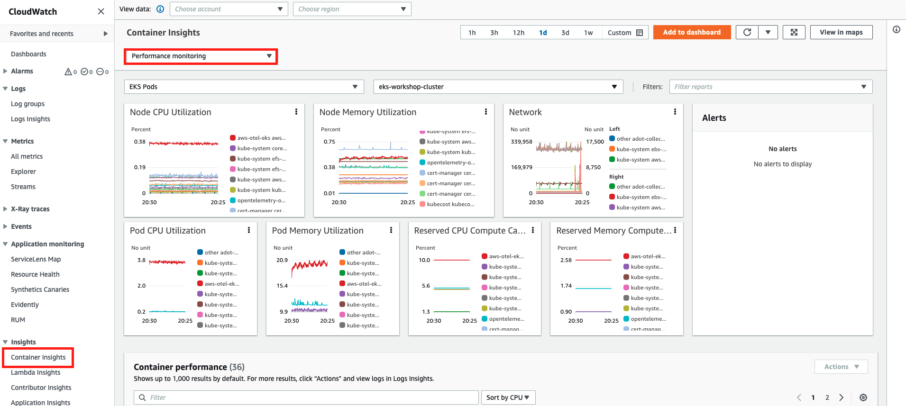

In this lab exercise, we'll visualize the Container Insights metrics using CloudWatch.

:::tip
It may take a few minutes for data to start appearing in CloudWatch
:::

To view metrics first open the CloudWatch console and navigate to Container Insights:

https://console.aws.amazon.com/cloudwatch/home#container-insights:infrastructure

Select **Performance Monitoring** from the dropdown menu at the top of the page, and now select the type of resources you wish to view. For example, select **EKS Pods** to get basic metrics such as CPU, memory and utilization for the Pods running in our EKS cluster:

You can set a CloudWatch alarm on any metric that Container Insights collects. For more information, see [Using Amazon CloudWatch alarms](https://docs.aws.amazon.com/AmazonCloudWatch/latest/monitoring/AlarmThatSendsEmail.html)
