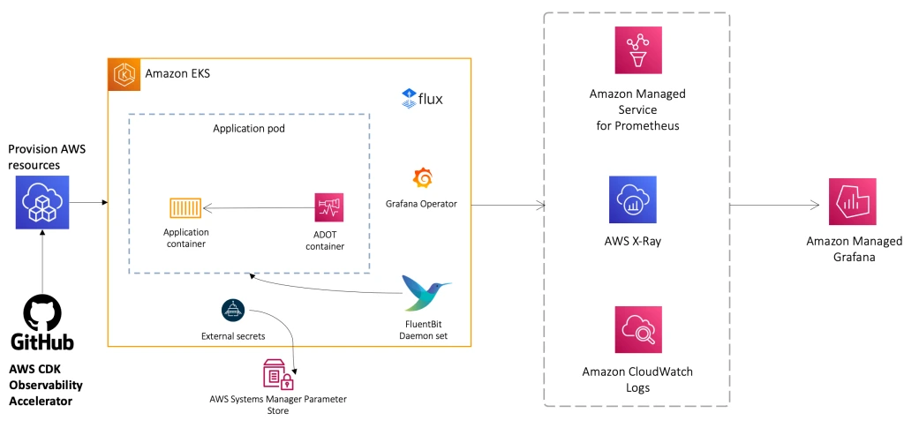

Observability is a foundational element of a well-architected EKS environment. AWS provides native (CloudWatch) and open source managed (Amazon Managed Service for Prometheus, Amazon Managed Grafana and AWS Distro for OpenTelemetry) solutions for monitoring, logging and alarming of EKS environments.

In this chapter, we'll cover how you can use AWS observability solutions integrated with EKS to provide visibility into:

- Kubernetes Resources in the EKS console view
- Control Plane and Pod Logs utilizing Fluentbit
- Monitoring Metrics with CloudWatch Container Insights
- Monitoring EKS Metrics with AMP and ADOT.

Watch a video walk-through of the observability module with one of the module maintainers, Nirmal Mehta (AWS) here:

<ReactPlayer controls src="https://www.youtube-nocookie.com/embed/ajPe7HVypxg" width={640} height={360} />  

:::info
To dive deeper into AWS Observability features take a look at the [One Observability Workshop](https://catalog.workshops.aws/observability/en-US)
:::

:::info
Explore a set of opinionated Infrastructure as Code (IaC) modules to help you set up observability for your AWS environments in our [AWS Observability Accelerator for CDK](https://aws-observability.github.io/cdk-aws-observability-accelerator/) and [AWS Observability Accelerator for Terraform](https://aws-observability.github.io/terraform-aws-observability-accelerator/). These modules work with AWS Native services like Amazon CloudWatch and AWS managed observability services such as Amazon Managed Service for Prometheus, Amazon Managed Grafana and AWS Distro for OpenTelemetry (ADOT).
:::

