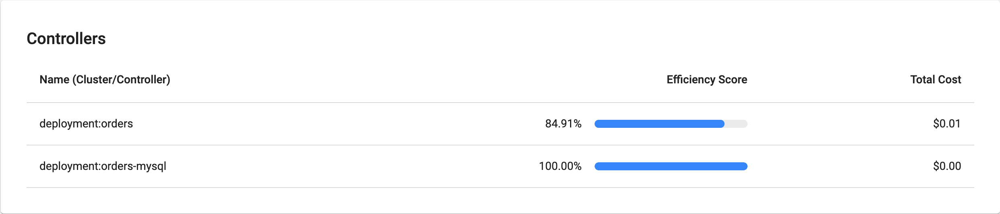

Now, we'll take a look at Cost Allocation. Click on <b>Cost Allocation</b>.

You should see the following Dashboard:

<browser url='https://2an0f568zlmnfkfb3w59iviyx6dedjmi.vfs.cloud9.us-east-1.amazonaws.com/allocations'>

</browser>

We can use this screen to dive further into the cost allocation of our cluster. We can look at various cost dimensions:

- namespace
- deployment
- pod
- labels

The application we installed in the Introduction section created several of these components. These components also have. Next, we'll drill into the costs of this application by using these dimensions.

To do this click on the setting button next to <b>Aggregate by</b> at the top right.

<browser url='https://2an0f568zlmnfkfb3w59iviyx6dedjmi.vfs.cloud9.us-east-1.amazonaws.com/allocations'>

</browser>

Then under <b>Filters</b> select <b>label</b> from the drop-down menu, enter the value `app.kubernetes.io/created-by: eks-workshop`, and click the plus symbol.

<browser url='https://2an0f568zlmnfkfb3w59iviyx6dedjmi.vfs.cloud9.us-east-1.amazonaws.com/allocations'>

</browser>

This filters down the namespaces to only show our workloads that have the label `app.kubernetes.io/create-by: eks-workshop`. This label is included on all the components of the application we launched in the Introduction section.

Now click on <b>Aggregate by</b> and choose <b>Deployment</b>. This will aggregate the costs by deployment instead of by namespace. See below.

<browser url='https://2an0f568zlmnfkfb3w59iviyx6dedjmi.vfs.cloud9.us-east-1.amazonaws.com/allocations'>

</browser>

We see that there are different deployments associated with our application. We can dig deeper. Let's look at a single namespace. Set <b>Aggregate by</b> back to <b>Namespace</b>, remove the filter, and click on one of the namespaces in the table. We've chosen the orders namespace.

<browser url='https://2an0f568zlmnfkfb3w59iviyx6dedjmi.vfs.cloud9.us-east-1.amazonaws.com/allocations'>

</browser>

In this view we can see all the costs associated with the Kubernetes resources running in this namespace. This can be a useful view if you have a multi-tenant cluster and have a namespace per customer.

We can also look at the different resources running in this namespace and see their associated costs.

Click on one of the entries under <b>Controllers</b>. We've clicked on the orders deployment.

<browser url='https://2an0f568zlmnfkfb3w59iviyx6dedjmi.vfs.cloud9.us-east-1.amazonaws.com/allocations'>

</browser>

This view shows us more detail of the specific "controller", in this case a deployment. We can start to use this information to understand what optimizations we can make. Such as tuning resource requests and limits to limit the amount of CPU and memory that is allocated to each pod in our EKS cluster.

Until now we've looked at a broad overview of cost allocations or a deep dive into single resource. What if we want to group dig into cost allocation by team? Consider the following scenario: each team at a company is responsible for their operating costs within a cluster. For example, we have a team that is responsible for all the databases in our cluster and they want to dig into their operating costs. This can be accomplished by giving each database a custom label associated to that team. In our cluster we've done this by given all the database resources the label `app.kubernetes.io/team: database`. Using this label, we can filter on all resources across the different namespaces that belong to this team.

<browser url='https://2an0f568zlmnfkfb3w59iviyx6dedjmi.vfs.cloud9.us-east-1.amazonaws.com/allocations'>

</browser>

There are many other features available with Kubecost as well, like Savings, Health, Reports and Alerts. Feel free to play around with various links.

### Clean Up

To Clean Up, go back to the Cloud9 terminal and stop the port forward by pressing `CTRL + C`. That's it.
