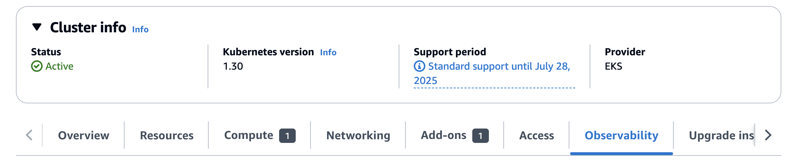
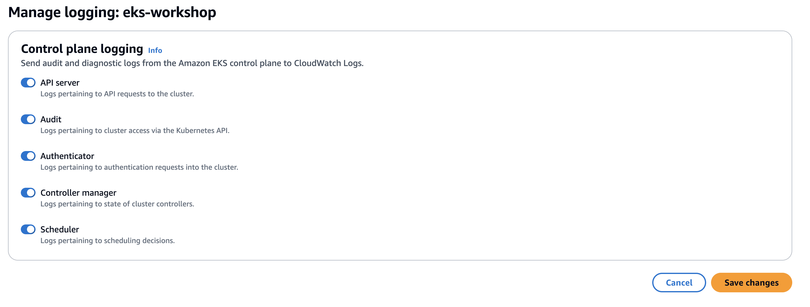
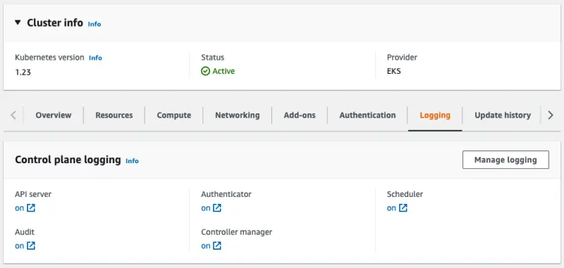
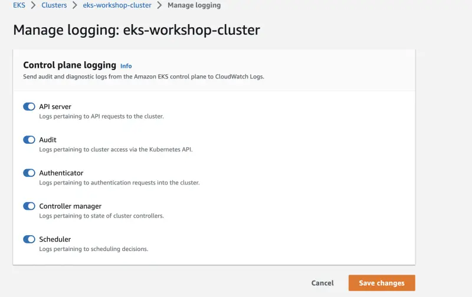

You can enable each of the cluster log types individually, and in this lab we're enabling everything.

Let's take a look this configuration in the EKS console:

<ConsoleButton url="https://console.aws.amazon.com/eks/home#/clusters/eks-workshop?selectedTab=cluster-logging-tab" service="eks" label="Open EKS console"/>

The **Logging** tab shows the current configuration for control plane logs for the cluster:




You can alter the logging configuration by clicking the **Manage** button:



You can also enable EKS control plane logs on a per-cluster basis through the EKS API. This will often be configured using Terraform or CloudFormation, but in this lab we can use the AWS CLI to enable the functionality:

```bash hook=cluster-logging
$ aws eks update-cluster-config \
    --region $AWS_REGION \
    --name $EKS_CLUSTER_NAME \
    --logging '{"clusterLogging":[{"types":["api","audit","authenticator","controllerManager","scheduler"],"enabled":true}]}'
{
    "update": {
        "id": "6d73515c-f5e7-4288-9e55-480e9c6dd084",
        "status": "InProgress",
        "type": "LoggingUpdate",
        "params": [
            {
                "type": "ClusterLogging",
                "value": "{\"clusterLogging\":[{\"types\":[\"api\",\"audit\",\"authenticator\",\"controllerManager\",\"scheduler\"],\"enabled\":true}]}"
            }
        ],
        "createdAt": "2023-05-25T19:33:16.622000+00:00",
        "errors": []
    }
}
$ sleep 30
$ aws eks wait cluster-active --name $EKS_CLUSTER_NAME
```

As you can see we can enable each of the cluster log types individually, and in this lab we're enabling everything.

Let's take a look this configuration in the EKS console:

<ConsoleButton url="https://console.aws.amazon.com/eks/home#/clusters/eks-workshop?selectedTab=cluster-logging-tab" service="eks" label="Open EKS console"/>

The **Logging** tab shows the current configuration for control plane logs for the cluster:



You can alter the logging configuration by clicking the **Manage** button:



:::info
If you are using the CDK Observability Accelerator then check out the [CDK Observability Builder](https://aws-quickstart.github.io/cdk-eks-blueprints/builders/observability-builder/#supported-methods) which supports enabling all control plane logging features for EKS clusters and storing them in CloudWatch.
:::
