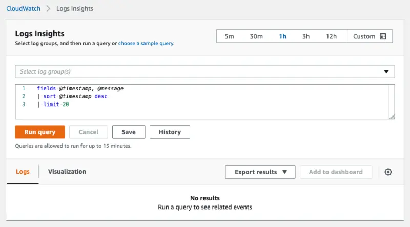

CloudWatch Logs Insights enables you to interactively search and analyze your log data in CloudWatch Logs. You can perform queries to help you more efficiently and effectively respond to operational issues. If an issue occurs, you can use CloudWatch Logs Insights to identify potential causes and validate deployed fixes. It includes a purpose-built query language with a few simple but powerful commands.

In this lab exercise, we'll take a look at an example of using CloudWatch Log Insights to query the EKS control plane logs. First navigate to CloudWatch Log Insights in the console:

<ConsoleButton url="https://console.aws.amazon.com/cloudwatch/home#logsV2:logs-insights" service="cloudwatch" label="Open CloudWatch console"/>

You will be presented with a screen that looks like this:



A common use-case for CloudWatch Log Insights is to identify component within an EKS cluster that are making a high volume of requests to the Kubernetes API server. One way to do this is with the following query:

```blank
fields userAgent, requestURI, @timestamp, @message
| filter @logStream ~= "kube-apiserver-audit"
| stats count(userAgent) as count by userAgent
| sort count desc
```

This query checks the Kubernetes audit logs and counts the number of API requests made grouped by `userAgent` and sorted them in descending order. In the Log Insights console select the log group for your EKS cluster:


Copy the query to the console and press **Run query**, which will return results:


This information can be invaluable to understand what components are sending requests to the API server.

:::info
If you are using the CDK Observability Accelerator then check out the [CloudWatch Insights Add-on](https://aws-quickstart.github.io/cdk-eks-blueprints/addons/aws-cloudwatch-insights/) which collects, aggregates, and summarizes metrics and logs from your containerized applications and microservices in EKS.
:::
