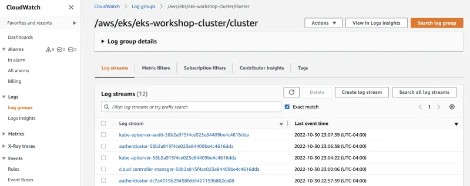

Let's take a look at the logs in the CloudWatch Logs console:

<ConsoleButton url="https://console.aws.amazon.com/cloudwatch/home?#logsV2:log-groups" service="cloudwatch" label="Open CloudWatch console"/>

Filter for **/aws/eks** prefix and select the cluster you want verify the logs:

You will be presented with a number of log streams in the group:

Select any of these log streams to view the entries being sent to CloudWatch Logs by the EKS control plane.
