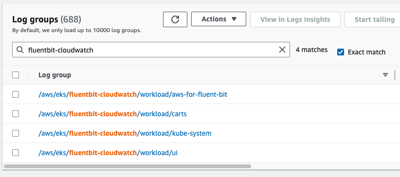
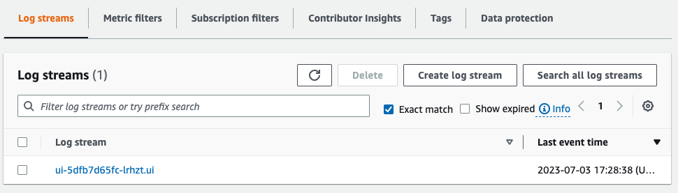
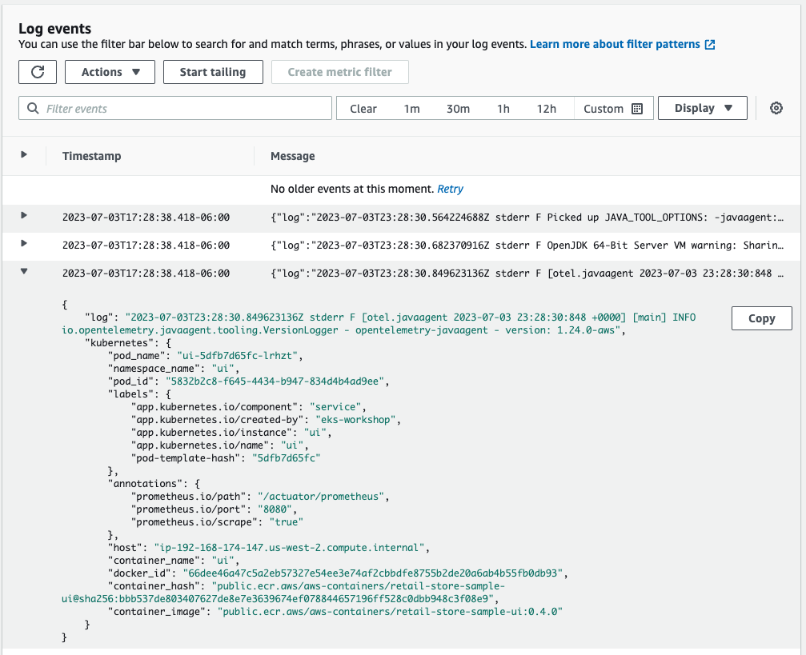

In this lab exercise, we'll see how to check the Kubernetes pod logs forwarded by the Fluent Bit agent deployed on each node to Amazon CloudWatch Logs. The deployed application components write logs to `stdout`, which are saved in the `/var/log/containers/*.log` path on each node.

First, lets check that our checkout component is creating logs by directly using `kubectl logs`:

```bash
$ kubectl logs -n checkout deployment/checkout 
[Nest] 1  - 11/23/2022, 12:00:14 AM     LOG [NestFactory] Starting Nest application...
[Nest] 1  - 11/23/2022, 12:00:15 AM     LOG [InstanceLoader] PrometheusModule dependencies initialized +123ms
[Nest] 1  - 11/23/2022, 12:00:15 AM     LOG [InstanceLoader] ConfigHostModule dependencies initialized +0ms
[Nest] 1  - 11/23/2022, 12:00:15 AM     LOG [InstanceLoader] TerminusModule dependencies initialized +1ms
[Nest] 1  - 11/23/2022, 12:00:15 AM     LOG [InstanceLoader] AppModule dependencies initialized +1ms
[Nest] 1  - 11/23/2022, 12:00:15 AM     LOG [InstanceLoader] ConfigModule dependencies initialized +1ms
[Nest] 1  - 11/23/2022, 12:00:15 AM     LOG [InstanceLoader] ConfigModule dependencies initialized +0ms
[Nest] 1  - 11/23/2022, 12:00:15 AM     LOG [InstanceLoader] CheckoutModule dependencies initialized +3ms
[Nest] 1  - 11/23/2022, 12:00:15 AM     LOG [RoutesResolver] AppController {/}: +423ms
[Nest] 1  - 11/23/2022, 12:00:15 AM     LOG [RouterExplorer] Mapped {/health, GET} route +3ms
[Nest] 1  - 11/23/2022, 12:00:15 AM     LOG [RoutesResolver] PrometheusController {/metrics}: +1ms
[Nest] 1  - 11/23/2022, 12:00:15 AM     LOG [RouterExplorer] Mapped {/metrics, GET} route +1ms
[Nest] 1  - 11/23/2022, 12:00:15 AM     LOG [RoutesResolver] CheckoutController {/checkout}: +1ms
[Nest] 1  - 11/23/2022, 12:00:15 AM     LOG [RouterExplorer] Mapped {/checkout/:customerId, GET} route +1ms
[Nest] 1  - 11/23/2022, 12:00:15 AM     LOG [RouterExplorer] Mapped {/checkout/:customerId/update, POST} route +1ms
[Nest] 1  - 11/23/2022, 12:00:15 AM     LOG [RouterExplorer] Mapped {/checkout/:customerId/submit, POST} route +1ms
[Nest] 1  - 11/23/2022, 12:00:15 AM     LOG [NestApplication] Nest application successfully started +3ms
```

Open the CloudWatch Logs console to check these logs are appearing:

https://console.aws.amazon.com/cloudwatch/home?#logsV2:log-groups

Filter for **worker-fluentbit-logs** to find the log group and select it:



Filter for **checkout** to check the logs streams and select one:



You can expand one of the log entries to see the full JSON payload:


