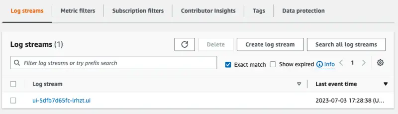
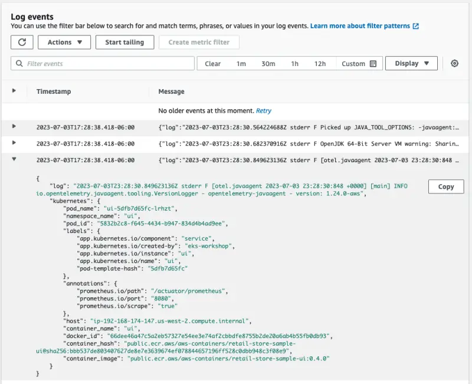

In this lab exercise, we'll see how to check the Kubernetes pod logs forwarded by the Fluent Bit agent deployed on each node to Amazon CloudWatch Logs. The deployed application components write logs to `stdout`, which are saved in the `/var/log/containers/*.log` path on each node.

First, lets recycle the pods for the `ui` component to make sure fresh logs are written since we enabled Fluent Bit:

```bash
$ kubectl delete pod -n ui --all
$ kubectl rollout status deployment/ui \
  -n ui --timeout 30s
deployment "ui" successfully rolled out
```

Now we can check that our `ui` component is creating logs by directly using `kubectl logs`:

```bash
$ kubectl logs -n ui deployment/ui
Picked up JAVA_TOOL_OPTIONS: -javaagent:/opt/aws-opentelemetry-agent.jar
OpenJDK 64-Bit Server VM warning: Sharing is only supported for boot loader classes because bootstrap classpath has been appended
[otel.javaagent 2023-07-03 23:39:18:499 +0000] [main] INFO io.opentelemetry.javaagent.tooling.VersionLogger - opentelemetry-javaagent - version: 1.24.0-aws

  .   ____          _            __ _ _
 /\\ / ___'_ __ _ _(_)_ __  __ _ \ \ \ \
( ( )\___ | '_ | '_| | '_ \/ _` | \ \ \ \
 \\/  ___)| |_)| | | | | || (_| |  ) ) ) )
  '  |____| .__|_| |_|_| |_\__, | / / / /
 =========|_|==============|___/=/_/_/_/
 :: Spring Boot ::                (v3.0.6)

2023-07-03T23:39:20.472Z  INFO 1 --- [           main] c.a.s.u.UiApplication                    : Starting UiApplication v0.0.1-SNAPSHOT using Java 17.0.7 with PID 1 (/app/app.jar started by appuser in /app)
2023-07-03T23:39:20.488Z  INFO 1 --- [           main] c.a.s.u.UiApplication                    : No active profile set, falling back to 1 default profile: "default"
2023-07-03T23:39:24.985Z  WARN 1 --- [           main] o.s.b.a.e.EndpointId                     : Endpoint ID 'fail-cart' contains invalid characters, please migrate to a valid format.
2023-07-03T23:39:25.132Z  INFO 1 --- [           main] o.s.b.a.e.w.EndpointLinksResolver        : Exposing 15 endpoint(s) beneath base path '/actuator'
2023-07-03T23:39:25.567Z  INFO 1 --- [           main] o.s.b.w.e.n.NettyWebServer               : Netty started on port 8080
2023-07-03T23:39:25.599Z  INFO 1 --- [           main] c.a.s.u.UiApplication                    : Started UiApplication in 5.877 seconds (process running for 7.361)
```

Open the CloudWatch Logs console to check these logs are appearing:

<ConsoleButton url="https://console.aws.amazon.com/cloudwatch/home?#logsV2:log-groups" service="cloudwatch" label="Open CloudWatch console"/>

Filter for **fluentbit-cloudwatch** to find the log groups created by Fluent Bit:


Select `/aws/eks/fluentbit-cloudwatch/workload/ui` to view the log streams, each one corresponds to an individual pod:



You can expand one of the log entries to see the full JSON payload:


