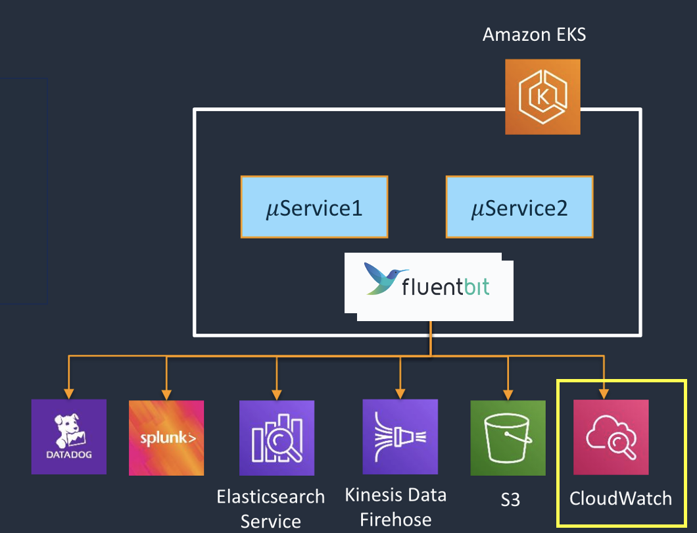

For Kubernetes cluster components that run in pods, these write to files inside the `/var/log` directory, bypassing the default logging mechanism. We can implement pod-level logging by deploying a node-level logging agent as a DaemonSet on each node, such as Fluent Bit.

[Fluent Bit](https://fluentbit.io/) is a lightweight log processor and forwarder that allows you to collect data and logs from different sources, enrich them with filters and send them to multiple destinations like CloudWatch, Kinesis Data Firehose, Kinesis Data Streams and Amazon OpenSearch Service.

AWS provides a Fluent Bit image with plugins for both CloudWatch Logs and Kinesis Data Firehose. The [AWS for Fluent Bit](https://github.com/aws/aws-for-fluent-bit) image is available on the [Amazon ECR Public Gallery](https://gallery.ecr.aws/aws-observability/aws-for-fluent-bit).

Fluent-bit can be used to ship logs to various destinations. However, in this lab, we will see how it is leveraged to ship the container logs to CloudWatch.



In the following section, you will see how to validate Fluent Bit agent is already running as a daemonSet to send the containers / pods logs to CloudWatch Logs. Read more about how to [deploy Fluent Bit to send logs from containers to CloudWatch Logs](https://docs.aws.amazon.com/AmazonCloudWatch/latest/monitoring/Container-Insights-setup-logs-FluentBit.html#Container-Insights-FluentBit-troubleshoot).

First, we can validate the resources created for Fluent Bit by entering the following command. Each node should have one pod:

```bash
$ kubectl get all -n aws-for-fluent-bit
NAME                           READY   STATUS    RESTARTS   AGE
pod/aws-for-fluent-bit-vfsbe   1/1     Running   0          99m
pod/aws-for-fluent-bit-kmvnk   1/1     Running   0          99m
pod/aws-for-fluent-bit-rxhs7   1/1     Running   0          100m

NAME                                DESIRED   CURRENT   READY   UP-TO-DATE   AVAILABLE   NODE SELECTOR   AGE
daemonset.apps/aws-for-fluent-bit   2         2         2       2            2           <none>          104m
```

The ConfigMap for aws-for-fluent-bit is configured to stream the contents of files in the directory `/var/log/containers/*.log` from each node to the CloudWatch log group `/eks-workshop/worker-fluentbit-logs`:

```bash
$ kubectl describe configmaps -n aws-for-fluent-bit
Name:         aws-for-fluent-bit
Namespace:    aws-for-fluent-bit
Labels:       app.kubernetes.io/instance=aws-for-fluent-bit
              app.kubernetes.io/managed-by=Helm
              app.kubernetes.io/name=aws-for-fluent-bit
              app.kubernetes.io/version=2.21.5
              helm.sh/chart=aws-for-fluent-bit-0.1.18
Annotations:  meta.helm.sh/release-name: aws-for-fluent-bit
              meta.helm.sh/release-namespace: aws-for-fluent-bit

Data
====
fluent-bit.conf:
----
[SERVICE]
    Parsers_File /fluent-bit/parsers/parsers.conf

[INPUT]
    Name              tail
    Tag               kube.*
    Path              /var/log/containers/*.log
    DB                /var/log/flb_kube.db
    Parser            docker
    Docker_Mode       On
    Mem_Buf_Limit     5MB
    Skip_Long_Lines   On
    Refresh_Interval  10

[FILTER]
    Name                kubernetes
    Match               kube.*
    Kube_URL            https://kubernetes.default.svc.cluster.local:443
    Merge_Log           On
    Merge_Log_Key       data
    Keep_Log            On
    K8S-Logging.Parser  On
    K8S-Logging.Exclude On
[OUTPUT]
    Name                  cloudwatch
    Match                 *
    region                us-east-1
    log_group_name        /eks-workshop/worker-fluentbit-logs
    log_stream_prefix     fluentbit-
    auto_create_group     true

...........

```

Use the `kubectl logs` command to check the Fluent Bit daemonset logs, where you will observe new CloudWatch Log groups and streams are created for each workload.

```bash
$ kubectl logs daemonset.apps/aws-for-fluent-bit -n aws-for-fluent-bit

Found 3 pods, using pod/aws-for-fluent-bit-vlx8j
AWS for Fluent Bit Container Image Version 2.28.4
Fluent Bit v1.9.9
* Copyright (C) 2015-2022 The Fluent Bit Authors
* Fluent Bit is a CNCF sub-project under the umbrella of Fluentd
* https://fluentbit.io

[2025/04/11 22:25:59] [ info] [fluent bit] version=1.9.9, commit=5fcfe330e5, pid=1
[2025/04/11 22:25:59] [ info] [storage] version=1.3.0, type=memory-only, sync=normal, checksum=disabled, max_chunks_up=128
[2025/04/11 22:25:59] [ info] [cmetrics] version=0.3.7
[2025/04/11 22:25:59] [ info] [filter:kubernetes:kubernetes.0] https=1 host=kubernetes.default.svc.cluster.local port=443
[2025/04/11 22:25:59] [ info] [filter:kubernetes:kubernetes.0]  token updated
[2025/04/11 22:25:59] [ info] [filter:kubernetes:kubernetes.0] local POD info OK
[2025/04/11 22:25:59] [ info] [filter:kubernetes:kubernetes.0] testing connectivity with API server...
[2025/04/11 22:25:59] [ info] [filter:kubernetes:kubernetes.0] connectivity OK
[2025/04/11 22:25:59] [ info] [sp] stream processor started
...
...
[2025/04/11 22:26:12] [ info] [output:cloudwatch_logs:cloudwatch_logs.0] Creating log stream orders-79bc47b54d-gsxd7.orders in log group /aws/eks/fluentbit-cloudwatch/workload/orders
[2025/04/11 22:26:12] [ info] [output:cloudwatch_logs:cloudwatch_logs.0] Log Group /aws/eks/fluentbit-cloudwatch/workload/orders not found. Will attempt to create it.
[2025/04/11 22:26:12] [ info] [output:cloudwatch_logs:cloudwatch_logs.0] Creating log group /aws/eks/fluentbit-cloudwatch/workload/orders
[2025/04/11 22:26:12] [ info] [output:cloudwatch_logs:cloudwatch_logs.0] Created log group /aws/eks/fluentbit-cloudwatch/workload/orders
[2025/04/11 22:26:12] [ info] [output:cloudwatch_logs:cloudwatch_logs.0] Creating log stream orders-79bc47b54d-gsxd7.orders in log group /aws/eks/fluentbit-cloudwatch/workload/orders
[2025/04/11 22:26:12] [ info] [output:cloudwatch_logs:cloudwatch_logs.0] Created log stream orders-79bc47b54d-gsxd7.orders
...
[2025/04/11 22:26:19] [ info] [output:cloudwatch_logs:cloudwatch_logs.0] Creating log stream orders-79bc47b54d-vvpf2.orders in log group /aws/eks/fluentbit-cloudwatch/workload/orders
[2025/04/11 22:26:19] [ info] [output:cloudwatch_logs:cloudwatch_logs.0] Created log stream orders-79bc47b54d-vvpf2.orders
```