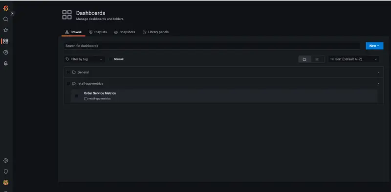
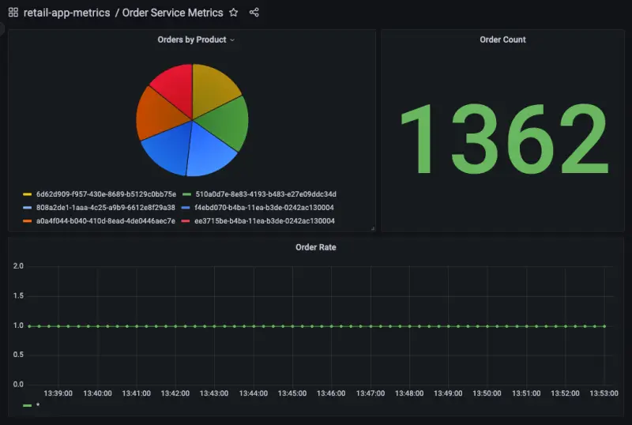
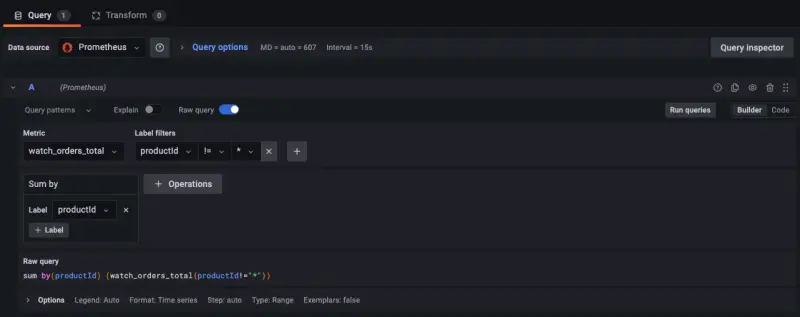

In this section we'll look at gaining insight in to metrics exposed by our workloads. Some examples of these could be:

- System metrics such as Java heap metrics or database connection pool status
- Application metrics related to business KPIs

Let's look at how to ingest application metrics using AWS Distro for OpenTelemetry and visualize the metrics using Grafana.

Each of the components in this workshop have been instrumented to provide Prometheus metrics using libraries relevant to the particular programming language or framework. We can look at an example of these metrics from the orders service like so:

```bash
$ kubectl -n orders exec deployment/orders -- curl http://localhost:8080/actuator/prometheus
[...]
# HELP jdbc_connections_idle Number of established but idle connections.
# TYPE jdbc_connections_idle gauge
jdbc_connections_idle{name="reader",} 10.0
jdbc_connections_idle{name="writer",} 10.0
[...]
# HELP watch_orders_total The number of orders placed
# TYPE watch_orders_total counter
watch_orders_total{productId="510a0d7e-8e83-4193-b483-e27e09ddc34d",} 2.0
watch_orders_total{productId="808a2de1-1aaa-4c25-a9b9-6612e8f29a38",} 1.0
watch_orders_total{productId="*",} 3.0
watch_orders_total{productId="6d62d909-f957-430e-8689-b5129c0bb75e",} 1.0
```

The output from this command is verbose so the example above has been pruned to show:

- System metric - How many JDBC connections are idle
- Application metric - How many orders have been placed through the retail store

You can execute similar requests to other components, for example the checkout service:

```bash
$ kubectl -n checkout exec deployment/checkout -- curl http://localhost:8080/metrics
[...]
# HELP nodejs_heap_size_total_bytes Process heap size from Node.js in bytes.
# TYPE nodejs_heap_size_total_bytes gauge
nodejs_heap_size_total_bytes 48668672
[...]
```

In this lab we'll leverage ADOT to ingest the metrics for all the components and explore a dashboard to show the number of orders that have been placed. Let's take a look at the OpenTelemetry configuration used to scrape metrics from the application pods, specifically this section:

```bash
$ kubectl -n other get opentelemetrycollector adot -o jsonpath='{.spec.config}' \
  | yq '.receivers.prometheus.config.scrape_configs[2]'
job_name: 'kubernetes-pods'
honor_labels: true
kubernetes_sd_configs:
  - role: pod
relabel_configs:
  - source_labels: [__meta_kubernetes_pod_annotation_prometheus_io_scrape]
    action: keep
    regex: true
  - source_labels: [__meta_kubernetes_pod_annotation_prometheus_io_scrape_slow]
    action: drop
    regex: true
  - source_labels: [__meta_kubernetes_pod_annotation_prometheus_io_scheme]
    action: replace
    regex: (https?)
    target_label: __scheme__
  - source_labels: [__meta_kubernetes_pod_annotation_prometheus_io_path]
    action: replace
    target_label: __metrics_path__
    regex: (.+)
  - action: labelmap
    regex: __meta_kubernetes_pod_annotation_prometheus_io_param_(.+)
    replacement: __param_$1
  - action: labelmap
    regex: __meta_kubernetes_pod_label_(.+)
  - source_labels: [__meta_kubernetes_namespace]
    action: replace
    target_label: namespace
  - source_labels: [__meta_kubernetes_pod_name]
    action: replace
    target_label: pod
  - source_labels: [__meta_kubernetes_pod_phase]
    regex: Pending|Succeeded|Failed|Completed
    action: drop
```

This configuration leverages the Prometheus [Kubernetes service discovery](https://prometheus.io/docs/prometheus/latest/configuration/configuration/#kubernetes_sd_config) mechanism to automatically discover all pods with specific annotations. This particular configuration will discover any pods with the annotation `prometheus.io/scrape`, and will enrich metrics it scrapes with Kubernetes metadata such as the namespace and pod name.

We can check the annotations on the order component pods:

```bash
$ kubectl get -o yaml -n orders deployment/orders | yq '.spec.template.metadata.annotations'
prometheus.io/path: /actuator/prometheus
prometheus.io/port: "8080"
prometheus.io/scrape: "true"
```

As we saw in the section regarding cluster metrics, these pod metrics will also be sent to AMP using the same OpenTelemetry exporter.

Next use the below script to run a load generator which will place orders through the store and generate application metrics:

```bash test=false
$ cat <<EOF | kubectl apply -f -
apiVersion: v1
kind: Pod
metadata:
  name: load-generator
  namespace: other
spec:
  containers:
  - name: artillery
    image: artilleryio/artillery:2.0.0-31
    args:
    - "run"
    - "-t"
    - "http://ui.ui.svc"
    - "/scripts/scenario.yml"
    volumeMounts:
    - name: scripts
      mountPath: /scripts
  initContainers:
  - name: setup
    image: public.ecr.aws/aws-containers/retail-store-sample-utils:load-gen.1.2.1
    command:
    - bash
    args:
    - -c
    - "cp /artillery/* /scripts"
    volumeMounts:
    - name: scripts
      mountPath: "/scripts"
  volumes:
  - name: scripts
    emptyDir: {}
EOF
```

Open the Grafana as we did in the previous section:



Go to the dashboard page and click on the dashboard **Order Service Metrics** to review the panels within the dashboard:



We can see how the dashboard was configured to query AMP by hovering over the title of the "Orders by Product" panel and clicking the "Edit" button:


The PromQL query used to create this panel is displayed at the bottom of the page:



In this case we are using the query:

```text
sum by(productId) (watch_orders_total{productId!="*"})
```

Which is doing the following:

- Query for the metric `watch_orders_total`
- Ignore metrics with a `productId` value of `*`
- Sum these metrics and group them by `productId`

You can similarly explore the other panels to understand how they have been created.

Once you're satisfied with observing the metrics, you can stop the load generator using the below command.

```bash timeout=180 test=false
$ kubectl delete pod load-generator -n other
```
