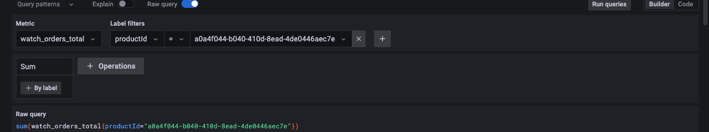
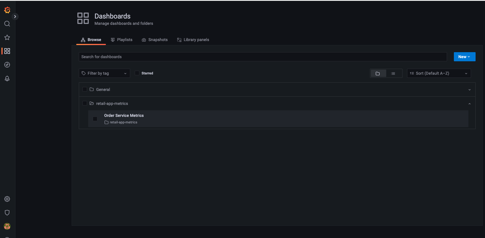

Application metrics are user defined metrics that help track your application KPIs. These metrics help analyze data and derive insights to meet your business needs. Let's look at some application metrics using AWS Distro for OpenTelemetry and visualize the metrics using Grafana.

The application metrics we want to capture and show in the dashboard for the sample application are:
- number of total orders created
- most popular watch type order, based on number of each watch type ordered
- total cost of each order

The "retail-store-sample-app" has already been instrumented to capture the above mentioned metrics. The OrderMetrics class uses Spring Boot [Micrometer](https://spring.io/blog/2018/03/16/micrometer-spring-boot-2-s-new-application-metrics-collector) a metrics collection facade which collects metrics data from the application with a vendor neutral API. In the sample application we use [AWS Distro for OpenTelemetry (ADOT Collector)](https://aws-otel.github.io/) to instrument, generate, collect and export telemetry data (logs, traces and metrics). The OpenTelemetry Collector offers a vendor-agnostic implementation of how to receive, process and export telemetry data. It removes the need to run, operate, and maintain multiple agents/collectors.

Take a look at the OpenTelementy collector configuration using below command. You will notice two main components - Receivers and Exporters
```bash
$ kubectl -n other get opentelemetrycollector adot -o jsonpath='{.spec.config}'
```

**Receivers** - scrape metrics from targets that expose a Prometheus endpoint. Prometheus uses a pull based system to pull the application metrics exposed via an HTTP endoint at regular intervals. The retail-store-sample-app microservice exposes an endpoint **/actuator/prometheus** which is scarped to retrieve the application metrics. Each of the sample microservices expose a Prometheus endpoint making this a consistent metrics implementation.
Use the curl command below to look at the application metrics for **watch_orders** that are exposed through the Prometheus endpoint.
```bash
$ kubectl -n orders exec $(kubectl -n orders get pods -o name) -- curl http://localhost:8080/actuator/prometheus | grep "watch_orders"
# HELP watch_orders_total The number of orders placed
# TYPE watch_orders_total counter
watch_orders_total{productId="510a0d7e-8e83-4193-b483-e27e09ddc34d",} 2.0
watch_orders_total{productId="808a2de1-1aaa-4c25-a9b9-6612e8f29a38",} 1.0
watch_orders_total{productId="*",} 3.0
watch_orders_total{productId="6d62d909-f957-430e-8689-b5129c0bb75e",} 1.0
```
**Exporters** - send these application metrics to a Prometheus remote write endpoint which in our case is Amazon Managaed Prometheus.

We will use Amazon Managed Grafana to visualize these application metrics collected in AMP. AMG has built-in support for Prometheus as datasource. Each datasource in Grafana has its query language to query the metrics data. [PromQL](https://prometheus.io/docs/prometheus/latest/querying/basics/) is the query language for Prometheus. Using the metrics key - 'watch_order_total' and the Query builder, we will build a query for retail-store-sample-app application to get the count of all orders of a certain productId as shown below

Now that we understand how the application metrics are generated, captured, and visualized, we will drive some traffic to see this in action. Use the below script to run load-generator to place watch orders to capture the application metrics.

```kubectl wait --for=condition=Ready --timeout=180s pods \
cat <<'EOF' | kubectl apply -f -
apiVersion: v1
kind: Pod
metadata:
  name: load-generator
  namespace: other
spec:
  containers:
  - name: artillery
    image: artilleryio/artillery:2.0.0-31
    args:
    - "run"
    - "-t"
    - "http://ui.default.svc"
    - "/scripts/scenario.yml"
    volumeMounts:
    - name: scripts
      mountPath: /scripts
  initContainers:
  - name: setup
    image: public.ecr.aws/aws-containers/retail-store-sample-utils:load-gen.0.4.0
    command:
    - bash
    args:
    - -c
    - "cp /artillery/* /scripts"
    volumeMounts:
    - name: scripts
      mountPath: "/scripts"
  volumes:
  - name: scripts
    emptyDir: {}
EOF
```

Open the Grafana dashboard

Go to the dashboard section and click on the dashboard **Order Service Metrics** and let's review the panels wintin the dashboard.

The dashboard displays the panels that represent all the metrics we outlined

You can view / edit each panel to look more closely at the metrics.

This panel displays the toal number of orders placed by the user in the given time range.


This panel displays the number of each watch type ordered, displayed as a pie chart.


This panel displays the toal price of the order in the given time range.


Once you're satisfied with observing metrics, you can stop the load generator using the below command.

```bash timeout=180
$ kubectl delete pod load-generator -n other
```

