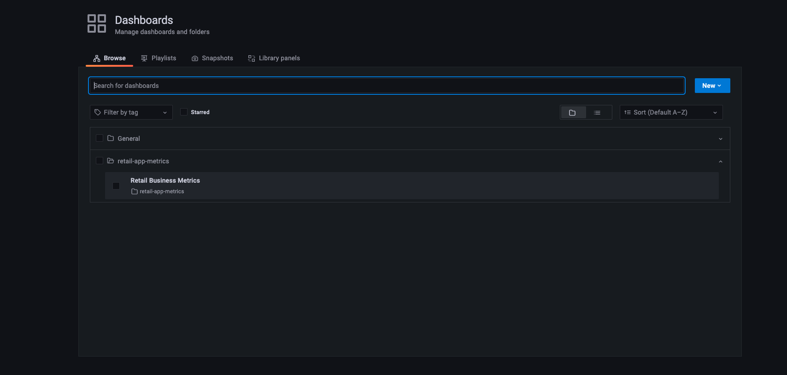
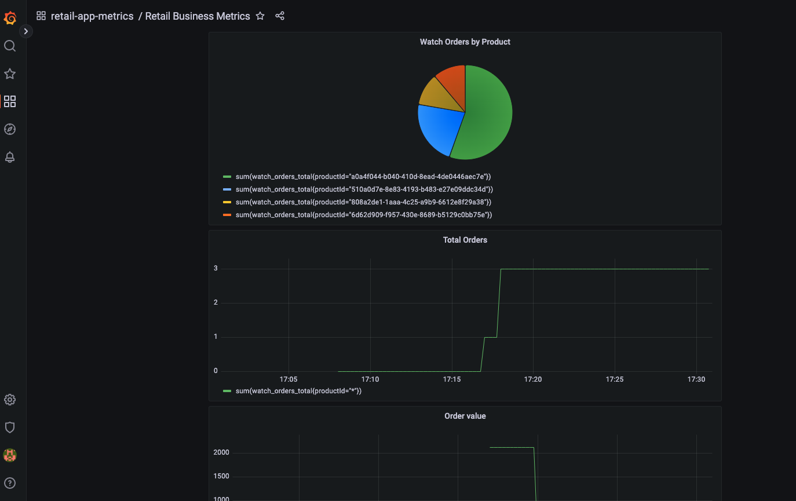
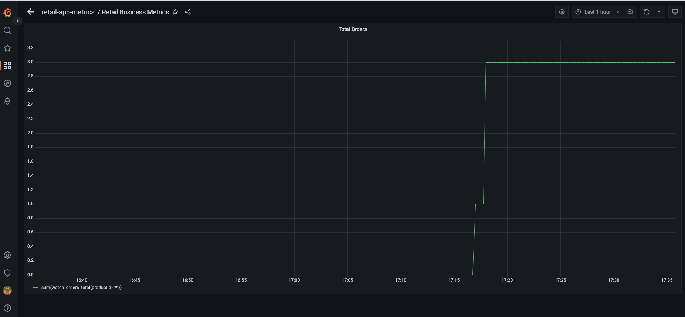
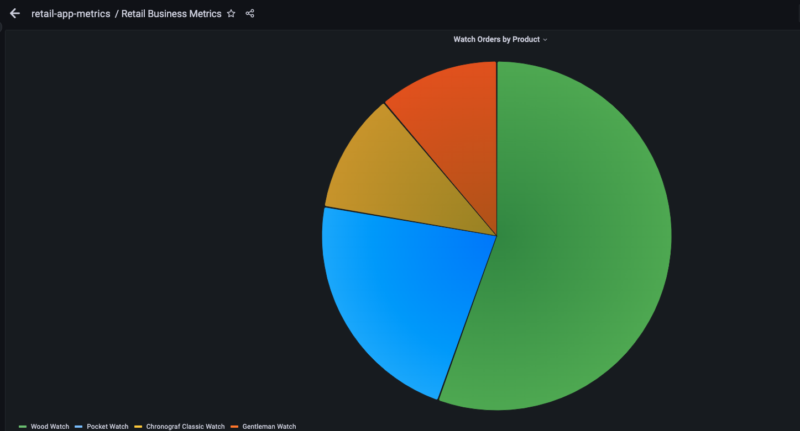
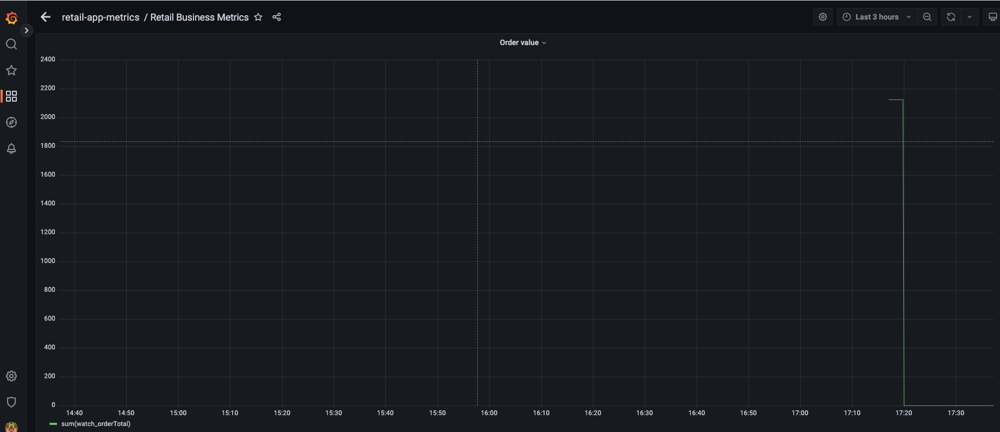

Let's look at adding some busniess metrics by using AWS Distro for OpenTelemetry and visualize these metrics using grafana.

The business metrics we want to add to the retail application is:
- number of total orders created
- most popular watch type order, based on number of each watch type ordered
- total cost of each order

The [retail-store-sample-app](https://github.com/aws-containers/retail-store-sample-app/tree/main/src/orders) has the code to capture the metrics. The OrderMetrics class uses springboot [Micrometer](https://spring.io/blog/2018/03/16/micrometer-spring-boot-2-s-new-application-metrics-collector) a metrics collection facade which collects metrics data from the application with a vendor neutral api. 

Access the UI URL in your web browser. You will see the UI from the web store displayed. Add a couple of watch orders so we can pull the metrics.

```bash
$ kubectl get ingress -n ui ui -o jsonpath="{.status.loadBalancer.ingress[*].hostname}{'\n'}"
k8s-ui-ui-5ddc3ba496-1272081620.us-east-1.elb.amazonaws.com
```


The application code will capture the business metrics outline above. These metrics are exported to Amazon Managed Prometheus. We will use Amazon Managed Grafana to visualize the metrics. 

Open the retail sample application and place a few orders using different quantities of the watches.

Open the Grafana dashboard

Go to the dashboard section and click on the dashboard **Retail Business Metrics** and let's review the panels wintin the dashboard.

The dashboard displays the panels that represent all the metrics we outlined

You can view / edit each panel to look more closely at the metrics.

This panel displays the toal number of orders placed by the user in the given time range.


This panel displays the number of each watch type ordered, displayed as a pie chart.


This panel displays the toal price of the order in the given time range.



